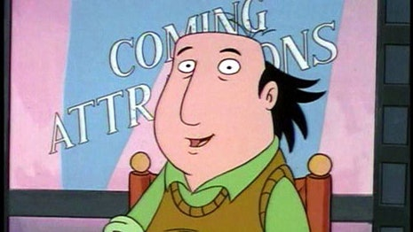

# How to Be a Critic

 
     #artist/writer/wisdom

  
     
  
     
Criticism is a damned and doomed activity, because critics have (or should have) a sick feeling of bad faith every time they lift the pen or strike the keyboard. Criticism is a parasitical operation that depends not only on the activity of others (most jobs do—a builder doesn’t hew the wood or design the building) but also on the greater activity of others. It takes months or years to make a film or write a book, a few hours or a few days to dash off a review (a long and serious study is another thing altogether). A review, however rapidly composed, may well have an aphoristic brilliance or a mercurial insight that’s missing from a work under consideration (at its best, criticism is aesthetic philosophy practiced in a periodical or is in itself a literary performance). But even in the midst of such inspirations, the critic ought to harbor the shadow of a doubt whether these flourishes are conceived in the spirit of the art or at its expense.

Of course, an awful lot of art and music is made and sold and much of it isn’t particularly worthwhile; plenty of movies are deadening to watch, and the attempt to give a neutral parsing of something that sparks revulsion or even boredom is a task made in hell, because it’s a further deadening of the writer’s emotional responses. Negative criticism is as much an obligation of the nervous system—indeed, of the soul—as it is a part of the critics’ job, a responsibility to readers. But the fact that it is so—that negativity is undertaken both to save one’s sanity and to win one’s bread—is all the more reason for critics to submit their own judgments to questioning, to take their own reactions as a crucial part of what’s under their own consideration, reëvaluation, and skepticism. It’s crucial for critics to acknowledge their activity as the personal enterprise that it is. If criticism is the turning of the secondary (the critic’s judgment) into the primary, then the judgment should, in turn, be judged. Criticism, if it’s worth anything at all, is, first of all, self-criticism.

It’s an impractical and difficult thing for critics to do. It’s also a reason why it’s unseemly for self-interested critics to beat their breast in pride over negativity. But this has become a popular stance, as in a 
  
     [Jacob Silverman’s recent post](http://www.slate.com/articles/arts/books/2012/08/writers_and_readers_on_twitter_and_tumblr_we_need_more_criticism_less_liking_.single.html)
  
      at Slate. Its very title, “Against Enthusiasm,” rankles. Enthusiasm should be more or less the only thing that gets a critic out of bed in the morning, except in the case of ghouls who are aroused by the taste of blood. But Silverman is worried:

  
     *If you spend time in the literary Twitter- or blogospheres, you’ll be positively besieged by amiability, by a relentless enthusiasm that might have you believing that all new books are wonderful and that every writer is every other writer’s biggest fan.*

  
     
And, who knows, it could be so; but I doubt it. Certainly, in the online discussions about movies, invective, endorsement, (often superbly trenchant) analysis, and personal discussion all blend together into a remarkably vigorous and enlightening virtual conversation. Are things really that different in the world of books? Silverman thinks so, and so does Dwight Garner, who 
  
     [wrote in the Times last week](http://www.nytimes.com/2012/08/19/magazine/a-critic-makes-the-case-for-critics.html?ref=dwightgarner&pagewanted=all)
  
      in favor of negative criticism. Citing and praising Silverman’s post, Garner says,

  
     *What we need more of, now that newspaper book sections are shrinking and vanishing like glaciers, are excellent and authoritative and punishing critics—perceptive enough to single out the voices that matter for legitimate praise, abusive enough to remind us that not everyone gets, or deserves, a gold star.*

  
     
“Punishing”? “Abusive”? It sounds like the strap-wielding father who tells his children that they’re being beaten for their own good, and that’s the institutional menace of criticism—the sense that the critic represents a kind of order or rule to which the unruly artist needs to be recalled. Garner doubles down on the violent metaphors in this strange passage:

  
     *To writers, Edna St. Vincent Millay offered the wisest counsel. It rings down the decades. “A person who publishes a book willfully appears before the populace with his pants down,” she said. “If it is a good book, nothing can hurt him. If it is a bad book, nothing can help him.”*

  
     
To me, it seems obvious that a person appearing in public with his pants down is susceptible to being grievously hurt or kindly helped, whether his book is good or bad. Millay may (for all I know) be right that the knowledge of having written a good book may make it easier to endure a resulting act of cruelty with stoic restraint, but this doesn’t justify the cruelty. It’s certainly the case that artists do well to ignore the nastiness and simply continue creating (Daniel Mendelsohn recently 
  
     [pointed out to me via Twitter](https://twitter.com/DMendelsohn1960/status/234424316509425664)
  
      that Euripides wrote “The Bacchae” in response to the caricature of him in Aristophanes’ “Thesmophoriazousae”), but critics can’t have it both ways—it’s naïve to think that negative reviews have no effect on artists’ psyches or careers, and critics should consider what it takes to recover from wounds before inflicting them.

It’s as silly to deplore nasty criticism as it is to deplore snark or wit or sarcasm or just plain crankiness. It’s how we are—it’s how I am—and nastiness is as inseparable from criticism as it is from family life, from politics, from business, from the playground, and, for that matter, from art itself. One of the defining qualities of art is its implacability—its representation of violent and dangerous emotions, its ardor for and even embodiment of the negative, the destructive, the repugnant. Art is a place of maximal danger; it endangers the soul of the artist no less than the soul of the reader or viewer or listener. Exaltation comes at a price; sublimity, after all, involves a type of terror. Critics don’t need to be nice (programmatic niceness is itself another sort of self-falsification and self-punishment, and is at least as sanctimonious as self-justifying meanness), but they do need to know where they stand.

I’m reminded of a great scene from a great movie—Sofia Coppola’s “Somewhere,” in which the protagonist, an actor (played by Stephen Dorff) strips naked for a massage. His masseur (not his usual one) prepares to administer the massage by taking off his own clothes, telling the actor, “I feel that if my client is naked, it’s more comfortable if I meet them on the same level.” The relationship, of course, is not on the same level— the actor is prone and vulnerable and the masseur looms above, active and handling the client—which renders their nakedness altogether incomparable. There’s no particular method for practicing criticism, no technique to prescribe and no tone to recommend, any more than there is for art. It’s a matter of sensibility—and of sensitivity.

  
     [How to Be a Critic](http://www.newyorker.com/books/page-turner/how-to-be-a-critic)
 