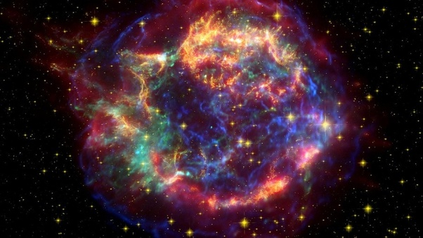

# There's a Ticking Time Bomb in the Constellation of Orion... - Out…

 
     **There's a Ticking Time Bomb in the Constellation of Orion... - Out There**

  
     #artist/writer/scifi
Of the two, Betelgeuse is more intriguing. It is somewhat larger, more massive, more menacing. Really, it’s huge–see 
  
     [above](https://www.eso.org/public/unitedkingdom/images/potw1726b/)
  
     . It has inspired a lot of astronomical scare-stories as a relatively 
  
     *nearby*
  
      red giant star that is expected to explode 
  
     *soon*
  
      as a powerful supernova. (The movie 
  
     *Beetlejuice*
  
      undoubtedly helped raise its profile as well.) When it explodes, it could reach a brightness in our sky of about magnitude -11. That’s about as bright as the Moon on a typical night, bright enough to cast dramatic shadows, bright enough to see clearly in the middle of the day. Surely that would do some nasty stuff to us, right?

But there is as reason that our planet has not been destroyed yet, despite having loitered around the galaxy for some 4.5 billion years. What the Betelgeuse-scare stories often gloss over is that “nearby” and “soon” are relative terms. The way astronomers use them is quite different from the way we use those words in everyday conversation.

  
     
  
     

As soon as we pick apart that term “soon,” the situation starts to look less dire. Astronomers estimate that Betelgeuse is approximately 10 million years old, and it began expanding into a red giant 40,000 years ago. That means it has begun nuclear fusion of helium in its core, creating oxygen and carbon and starting down the pathway to core collapse and eventual supernova detonation. Exactly how long it will take for that full process to happen is unknown; researchers can make only approximate estimates using models of stellar evolution. Those models, in turn, depend on Betelgeuse’s mass and rotation period, both of which are imprecisely known.

If Betelgeuse is almost 20 times as massive as the Sun, as most studies indicate, then it will explode sometime within the next 100,000 years, leaving a celestial splatter similar to Cassiopeia A, 
  
     [shown above](http://chandra.harvard.edu/photo/2017/casa_life/)
  
     . It’s more likely to blow up later in that time-frame, but it’s not 
  
     *impossible*
  
      that it could explode tomorrow. Still, even if you assume that an explosion could happen randomly any time within that period (which will probably overstate the near-term probability), the odds of Betelgeuse exploding in your lifetime are less than 0.1%.

Then again, if Betelgeuse is closer to 15 times the mass of the Sun, as implied by a few other studies, and if it is rotating slowly, then it could take a million years or more to go supernova. In that case, the likelihood that you will live to see Betelgeuse go boom is a good, solid zero. Time to go back to worrying about asteroids and all of the bad things we humans are inflicting on ourselves.

Now, let’s look at that other term, “close.” It’s not so easy to measure the distance to a bright red giant star like Betelgeuse. Different methods give answers ranging from 520 light years to nearly 700 light years. That’s about 150 times as far away as Alpha Centauri, the nearest star system. Even at the low end of the distance estimates, Betelgeuse is too far away to do significant damage to Earth. Material ejected by the Betelgeuse supernova will have expanded and cooled to insignificance long before it reaches Earth.

Radiation from the Betelgeuse supernova will certainly have some measurable effects on Earth’s environment, but probably only a minor impact on life. Betelgeuse is too far away to significantly ionize Earth’s atmosphere and strip away its ozone layer, for instance.  Don’t get me wrong, it will be spectacular (as illustrated below by Henrykus/Celestia), but probably not deadly.

  
     [https%3A%2F%2Fblogs-images.forbes.com%2Fstartswithabang%2Ffiles%2F2017%2F03%2FBetelgeuse_supernova.jpg](http://2Fblogs-images.forbes.com)
  
     

A great way to evaluate the risk is to look at the consequences of past nearby supernovas. It’s not easy to find evidence of them (which itself is a strong indication that they don’t pose much of a threat), although one 
  
     [recent study](http://www.anu.edu.au/news/all-news/supernovae-showered-earth-with-radioactive-debris)
  
      claims to find chemical evidence of two supernova explosions between 1.7 million and 3.2 million years ago.

These explosions allegedly happened on the order of 300 light years from Earth, meaning they hit us with radiation 4 times as strong (give or take) as what we’d expect from Betelgeuse. There’s no clear sign that they had any effect on life, however. It’s possible they caused a period of climate cooling, but it’s also possible that the changing climate was completely unrelated. At any rate, there was no mass extinction during that era.

Last November, a team led by Adrian Melott at the University of Kansas put together a more 
  
     [frightening interpretation](https://www.eurekalert.org/pub_releases/2018-12/uok-dsk121118.php)
  
      on the data. They date the ancient supernova to about 2.6 million years ago, and suggest that it might have coincided with the Pliocene-Pleistocene extinction, an intense die-off of marine species that occurred right around that time. Melott hypothesizes that muon radiation from the supernova led to intense cancer rates that wiped out many large marine animals.

One of the species that vanished was the infamous Megalodon. The headline practically writes itself: Nearby Supernova Slayed Megalodon with Blast of Cancer-Rays. The problem is, the evidence that a supernova had anything to do with this extinction is fairly thin, and the link is viewed with skepticism by many other researchers.

On the other hand, the geochemical evidence for the supernova itself is quite strong. A star almost certainly did pop off relatively nearby about 3 million years ago. Statistically speaking, that’s not surprising: On average, supernova explosions should occur within 100 parsecs (300ish light years) every 2 million–4 million years. Life on Earth must have weathered a great number of such events. It’s safe too say that even if Betelgeuse were to explode 
  
     *really*
  
      soon, in your lifetime, life would survive this time around as well.

Over the past 4 billion years, though, some supernovas must have gone off much closer than that. It’s quite possible that some of those 
  
     *did*
  
      have serious consequences for life on Earth, triggering mutations and extinctions that shaped the course of evolution. The connection between life and supernovas goes even deeper, however. According to one 
  
     [popular theory](https://carnegiescience.edu/news/our-solar-system%E2%80%99s-%E2%80%9Cshocking%E2%80%9D-origin)
  
     , the shock wave from a supernova triggered the formation of our solar system; and most of the heavy elements on our planet (and in our bodies) quite certainly originated in exploding stars. Supernovas might bring death, but they definitely brought life.

See what I mean? Disaster scenarios don’t have to be gloomy after all.

  
     [There's a Ticking Time Bomb in the Constellation of Orion... - Out There](http://blogs.discovermagazine.com/outthere/2019/03/31/betelgeuse/)
 