# Still The Smartest Guy On The Hill 30 Years After Sex, Lies & Videotape…

 
     **Still The Smartest Guy On The Hill 30 Years After Sex, Lies & Videotape: Steven Soderbergh Unravels Hollywood Chaos**

  
     It’s three decades ago that 
  
     [Steven Soderbergh](https://deadline.com/tag/steven-soderbergh/)
  
      ’s debut /sex lies & videotape/ won the top 
  
     [Sundance Film Festival](https://deadline.com/tag/sundance-film-festival/)
  
      prize and turned the indie film into an industry after his $1 million film grossed $36 million for Miramax. He’s since generated Oscar winners ( /Traffic, Erin Brockovich/ ) and launched blockbuster franchises /(Ocean’s Eleven, Magic Mike/ ), but at heart has remained a maverick with innate curiosity and restlessness that led him to test every possible distribution model. And, retirement, briefly.

Soderbergh returned to Park City this year to accept the Founder’s Award from rival Slamdance, and launch his iPhone-shot Netflix film /
  
     [High Flying Bird](https://deadline.com/tag/high-flying-bird/)
  
     / there with his /The Knick/ star 
  
     [Andre Holland](https://deadline.com/tag/andre-holland/)
  
     . And oversee the Sundance launch of /The Report/, the true torture cover-up tale he produced that got a $14 million world rights deal from Amazon Studios. In a time of unparalleled chaos in the film industry, who better to tell us how to keep from getting swallowed up in the shifting sands than Soderbergh?

  
     */DEADLINE: It is the 30th anniversary of/ sex lies & videotape /, which put the Sundance Film Festival on the map and established the indie film niche as a booming industry. There should be a statue of you on Main Street. So why were you at Slamdance accepting its Founder’s Award?/*
 

 
     *STEVEN SODERBERGH*
  
     : Well, my relationship with Slamdance was borne of by necessity. Nancy Tenenbaum and I produced Greg Mottola’s /The Daytrippers/. And it was turned down by Sundance.

  
     */DEADLINE: Good movie./*
 

 
     *SODERBERGH*
  
     : It is a good movie, with a lot of talent in it that would later become much more notable.

  
     */DEADLINE: Hope Davis, Stanley Tucci, Parker Posey, Liev Schreiber…/*
 

 
 
     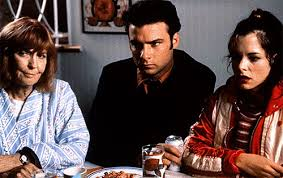
  
     
   

Alliance

  
     *SODERBERGH*
  
     : We were looking for alternative opportunities to show the film. I think Slamdance was in their second year, and they said, we’d love to have it. We had a really fun, semi-notorious screening that night, because this was back in the era of film projectors. The projectors were in the room where the films were shown. They constructed a plywood box that was open on top, to try and deflect some of the sound. Not very successfully. The night we screened, one of the projectors went down. So we could only screen one 20-minute reel at a time. We were keeping the audience aware of what was going on. We’d show these 20-minute reels. The reel would end. The whole room would go, “Ohhh.” The lights would come up. People would start talking, while we changed the reel. Put the new reel up. Lights would go down. They would clap and we would do the next 20-minute section. It ended up being a really crazy night. People were rooting for the movie and Greg and I were standing in the back, passing a bottle of vodka back and forth. So I felt the whole vibe of that was what I wanted to be a part of.

  
     */DEADLINE: I am old enough to have been there when you won the top prize at Sundance for your debut film which cost about $1 million and grossed over $36 million and was important in showing these art films could be a booming business. What’s your relationship with Sundance?/*
 

 
     *SODERBERGH*
  
     : Oh, we’re still in touch. I’ve got a movie there that I produced, which I’m really excited about and pushed for us to get in. I’ve got plenty of love to spread around and I think they both have their place for filmmakers and for audiences. The ecosystem needs it and that kind of diversity really helps everyone. The year of /sex lies/, the festival felt a lot different than it did the following year, when I was on the jury. That is probably inevitable and purely a function of economics and market forces. It was weird to go back the following year and feel that the energy had changed and I wasn’t sure how I felt about that.

  
     */DEADLINE: What part of it left you conflicted?/*
 

 
     *SODERBERGH*
  
     : It had become more of a market. The market energy increased.

 

  
     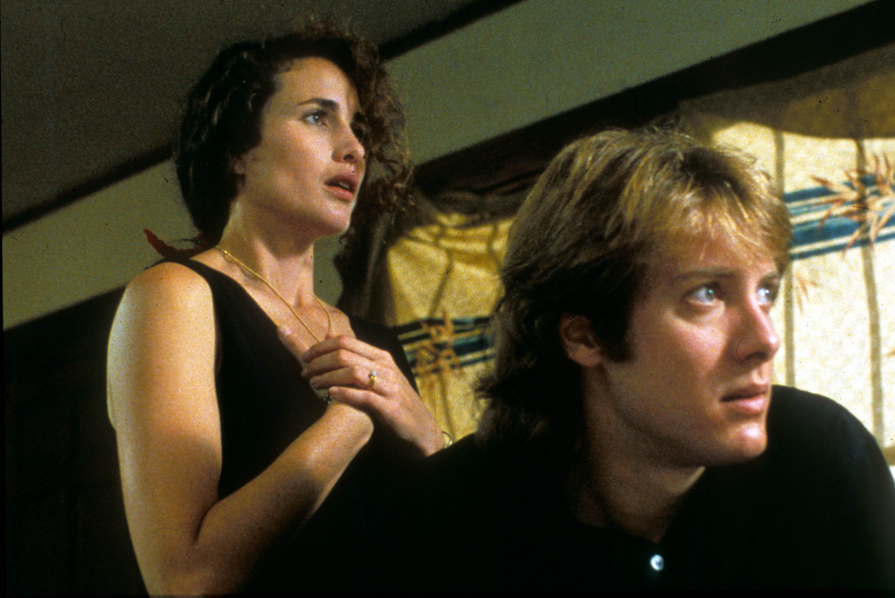
  
     
   “sex, lies and videotape” 

Moviestore/Shutterstock

  
     */DEADLINE: After it won Sundance and then Cannes, your movie grossed like 36 times its cost. Were you like, what have I wrought?/*
 

 
     *SODERBERGH*
  
     : No. It could have been somebody else and it could have been another movie. I was just clocking the fact that there was no going back, that this is the way that it’s going to be now. The festival itself is still fulfilling its original mandate, which is to give a platform to independent filmmakers from all over the world. They’re still doing what they started doing and it’s not really their fault that suddenly a lot of buyers show up. Things have calmed down a bit. There are the inevitable festival deals that sometimes don’t play out the way people anticipated. It’ll be interesting this year to see what the vibe is, because a lot of the companies that would typically be buying films are now shrinking the number of films that they purchase and doing a lot more production themselves. It will be interesting to see if that trend continues and what the effect is on the lives of the films that go to the festival.

/
  
     *DEADLINE: This has been a surprisingly booming sales market at Sundance. But many believe we’re two years away from a real boom market as major studios will need to feed streaming service launches. What will the growth of streaming mean for the next generation of young filmmakers?*
  
     /

  
     *SODERBERGH*
  
     : It’s a great time to be someone who makes things because there are lots of places to go and they’re all hungry for content. That’s the good news. The obvious problem is how to draw eyeballs to your project against a level of competition that was unimaginable when I was coming up in the business. I would never have thought people would be targeted with so much content all day, every day. I just couldn’t have imagined it. Given it’s impossible to get eyes on everything, I think most people are looking for a filter. That can come in a variety of guises. It can be a filmmaker, it can be a genre, it could be a certain platform that you’ve become loyal to. Any of these things can help the viewer cleave their way through all of these options, but it’s hard. Like I said, it’s a great time to be making stuff. It’s just harder and harder to be the signal in the midst of all the noise.

  
     */DEADLINE: This is a tidal wave, compared to when you released/ Bubble /and NATO labeled the day-and-date release strategy “dangerous.” You’ve come here with/ High Flying Bird /, which you made for Netflix, and you follow with the Panama Papers drama/ The Laundromat /with Gary Oldman, Meryl Streep, Antonio Banderas, all movie stars working for Netflix, which the theater owner group has also labeled as a threat to its business and a harm to the moviegoing industry. Your feeling on what this streaming revolution means for the future of moviegoing?/*
 

 
     *SODERBERGH*
  
     : I don’t think anybody knows. It’s not going away. When things take off theatrically, there’s no real equivalent in any other revenue stream. When a movie really blows up, you can’t duplicate that on a platform.

  
     */DEADLINE: Financially?/*
 

 
     *SODERBERGH*
  
     : Everything. The cultural real estate that it takes up. The money that it brings in. If you are somebody who works for a streaming platform and feel that theatrical is dead or is dying I would say to you, oh, really? Why don’t you tell that to the makers of /Get Out/, who in a typical streaming deal would have gotten somewhere in the teens for that movie. And that would be it, for the rest of their lives. Don’t tell me that there isn’t a business out there. The question becomes, what’s working theatrically? So that’s the more relevant question for me as a filmmaker. What’s working? I tried to test a few theories of mine about wide-release movies. In retrospect, I think the studios were right about everything.

  
     */DEADLINE: Describe a theory you tested that failed./*
 

 
     *SODERBERGH*
  
     : That you didn’t need that much marketing money to put a movie into wide release. That they were overspending.

  
     */DEADLINE: You tested that on the movie that ended your retirement,/ Logan Lucky /?/*
 

 
 
     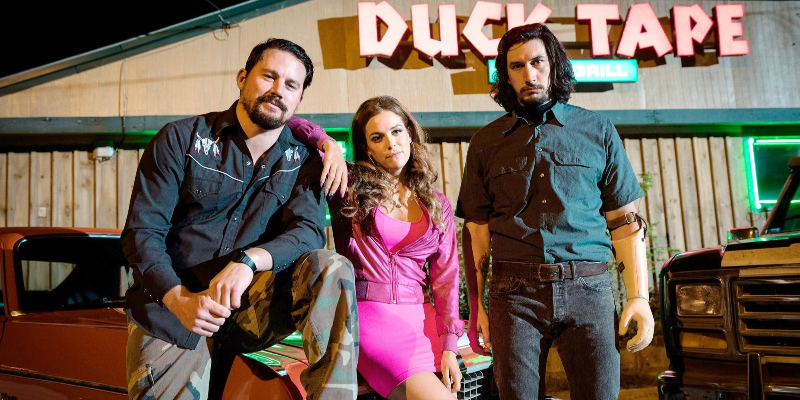
  
     
   

Bleecker Street

  
     *SODERBERGH*
  
     : That was one of them, yeah. I had a bunch. Typically, you cannot get out of bed for under $30 million in marketing and it’s probably going up from there. I felt with a strategically targeted campaign, you ought to be able to do it for $20 million. My concern was, the implications of skyrocketing marketing costs are dire for creative people. So I wanted to see if it was possible. It didn’t work on /Logan./ I got the opportunity to do it again on /Unsane/. It didn’t work again. The bottom line: $20 million is not enough for a wide-release film to generate the level of awareness that you have to have. It’s just not.

  
     */DEADLINE: If you had it to do again on/ Logan Lucky /or/ Unsane /, what would do differently?/*
 

 
     *SODERBERGH*
  
     : A lot of the things that I disliked about marketing, if I were going to put a movie out in wide release now I would be forced to embrace. Talk shows, junkets, all that stuff that I always wonder, what is this for? What is this doing? If they work, why do movies tank while other movies don’t do anything and they take off? There is this whole other ecosystem that just deals with PR and all that stuff. Just talk to the people over at the Four Seasons. I wanted to test a theory. Could you increase awareness by generating direct contact between, let’s say, your talent and the audience, and draw people toward a film? Chan
  
     [
  
     ning Tatum
  
     ]
  
      went on this little road trip the week before /Logan Lucky/ opened. He was doing fun stuff with real people and he posted a couple of things that millions and millions of people saw.

  
     */DEADLINE: The result?/*
 

 
     *SODERBERGH*
  
     : Didn’t move the needle at all. They didn’t connect that to, “I’ve got to go see that movie.” It was just, “I love Chan.” So in retrospect I’m like, I should have made him do all the talk shows.

  
     */DEADLINE: Last year’s biggest deal film,/ Assassination Nation /, also did a largely viral campaign and failed. Is the consumer so conditioned to only regarding the inefficiently targeted TV commercial campaign?/*
 

 
     *SODERBERGH*
  
     : Well, I think you’re right in that the other thing…on /Logan Lucky/ we put a disproportionate amount of our money into digital and a very small amount into TV. I decided to reverse that ratio on /Unsane/, because my takeaway from /Logan Lucky/ is forgetting about awareness, and that it’s still, for all its inefficiency, a good way to get a lot of eyeballs on your movie through commercials. I think there’s also a psychological component that’s tricky to quantify. Which is, if people don’t see commercials for your movie, they don’t think it’s a real movie. Seriously. Real movies advertise on TV. I think that’s how people think. So if they didn’t see your commercial, they’re like, that must be some off-market thing. Because I see ads on my favorite shows for real movies. So we tried that on /Unsane/. It still didn’t work.

  
     */DEADLINE: It’s maddening. P&A is such an inefficient spend, but you risk letting down your film, your entire investment if you don’t play that game. That pressure isn’t there with Netflix, where you aren’t selling movie tickets and they have a vast number of worldwide subscribers who might watch your film./*
 

 
     *SODERBERGH*
  
     : Well, this is why I have a meeting after our interview with a couple of the higher-ups 
  
     [
  
     at Netflix
  
     ]
  
     . I want to know more about what they’re doing. I’m interested in the business, so when I’m working for people, I like to know how their business works. One question in particular that I want to talk about with them is, what is your position on theatrical now? I had to get on the phone with some Netflix folks to explain in person — because apparently this message wasn’t getting through to anybody — that I did not want a theatrical release for /High Flying Bird/. They’d been having screenings for people, who seemed to like the movie and so this proposal started, let’s do New York and L.A., a couple of screens. And I said no.

  
     */DEADLINE: Why? That has been the rub with most filmmakers who want to see their films on that giant movie screen with a communal audience…/*
 

 
     *SODERBERGH*
  
     : I go, if I wanted to do that, I would have accepted an offer from one of your competitors who do that for a living and gone that way. I sold the movie to you to be on your platform. So that’s what I want. I want every eyeball on the platform. It’s coming out February 8. If you guys are doing this as some sort of awards thing to have in your back pocket, I think you’re putting the cart before the horse. Let’s stick to the plan.

  
     */DEADLINE: You clearly put a lot of thought into finding seams with your movies. What is the measure of success for your movies playing on Netflix?/*
 

 
     *SODERBERGH*
  
     : Well, initially it was the participation in the movie of everyone involved, from me to the cast and the crew. The Netflix deal has serious economic benefits to everybody that worked on the movie.

  
     */DEADLINE: And it’s all negotiated in advance, so you get a big paycheck and that’s it. That is the polar opposite of what you did on/ Magic Mike /, when Channing Tatum told you his movie idea and you insisted that both of you finance the film and control it. I’ve always heard that you never made as much on a movie as you did on/ Magic Mike /, tens of millions of dollars each. True?/*
 

 
 
     
  
     
   

Image Courtesy Of Warner Bros.

  
     *SODERBERGH*
  
     : Yeah. But let’s be clear. That idea of Chan…it was like one sentence. When he said, I’m working on this project about when I was 19 stripping in Tampa…I mean, there was no doubt in my mind how big an idea that was.

  
     */DEADLINE: You heard a cash register ring in your head?/*
 

 
     *SODERBERGH*
  
     : Absolutely. I’m like, that’s Haley’s Comet. You have to do everything you can to make that happen, as quickly as possible. That was part of the reason for us to self-finance. We needed to start right away and so neither of us wanted to talk to anybody. We just wanted to go and do it. I knew that was a very commercial idea. I ended up doing the same thing on /Unsane/ and /High Flying Bird/, but for different reasons. Strictly, I just wanted to go and do this without talking to anyone or clearing it with anybody. I just want to be able to go do it. I tried to keep them as quiet as possible while we were doing it because I think it’s fun when stuff sort of pops up that you didn’t know about.

Again, despite the conversation about the whole fingerprint distribution experiment, /Unsane/ was still economically a nice thing for all of us to be involved with. It was not an expensive movie to make and we were able to make deals where everybody got some checks, so that’s nice. What I’m trying to figure out going forward is what lane should I be driving in right now, and, am I being too small? Should I be restricting myself to any one lane or should I be moving on multiple fronts? I’ve got several projects going both as a director and a producer that are in various stages of development. I’m trying to figure out if I should come up with a more coherent structure for all of that.

  
     */DEADLINE: You look at Disney even before it inhales Fox and it will be hard pressed not to have the greatest year that any major studio has ever had at the box office. Look at/ Black Panther /and you can see it’s still possible to create magic even on that spectacle scale. Is that the kind of thing that you would ever see yourself doing?/*
 

 
     *SODERBERGH*
  
     : I don’t have that skill-set. I’m not a snob; I just don’t think I would be very good. Fantasy spectacle is just not my thing. I didn’t read it growing up. I just have no feel for it. I would end up stripping it of everything that made people want to go see it in the first place. So it’s just not a good match for me. It’s not that I find it culturally destructive. I’m just not the audience for it. I can’t make something that I wouldn’t stand in line to go see.

I agree with you. Look what Brad Bird did with the two /Incredibles/ movies. Those are amazing. By any standard, those are classics. He can do that. I can’t. I’ve got to focus on the things that I can do and try to get better at that. So what’s nice to me about /High Flying Bird/ dropping essentially 30 years to the week of /sex lies & videotape/ is, it’s another two-people-in-a-room movie. That’s how I started, and I’ve always believed that no matter how big a sort of historical context that you’re trying to portray in a story, you can ultimately trace it back to two people in a room. I’m happy that I haven’t lost that belief and that interest in close-quarter physical and psychological interaction. It still is as interesting to me as it ever was.

  
     */DEADLINE: You did play in that studio franchise sandbox with the/ Ocean’s Eleven /film series. What was satisfying enough about that experience for you to return for two sequels?/*
 

 
     *SODERBERGH*
  
     : Two things. One, the ability to play visually in a way that isn’t always appropriate for a different kind of movie. I had a license there to have fun with the images and the cutting patterns and the music, which felt organic to those movies but in another context might have felt weird or too self-conscious. I viewed those movies as these giant, moving Lichtenstein panels. They were like comic books to me. That’s how I imagined them. So there was that and underneath all that they were odes to professionalism and process and fraternity, and how to deal with pressure. How to treat people that worked for you and with you. All that other stuff that I’m interested in is moving along below the surface of all that.

 

  
     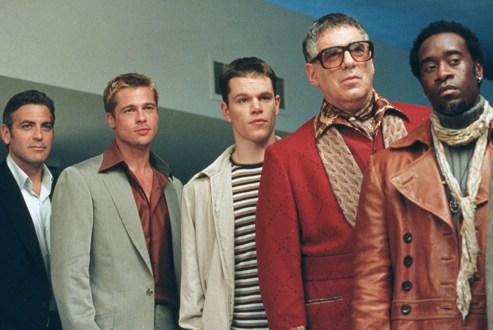
  
     
   “Ocean’s Eleven” 

Bob Marshak/Warner Bros/Kobal/Shutterstock

So I loved doing those films. Compared to other things I’ve done, they were not easy. It’s harder than you think to make something look breezy but that still has a very defined visual and narrative architecture. It is not often I get stuck on a set, truly stuck, like send-everybody-away-because-I-need-to-think-about-this-problem-and-the-answer-isn’t-coming kind of hard. That doesn’t happen to me often but 85% of when it has happened, it has been on an /Ocean’s/ film. Literally watching a scene and just going, I don’t have an idea. I don’t have an organizing principle of how to shoot this scene.

  
     */DEADLINE: What do you do when that happens?/*
 

 
     *SODERBERGH*
  
     : I’ll keep running it for a while and see if something dislodges or if somebody comes up with an idea or suggestion. I’ll let that run its course for a while and then if nothing’s coming, I will send everybody away. I remember on /Ocean’s Twelve/, we had this dialogue scene. It was scheduled for day-and-a-half. I sent everybody away…I wrapped at lunch the first day because I didn’t know how I wanted to do it. I spent that afternoon thinking about it, looking at other things that were around it and finally came up with, if not the perfect solve, at least something that I felt good about. We finished it by lunch the next day because once you have the idea, it goes really fast. I try to screen those movies as soon as we wrap and usually within a week I have it put together.

/
  
     *DEADLINE: You edit that fast?*
  
     /

  
     *SODERBERGH*
  
     : With today’s technology? Absolutely. It’s the Pixar motto, be wrong as fast as you can. I want people to see it as quickly as possible so I can get a sense of what we have, or don’t have. In the case of /Ocean’s Thirteen/, it was clear the narrative was malnourished in some way and there needed to be another major component to the whole thing. So the good news was we were under budget and the writers and I gathered and came up with a solve that took seven days of shooting. We had a screening at Warner Bros a week after the movie wraps. All my friends are there and everybody knows, we have a problem. Alan Horn, bless his heart, just came up and basically said, “Well, I’ll leave you to it.” Because he knew I knew. There was nothing to say and he knew it’s on me to figure this out with some help from my friends. When we previewed the finished film in Phoenix and it went very well, Alan came up and said, “I’ve never seen a transformation like that in my entire career. What I saw two-and-a-half months ago and what I saw tonight. I’m so happy.” I said I’m happy you’re happy but more than anything, I’m just relieved. In /Ocean’s Thirteen/, all of that Eddie Izzard stuff, the computer stuff with Julian Sands, that was all new. Anything that Eddie had to do with in that movie and that new system that Al Pacino was presiding over, The Greco, that didn’t exist, none of it.

  
     */DEADLINE: It was remarkable you had that many stars and kept adding more through three films. How was that financially possible?/*
 

 
     *SODERBERGH*
  
     : Jerry Weintraub was the main reason, and the other was the generosity of George and Brad and Matt in essentially keeping the same deal that they had for all three movies. And just increasing the pot that everybody else was able to participate in, including me. They were real stand-up guys about that because they knew if we don’t do this, we’re not going to be able to make the movies and we all felt we’d rather do them. They were fun. On those three films I think if you asked any of the cast they were fun movies for them because nobody had to shoulder the whole thing. It was a fun group. They were having more pure pleasure in the moment than I was. My pleasures were delayed. I’m really happy to have been involved with a franchise that performed like that, in which for all intents and purposes, there was no violence. Guns didn’t matter. The characters are generous of spirit, not mean. Their humor isn’t mean. They’re friendly without being cloying.

  
     */DEADLINE: Do you try, as a rule, to keep the guns out of it?/*
 

 
     *SODERBERGH*
  
     : In a movie like that, yeah. Something like /Out of Sight/, it’s a different world.

  
     */DEADLINE: Great movie./*
 

 
     *SODERBERGH*
  
     : That was a key project for me, a watershed moment. If I had blown that creatively I would have been in big trouble.

  
     */DEADLINE: What was the biggest lesson on that? You managed one of the most romantic love scenes without it feeling prurient, between* 
  
     *[George Clooney](https://deadline.com/tag/george-clooney/)*
  
      *’s criminal and Jennifer Lopez’s cop. Just two people who belong together but can never stay together. The film’s writer, Scott Frank, told me that was all your idea…/*
 

 
 
     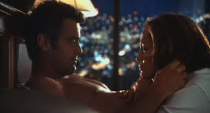
  
     
   

Universal

  
     *SODERBERGH*
  
     : Yeah. Which I stole.

  
     */DEADLINE: Who’d you steal it from?/*
 

 
     *SODERBERGH*
  
     : Nic Roeg. That was my riff on my memory of the getting dressed lovemaking session montage from /Don’t Look Now/. As it turns out, I kind of remembered it wrong, thank God. Because when I went back afterwards and watched /Don’t Look Now/ again, these things I remembered just weren’t in it.

  
     */DEADLINE: So your/ Out of Sight /idea was an original?/*
 

 
     *SODERBERGH*
  
     : Yeah. Standing on his shoulders. I got to know Nick reasonably well and was very sad to hear about his passing. He was a real influence on me. Those films that he shot as a cinematographer in the ’60s and the films that he made both co-directing and on his own, were really impactful when I saw them.

  
     */DEADLINE: Joe & Anthony Russo, whose/ Avengers: Infinity War /was last year’s highest-grossing film, launched a big company, AGBO, as an homage to you and the values you taught them after you took them under your wing. This after their first film played Slamdance but never saw the light of day because they used popular music without getting the rights. They maxed out their credit cards making the film and had no hope of being able to pay for the music. You were among a few who watched it at Slamdance and they believe they owe their careers to you. Half the Slamdance audience for their screening walked out and the only reviews were polarizing. What in the world did you see?/*
 

 
     *SODERBERGH*
  
     : A lot of energy and intelligence. There was a lot of talent, both explicit and nascent, that was apparent to me. I was just like these guys, and I thought they are on to something. I want to meet these guys. Sometimes you see things and you feel like they’re bluffing. It’s a pose and my sense was these guys have got something. I want to know more. I wanted to know what they knew and so we just started talking and stayed in touch. Another good sign: they’re self-starters. They already had a bunch of scripts. We immediately hit the ground and I was like, what else have you got? They had three other things and were constantly throwing ideas. That’s always a good sign that they had an innate understanding that you’ve got to be the prime motivator in your attempts to navigate this business. You can’t wait for anything. They also seemed like good guys.

 

  
     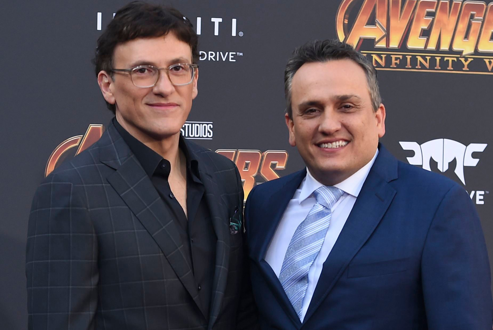
 
 

 
     */DEADLINE: As they were finding their voice, sitting on the couches in the offices of your and George Clooney’s Section Eight, did you imagine they would have directed last year’s biggest-grossing film, with a second installment coming this summer that might be even bigger?/*
 

 
     *SODERBERGH*
  
     : Well, no, only because I didn’t know until later of their interest in that genre. So when they rang me up and said, hey, will you call Kevin Feige on our behalf? I said, yes, after you answer one question: Why do you want to make this? They said, oh, we have a $60,000 comic book collection, and this is literally our dream job.

  
     */DEADLINE:/ Captain America: Winter Soldier /?/*
 

 
     *SODERBERGH*
  
     : It’s our dream job! I said, that’s all I wanted to hear. That was the right answer. So I called Kevin and I go, these guys are great. I think you’re going to like them. They’re hard workers. They’re good people. That was a big part of it, too. I liked them personally and that matters. Their character…it was obvious that they were people of integrity, two nice Italian boys from Cleveland. So the only surprise is that they’re Marvel movies but generally speaking, am I surprised at their success? No. I expected it. Absolutely.

  
     */DEADLINE: How often have you taken a leap on talent like that at nascent stage?/*
 

 
 
     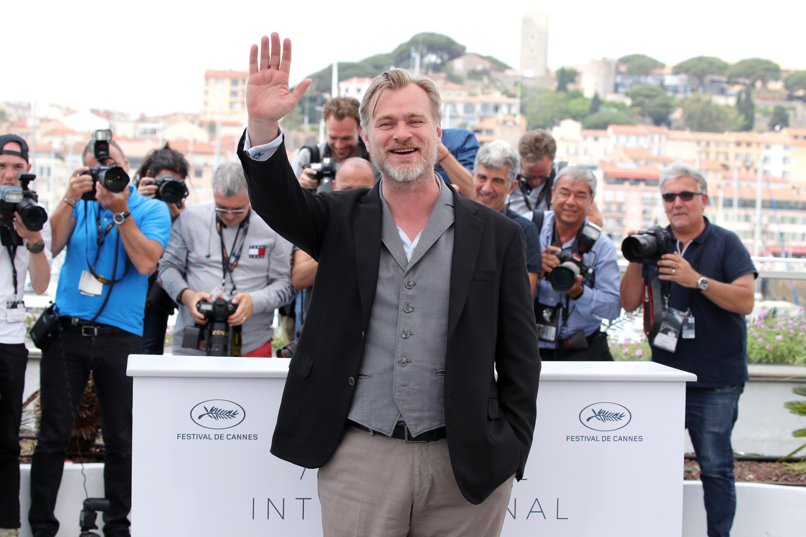
  
     
   

REXShutterstock

  
     *SODERBERGH*
  
     : Here and there. Every situation is different. When Chris Nolan became interested in /Insomnia/ and word got back to me from Dan Aloni that he couldn’t get a meeting at Warner Bros, and that they wouldn’t meet with him to talk about it, I said that’s ridiculous. I called the person who wouldn’t meet with him and said you need to sit down with this guy. Whether it’s this project or something else, you need to meet this guy. You need to talk to him. Turns out he has the meeting, and it was a total love fest. He goes and makes /Insomnia/ and begins his relationship with Warner Bros. So the only thing I did was get him in the room.

  
     */DEADLINE: You based that on/ Memento /?/*
 

 
     *SODERBERGH*
  
     : Yeah.

  
     */DEADLINE: So to you, it was just, what’s the problem?/*
 

 
     *SODERBERGH*
  
     : This is a no-brainer. This guy’s ridiculously talented. Why wouldn’t you want to meet with him? That was certainly my sensation when I saw /Memento/, for instance, and I saw it because again Dan Aloni called me and said will you do me a favor? I’ve got this movie made by this client. It’s done the festival circuit. People seem to really like it a lot. It’s gotten great press and nobody will buy it. We can’t get a distributor. Will you watch this thing and tell me, have people just been gas-lighting us? I watched the movie in a screening room alone. My first reaction was one of real depression, because I thought if that can’t get a distributor then what is happening in this business? What ended up happening is the chief financier, Newmarket, ended up forming their own distribution company and the movie made $25 million here. So it ended up being a success story. But I was sort of having two reactions at once. Why won’t anybody buy this movie, and, there’s a new kid in town. This is like an incredible showcase for someone who we’re now going to know who Christopher Nolan is.

I love the idea that whenever we’re bitching and moaning about some aspect of the business, unbeknownst to us somebody somewhere is working on something that in like six months is going to blow us away, and we have no awareness of. I love that. It always happens.

  
     */DEADLINE: On your new film/ High Flying Bird /: you were a strong baseball pitcher as a kid. Was it athletics or other elements that sparked your interest in a film where the NBA is on lockout, and owners are faced with the possibility of players taking back ownership of the game?/*
 

 
 
     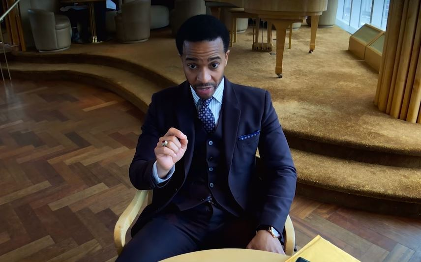
  
     
   “High Flying Bird” 

Netflix

  
     *SODERBERGH*
  
     : It was the inevitable outgrowth of a series of conversations that Andre and I had been having about things that we were both interested in outside of the entertainment business. We were swapping books, making time to talk every so often without any defined purpose other than we liked talking to each other. Then it sort of gradually evolved into ideas. This one kind of came to the surface before some of the others primarily because its scale fit it within the box of we can just go do that on our own. I like things that fit in that box. Some of the other ideas we discussed were just too big to be able to do on our own. So when I said I’ve always been interested…of all the major sports every time there’s a contract negotiation when I look at the NBA I always wonder why don’t they just own this whole thing? Why don’t they start their own league?

  
     */DEADLINE: It reminded me of when you, Alexander Payne, Spike Jonze and David Fincher were going to form a company where you owned the game. It’s clear in that movie that players taking back control of the pro hoops league comes with infrastructure headaches, and it seems the same for a group of artists. In a period as disruptive as the one we’re in, would that directors’ company concept work today?/*
 

 
     *SODERBERGH*
  
     : It depends. It didn’t happen because a couple weeks before it solidified, Barry Diller sold USA to Universal. It was critical that USA be Switzerland in a sense, for this to work. In the immediate aftermath of that, as interesting as that could have been and as hard as we worked on the structure of it to make sure that it had its best chance of working, I felt that no matter how good the deal or structure, if you don’t control distribution you’re still working for the man.

The only scenario I think I would ever try to revive an idea like that would be in a situation in which the makers of it, the owners of that company, the filmmakers would control and own the distribution. Now, there are a couple different ways to do that but as you said, starting these companies is hard. It’s hard. I spent a couple years kicking around the idea of starting a platform, a content platform from scratch and determined ultimately that it was axiomatic if it was going to work the way I wanted it to work that I had to be the person administering it and therefore I wouldn’t be able to do my day job as often or as successfully as I would like.

  
     */DEADLINE: Why invent a new wheel when there’s a tire store across the street?/*
 

 
     *SODERBERGH*
  
     : If you talk to a lot of filmmakers or artists in general, there’s a part of you that sometimes feels, even when you’re well-compensated, sometimes stupidly compensated, you feel like, I just spent a lot of time making an asset for somebody else. They own it. Not everybody is as shrewd and forward-thinking as Jim Jarmusch, who owns all of his negatives.

  
     */DEADLINE: Do you own a lot of yours?/*
 

 
     *SODERBERGH*
  
     : Half a dozen.

/
  
     *DEADLINE: William Friedkin, Francis Coppola and Peter Bogdanovich in the early ‘70s formed a director’s company when they were superstars. It failed partly because they got distracted taking studio jobs and relegated to the company passion projects no studio wanted to finance.*
  
     /

 

  
     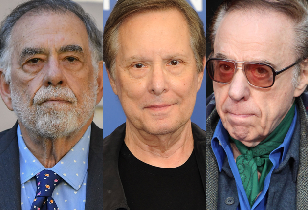
  
     
   

REX/Shutterstock

  
     *SODERBERGH*
  
     : We talked about that. We articulated this multiple times. This company cannot be a repository for the shit that you can’t get made. It can’t. We have to very purposefully front-load this thing with the projects we want to make, that have the best chance of being commercially successful, or we’re not going to have a company. We took very seriously the director’s company and First Artists’ histories as instructive. We did our homework on that and we’re like OK, here was the problem with both of those companies. I spent a little time sort of researching the content platform thing and just decided that the amount of money really required to kick off a platform from scratch was way more than I thought when I started thinking about it. I thought if I could get $300 to $400 million I could probably get something going.

  
     */DEADLINE: A theatrical platform?/*
 

 
     *SODERBERGH*
  
     : Like movies, TV, whatever, but a streaming platform. By the end of my year-and-a-half of exploring this and talking to people and really trying to understand that model I realized to start from scratch you’d need billions of dollars to be able to keep generating enough content so that people felt their subscription price was worth it. There needs to be new stuff. I can’t go and buy a back catalog. That’s how Netflix started. Their master plan obviously is to eventually transition to a place where everything that’s on the platform, they own forever. That’s the big move, which makes sense. So I backed away from it. I called Michael Sugar, because he’d lined up people to give me money, and I said, I’m not going to do it. It’s just way more work than I ever would have anticipated and I just think the economic scale of it is greater than I expected.

  
     */DEADLINE: We’ve seen companies like Global Road and Broad Green build infrastructures and be unable to weather failure. I imagine it might be hard for you to have to be involved with product not up to your personal standards. You have to shovel a lot of coal to keep the engine going./*
 

 
     *SODERBERGH*
  
     : Absolutely. You could make an argument that the theatrical business especially, it’s ultimately a house game. If you stay in it long enough you will probably lose what you made. I remember talking to somebody who worked for one of the most well-known, high-profile co-financing entities. He was referring to a title of theirs that was massive some time ago and he told me, we should have gotten out right after that. He goes it’s a house game. All the money we made on that, within two years we lost it. We should have just stopped right after that one. I was like really? He goes, yeah, I think so.

  
     */DEADLINE: The landscape is littered with stories like that./*
 

 
     *SODERBERGH*
  
     : Yeah, literally…look, Disney’s exceptional in what they’ve build both the Disney part of it and then the Pixar part of it then the Star Wars part of it now the Marvel part of it. This is a masterfully executed plan for world domination. Alan Horn’s a good friend of mine and I’m slap happy for him. He’s an exceedingly rare kind of executive. It’s going to be interesting to see how the Fox of it all plays out because Disney owns the family space, to a large extent. There’s a huge adult space that still needs to be serviced. I’m curious to see how they’re going to apportion resources to address that. You can’t just stop making things for grownups.

  
     */DEADLINE: Another disruptive move you made was to retire. And then un-retire./*
 

 
     *SODERBERGH*
  
     : Yes, I did.

  
     */DEADLINE: So what went into you basically deciding I don’t want to be retired?/*
  
     

/
  
     *SODERBERGH*
  
     : Well, I read The Knick./

  
     */DEADLINE: Simple as that?/*
 

 
     *SODERBERGH*
  
     : Yeah.

  
     */DEADLINE: What did it make you feel inside?/*
 

 
     *SODERBERGH*
  
     : Excited and jealous because I knew if I didn’t do it somebody was going to do it. It was a legit thing. I was out. I had nothing in development. I had nothing in front of me. I had cleared the decks. It was over and I was months into my painting lessons when that script showed up.

  
     */DEADLINE: Painting? Any good?/*
 

 
 
     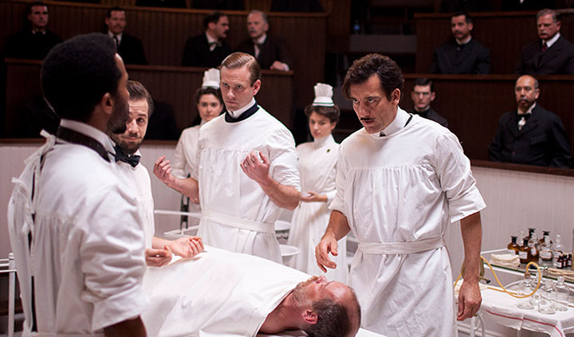
  
     
   

Showtime

  
     *SODERBERGH*
  
     : Yeah. I was painting or trying to paint. I can draw fairly well. There’s a basic skill level there that with training and 10 thousand hours I think could turn into something. I was very much onboard with that, that it was going to be a long time before I generate anything I want anybody to look at. Right around the time I last saw you, for /Behind the Candelabra/ at Cannes, /The Knick/ script showed up. And I went from being out to, we start shooting in four months.

  
     */DEADLINE: Making you the Brett Favre of filmmakers. He unretired several times./*
 

 
     *SODERBERGH*
  
     : I am. /The Knick/ scared me. The schedule was incredibly aggressive. It had to be, in order for us to make it for the number that we were given. About a week in, I realized we were going to be OK. That there was a way to accomplish this in the time allotted and not have it be a compromise. I also realized this is what I should be doing. This is my job. Being on the set and doing this. This is my job. This is what I should be doing. Nobody’s sitting around waiting for my paintings. I like the job.

I had conflated my frustration with the movie business with directing. I realized when I was on the set of /The Knick/ that I love directing. I just don’t like the movie business or I didn’t like it at that point. I was frustrated.

/
  
     *DEADLINE: There is a correlation to what you just said about how hard you studied to create your own platform. At a certain point, someone’s got to say to you, why are you making it so hard on yourself? If you are a good storyteller, isn’t it OK to be content with that?*
  
     /

  
     *SODERBERGH*
  
     : Well, I think it should be. You’re right. I think it’s human nature, if you’re a certain kind of person, to want to keep pushing yourself. If you’re somebody that can rain threes from the perimeter, that’s great, but I’m sure it would be cool to drive to the hoop once and a while. Maybe I should work on that because everybody sees this coming. I’ve always looked at it that way. Like I said, I also enjoy seeing things happen that I helped with, all of that. And then there is that other thing. How do I feel about making assets for other people, in a world in which there are structures now that allow for real ownership because of the distribution outlets.

/
  
     *DEADLINE: Did your love of the game feel different after you had been away?*
  
     /

  
     *SODERBERGH*
  
     : Yeah. I was just able to be more present. I’m always present on set but I was able to reduce the amount of noise and ceaseless internal commentary about all the other stuff that has nothing to do with being on a set and directing. As Kevin Costner says in /For Love of the Game/, close the mechanism a little bit and be happier just doing that thing and not worrying so much about the other stuff. But I think that, like Stalin, I like having five-year plans because it gives me something to push against or to dance with. To have some sense of what the next five years are going to look like at least then it doesn’t feel like I’m riding madly off in all directions.

  
     */DEADLINE: This has been a very ugly year-and-a-half in Hollywood starting with the exposé articles and downfall of Harvey Weinstein, who acquired and released your breakout film 30 years ago that changed the face of the financial possibilities of the indie festival film. What’s your view of the good and the bad things of the resulting pendulum swing, and how do you see it factoring into the creative work that we’re beginning to see? If the great ‘70s films were borne of Vietnam and distrust in government, what’s the artistic interpretation of all that is going on now? What’s your feeling about all of this?/*
 

 
     *SODERBERGH*
  
     : I was happy about the fact that basically overnight, once the Harvey story broke…as far as me and everybody that I knew was concerned, my reaction was, this shit’s over. Anybody who indulges in that kind of behavior or has indulged in that, that shit’s over. The question I think you ask yourself is, what took so long? But things play out the way they play out and what was clear, the scale of the response was an indicator of how much pressure had been building up and how broad this problem was.

I was really excited and encouraged by the energy that was put into getting rid of this kind of behavior. It is still early days, and some of this is moving into an even broader conversation about assholes and abusive behavior in general that is nonsexual and not even necessarily physically assaultive. That would be awesome, that basically assholes are on notice that that doesn’t really fly anymore. We’ll see.

  
     */DEADLINE: Some byproducts are disturbing, like the shaming campaign waged against Scarlett Johansson when she came attached to/ Rub and Tug /, a project about a Pittsburgh massage parlor owner playing an illegal male-dominated game and dressing like a man. We’ve seen an attitude on other movies of, how dare a white director tell that story? I suppose since/ High Flying Bird /is about African Americans taking control of the sport of basketball which is inherently African American, that some could have said, how dare a white guy tell this story. Sometimes it feels like we are in the second act of/ The Crucible /…/*
 

 
     *SODERBERGH*
  
     : There’s a lot of virtue signaling going on and that can be a fascinating and destructive process in which sometimes people who’ve literally done nothing wrong except comment on the issue in a way that is not deemed appropriate, and then they get their turn on the rack. But I think each project is different and needs to be looked at as an individual piece of art. All of these factors need to be thought about. I asked Andre and 
  
     [
  
     screenwriter
  
     ]
  
      Tarrell 
  
     [
  
     Alvin McCraney
  
     ]
  
      when the full script finally came in. I said, I want to do this but I’m aware that potentially the optics of a middle-aged white guy doing this may not be ideal. What do you guys want to do? They said, we always hoped and assumed that you would do it. I said, I want to do and they said, then you should. I guess we’ll see what happens.

  
     */DEADLINE: What about this democratization of the creative process at ground zero, where people find out about projects like/ Rub and Tug /in its nascent stages and foment outrage about who’s directing and who might be cast in it. That’s extra pressure on artistic choices that to me seems unwarranted. If I buy a plane ticket, I don’t expect to take a shift at the wheel and if I go see your movie, I want to see what the artist came up with. I bet many of these people don’t have an artistic bone in their bodies and yet they want a say./*
 

 
     *SODERBERGH*
  
     : Again, it depends on the specific set of circumstances and, given the economic stakes of anything on any sort of scale now, whether or not the people have the appetite to defend certain choices creatively or whether they feel that we now live in a place where anything that’s polarizing, even if it’s polarizing by design, is death now for its commercial life. That all you need is a couple people coming out and going against it and you’re done. As opposed to when I was growing up, when, a movie that was polarizing for whatever reason, you had to go see it so you could weigh in.

  
     */DEADLINE: That’s the vexing thing. I just did this long look back on the 20th anniversary of/ The Sopranos /with David Chase and the cast. As I re-watched I wondered if it could be made that way in this PC moment. It was depressing. Am I overreacting?/*
 

 
 
     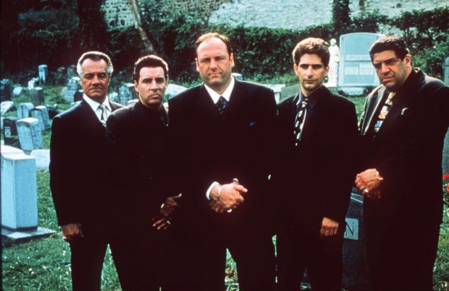
  
     
   

HBO

  
     *SODERBERGH*
  
     : It’ll become something else. This is a necessary stage. It had to happen. It will result in creative people coming up with different ways to tell their stories. But it’s not going to keep anybody from making something great. You just figure it out. It’s no different in my mind to look at something in cultural terms and acknowledge that culture evolves. You know, in the studio movies of the ’40s, Native Americans were the bad guys. And today they’re not. Because they never were.

  
     */DEADLINE: That’s a good way of looking at it./*
 

 
     *SODERBERGH*
  
     : And that hasn’t hurt anybody. There have been some very good films that have come out of the discussion of what happened to Native Americans, both in the past, and what’s happening to them today. I look at it that way. Things change. They have to. I don’t think anybody who’s trying to be on the right side of history here should be surprised that any creative person from any spectrum is going to have an immediate physical reaction to anything that sounds like the culture police. Artists tend to not want to be told what to do. Now, everybody should understand that you tell a writer or filmmaker what they can or can’t do…whether in a larger context you’re right or not, they’re going to react. What I would suggest is they’ve got to count to 10 and sort of think in terms of the 50-year rule. Like, 50 years from now, how will we look back and determine was that the right call? Because 50 years from now, you can usually tell what the right calls were.

  
     */DEADLINE: You placed your Panama Papers movie/ The Laundromat /at Netflix. Big stars. Theatrical potential. Why Netflix?/*
 

 
     *SODERBERGH*
  
     : I couldn’t really in my mind come up with a comp that I could point to if I was going to a studio and say I think we have a shot of it doing that kind of business. I really couldn’t. It was a weird script, in a good way, but by no stretch of the imagination is this down the middle. It’s not an expensive movie to make, but it’s not cheap either. It’s right in that dead zone you’re not supposed to be in. So I really felt this would potentially provide the opportunity to get the movie made in a timely fashion, and have a good creative experience, which I’ve had so far and which I had on /Godless/, and test the water a little bit with Netflix. Once I get on the other end, I’m going to do an analysis of the whole experience. There are upsides to it, there are downsides in terms of the deals, as you know, because it’s a buyout and that’s it.

  
     */DEADLINE: Besides mitigating risk on a back-end minimum, Netflix eliminates the pressure to perform at the box office. We are meant to assume that eight gazillion subscribers are watching the world over, but we don’t know because they don’t divulge viewership. Also gone is most of the P&A dependency. Do you like the fit of all that?/*
 

 
     *SODERBERGH*
  
     : Well, yeah. For this movie, absolutely. The question is, is that how I want to do it every time? I don’t know.

  
     */DEADLINE: You’ve shown a flexibility to not do the obvious thing with distribution. Traffic won you the Oscar and it seemed like a studio film but you put it at USA Films./*
 

 
     *SODERBERGH*
  
     : Well, those majors all had it and turned it down. If it weren’t for Graham King, that movie doesn’t get made. Everybody saw it and the consensus was at that number, which was like $46 million which is not a small number, there were no comps. They said drug movies do not make money and they were right. We just felt we had a zeitgeist piece, and that the time was right for this. It was an election year. It just felt right. We believed it and luckily we weren’t wrong.

 

  
     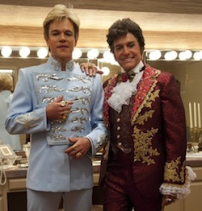
  
     
   

HBO

  
     */DEADLINE: What about/ Behind the Candelabra?/Landed at HBO and won 11 of 15 Emmys it was nominated for. Could have been a feature film./*
 

 
     *SODERBERGH*
  
     : Tried to. The budget of that movie was $21 million. We had raised 16 foreign. We needed $5 million from a domestic partner. Couldn’t get it. More than anything I was desperate to make that movie.

  
     */DEADLINE: I guess there is reward in being forever changeable, even if you didn’t end up owning the game./*
 

 
     *SODERBERGH*
  
     : I don’t know what the alternative is. If you’re not James Cameron and you can leap from mountain top to mountain top, you’ve got to be adaptable. You need to take your ego out of it. What’s working? That doesn’t mean that I’m trying to reverse engineer to make something in a cynical way that like people seem to be liking this now so I’m going to make that. It’s more looking at the theatrical movie business and going, what seems to be working now? You’ve got this kind of movie over here. Then you’ve got end-of-the-year awards, Oscar bait stuff that’s all jammed onto one side. I’m not really interested in that, or in fantasy spectacle. Is there something else that seems to be working that maybe I can slip in here? I’m trying to find a connection point between my interests and what people seem to be watching. There’s got to be something because I watch stuff.

  
     */DEADLINE: You had a good partnership in Section Eight with George Clooney in that you did things together, but you were two stylish filmmakers whose differing interests led you to do things apart as well. What do you miss about that partnership and why did the two of you disband that studio-backed partnership? Is what you’re doing now, better?/*
 

 
     *SODERBERGH*
  
     : I don’t know. In a sense, we became victims of our own success. The arrangement that we had with each other was, if it stays lean and mean and it stays fun, then we’ll keep doing it. It just got too big. There were just too many things happening and it was affecting our ability to do our day jobs. So that gentlemen’s agreement of, if it turns into something that’s starting to not be fun, then it’s not worth it. The friendship’s not worth it to be put under that kind of pressure.

 

  
     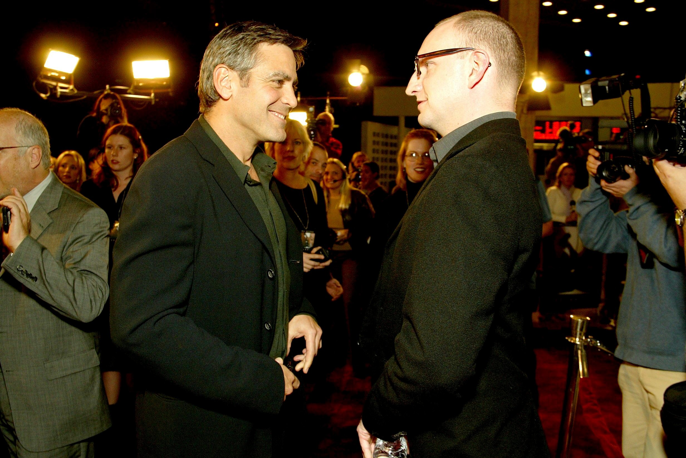
  
     
   Clooney, Soderbergh 

Charbonneau/BEI/Shutterstock

The great thing was we did a lot in a short period of time. Some really terrific work came out of it, and the talent that we met and made connections with, and people that worked for Section Eight have all gone on to do great things on their own. They’re scattered all over this business. I always felt we had a really exceptional group of people working there. It turns out we did. They’ve all done great. Some of them are working here. So we were always open to the possibility that this thing would have a lifespan. So now we just see each other, catch up and talk about the business and life. That was a really important period for both of us.

  
     */DEADLINE: Hearing you say that, and the way you described building your own distribution platform, do you wonder if the latter would have been an albatross?/*
 

 
     *SODERBERGH*
  
     : Yeah, it would have and I should have known that from the beginning but I was curious. Could it be done? How would you do it? What will it take? I’m one of those people even with the Fingerprint thing, as frustrating as that was, I’m glad I did it. I needed to internalize some knowledge that was purely intellectual. So I’m glad I did it because I learned a lot.

  
     */DEADLINE: Who learns anything in victory, anyway? All the best lessons come from defeat./*
 

 
     *SODERBERGH*
  
     : It’s hard. When things are going great it’s kind of like a chance close encounter with somebody. And you wake up the next morning and they’re gone and you don’t know where they’re from, you don’t know how to find them. They just sort of shook you up and then left. Defeat is like the house guest that won’t leave. Defeat hangs around. It’s got an extended family. It’s so much easier to analyze why something went wrong, and it’s so hard to parse why something went right, other than my belief that it went right because there was an overarching ethos to the way it was made. The way it was conceived. The way it was put together. The way it was executed. That your best chance of having it work is through the people that you work with, how you work with them and stripping your ego out of it as much as possible, which is a tricky thing. You have to be confident enough to make this thing happen and keep it on the rails. And in stress situations, in problem solving situations, your ego is your enemy. So you’ve got to find this place where you are…

  
     */DEADLINE: Desperate?/*
 

 
     *SODERBERGH*
  
     : Where your confidence is a fuel that keeps things moving forward but doesn’t tip over into megalomania and makes it impossible to hear the solutions that are floating in the air. If you’re talking all the time and expressing yourself and dominating the environment, you can’t hear these little whispered solutions. That’s the only way to approach it. And also for me, once they’re done, they’re in the rearview mirror and become something for somebody else to sort out.

  
     */DEADLINE: Swinging the conversation back to that first triumphant Sundance and/ sex lies & videotape /: it would have been very easy to imagine you getting caught up in megalomania after that. How did you avoid it?/*
 

 
 
     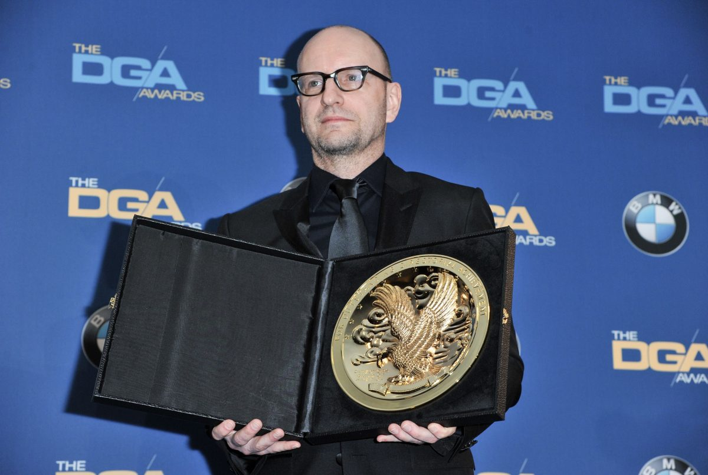
 
 

 
     *SODERBERGH*
  
     : I’d read enough about the trajectory of other people’s careers and all the potential traps. I was very, very aware that this was the first feature that I had made and I had a lot to learn and that these were early days. I was still trying to figure out what kind of filmmaker I wanted to be, and that that was what the next seven or eight years was going to be about. I had the luxury of being able to do that and try some things. I knew I was at the beginning and that I could count the things that I knew for sure on less than one hand. What I wanted was opportunities, the ability to go to work as often as possible. That’s what I was focused on. The social aspect of the business I wasn’t interested at all. I moved back to Charlottesville, got married. All I was focused on was improving.

  
     [Still The Smartest Guy On The Hill 30 Years After Sex, Lies & Videotape: Steven Soderbergh Unravels Hollywood Chaos](https://deadline.com/2019/01/steven-soderbergh-sundance-slamdance-icon-interview-1202544513/)
  
     

#artist/watchlist #inbox
 