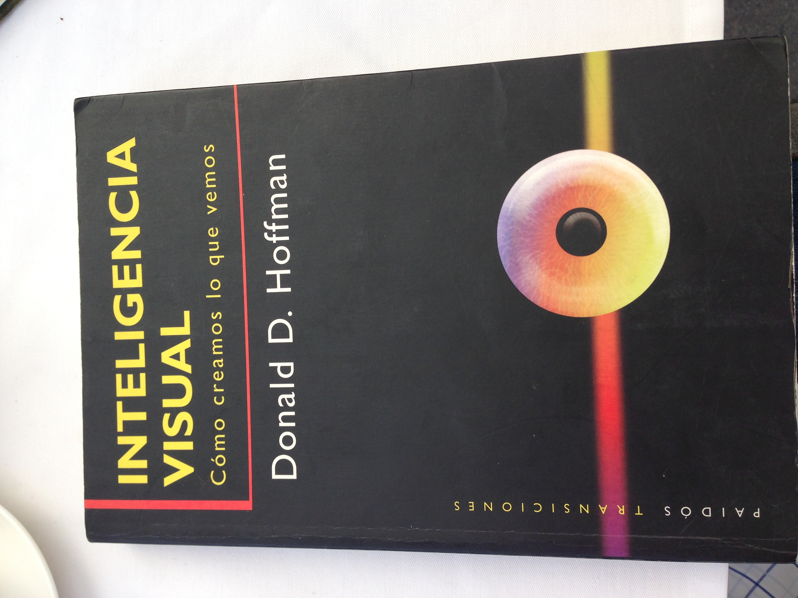

# THE WATCHLIST

## **FILMS**

## Content Committee
**Lifetime**
 
     	Girl in the Box
	Sister Cities
	Indiscretion
	Kruel

 # narrative
- [ ] Bring Me the Head of Alfredo Garcia
 
     - [ ] The Funeral / Peter Dinklage
 Midnight Run
- [ ] Yojimbo
- [ ] Days of Heaven
- [ ] The Holy Mountain 
- [ ] Eraserhead
- [ ] Stalker
- [ ] [https://en.m.wikipedia.org/wiki/Harvey_(film)](https://en.m.wikipedia.org/wiki/Harvey_(film))Chaplin movie Robert Downey
- [ ] Sleepers / Woody Allen
- [ ] La cenicienta moderna
- [ ] Neighborhood Food Drive / Slamdance 2017
- [ ] Dead Man w/ Johnny Depp 
- [ ] ITVs Victoria
- [ ] Dog Tooth
- [ ] Cronos / Willie of the Bull
- [ ] Happy Valley
- [ ] Yojimbo / Kurosawa
- [ ] Battle Royale / Japan
- [ ] Morris from America
- [ ] Criminal / Kevin Costner
- [ ] David Cronenberg Filmography
- [ ] Kuroneko / Animé
- [ ] Onibaba / 1964
- [ ] Animal Kingdom / Edgerton
- [ ] Maria full of Grace
- [ ] The Chaser
- [ ] The Yellow Sea / Na-Hong Jin
- [ ] The Rundown / Emersons fave rock movie
- [ ] Days of Heaven / Malik
- [ ] The Holy Mountain / Jodorowsky
- [ ] Eraserhead / Lynch
- [ ] Stalker / Tarkovsky
- [ ] La Bella del Alhambra 
- [ ] Clandestinos / Fernando Perez 
- [ ] Fresa y Chocolate 
- [ ] Un Hombre de Exito 
- [ ] El ojo del canario 
- [ ] Mañana 
- [ ] Suite Habana 
- [ ] Belle Epoque
- [ ] Fernando Perez 
- [ ] Habana Station 
- [ ] Los dioses rotos / Ernesto Daranas 
- [ ] Vampiros en la Habana 
- [ ] El Club / Pablo Larrain
- [ ] Lilith / Warren Beatty
- [ ] All the Presidents Men
- [ ] Dream House / Naomi Watts
- [ ] On the Valley of Violence / Ty West
- [ ] I am Hero
- [ ] Tusk
- [ ] Yoga Hosers
- [ ] Red State
- [ ] Fisher King
- [ ] You Only Live Twice 1967
- [ ] The Loved One 1965
- [ ] Medium Cool
- [ ] Quadrophenia
- [ ] Blow Out 1981
- [ ] Logans Run
- [ ] Easy Rider
- [ ] Razorback 1984
- [ ] Out of the Past 1947
- [ ] End of Love / Marc Webber
- [ ] Siberian Education / Italy Film
- [ ] 9 Songs
- [ ] Blue is the warmest Color
- [ ] Truth / Blanchett Redford
- [ ] Killer Joe
- [ ] The Exorcist
- [ ] Night Must Fall
- [ ] Life of Riley
- [ ] Leviathan
- [ ] The Day of Jackal (original)
- [ ] The Muse
- [ ] The poet of habana
- [ ] Eduardo Coutinho Filmography
- [ ] THE LAST WORD
- [ ] SEX & DEATH 101
- [ ] THE DARWIN AWARDS
- [ ] El Perro Andaluz / Luis Buñuel
- [ ] Oscuro del Deseo / Luis Buñuel
- [ ] El discreto encanto de la Burgeuesía / Luis Buñuel 
- [ ] Bell De Jour  / Luis Buñuel
- [ ] The Last Castle / Luis Buñuel
- [ ] El Patrullero  / México
 
     - [ ] The Cold Light of Day

  
     - [ ] 3 Idiots (indian)

  
     - [ ] Taare Zameen Par (Like Stars on Earth)

  
     - [ ] A Wednesday (indian)

  
     - [ ] Dil Chahta Hai (literally in Imdb Top 250) (indian)

  
     - [ ] Lagaan
 

# documentary

- [ ] Risky Drinking
- [ ] Undefeated
- [ ] The Latin Explosion
- [ ] Parrott Heads
- [ ] The Last Waltz / Bob Dylan
- [ ] Cuba Libre / 6 part doc
- [ ] Fat Sick and Nearly Dead / Doc
- [ ] 75th anniversary Captain America / doc Matt p
- [ ] More than a Game / Le Bron Doc / matt P
- [ ] Band Called Death / Doc / matt P
- [ ] Milius / doc / Matt P
- [ ] Sing Street
- [ ] Hunt for The wilderpeople
- [ ] Doc / Life Animated
- [ ] Doc / Tickled
- [ ] Doc / Presenting Princess Shaw
- [ ] Doc / Norman Lear
- [ ] Doc / Lady Valor
- [ ] Doc / The Lady in Number 6
- [ ] Doc / A Better Life
- [ ] Frequent Flyer Addict Documentary
- [ ] Pablo / cuban documentary
- [ ] Detras de la mascara peli 
- [ ] Santiago / Directed by Joao Moreira Salles
- [ ] A Brickumentary
- [ ] Edificio Master
- [ ] Kafka on the Shore
- [ ] Waltz with Bashir
- [ ] I am Bruce Lee
- [ ] Operation Avalanche
- [ ] Errol Morris Doc Filmography
- [ ] Tucker: A man and his dream - Coppola 
- [ ] Haxan  <u>[http://en.wikipedia.org/wiki/Häxan](http://en.wikipedia.org/wiki/H%C3%A4xan)</u>Rainer Werner Fassbinder
- [ ] The Paper Chase - James Bridges
- [ ] The Right Stuff - Philip Kaufman
- [ ] Waking Life - Limited
- [ ] The Day the Dollar Falls
- [ ] Destiny - Fritz Lang 
- [ ] Silvia Prieto
- [ ] David Lynch - una historia sencilla
- [ ] Truth 
- [ ] Blanchett Redford 
- [ ] Killer Joe 
- [ ] The Exorcist 
- [ ] Night Must Fall 
- [ ] Life of Riley 
- [ ] Leviathan 
- [ ] Pablo / Cuban Documentary 
- [ ] The Day of the Jackal (Original) 
- [ ] The Muse  
- [ ] The Poet of Habana 
- [ ] Polygram Documentary 
- [ ] Esperando la Carroza - Argentina - Jacobo Lansner 
- [ ] Watch No End In Sight 
- [ ] Errol Morris docs 
- [ ] Fog of War 

 
     **TV**

 - [ ] Going to California / Showtime
- [ ] Planete / Anime Series
  

 
     **BOOKS**

 
- [ ] The High Frontier by Gery Oneill
- [ ] Atlas Shrugged
- [ ] The Foundation Trilogy
- [ ] Red Rising
- [ ] El Despertar de los heroes Interiores 
- [ ] IDO Creative Company 
- [ ] Freakonomics 
- [ ] The Tipping Point - Malcolm Gladwell 
- [ ] Outliers 
- [ ] A short history of nearly everything 
- [ ] A walk in the woods 
- [ ] Hollywood Creative Directory 
- [ ] Robert McKee - Story 
- [ ] Marketing to Moviegoers - Robert Marich 
- [ ] Marketing Strategy - Kotler 
- [ ] On Strategy - Thorton 
- [ ] Funky Business 
- [ ] SEC - 20F - info on all corps that are publicly traded  on the NYSE 
- [ ] Oliver Sacks / Author / Neurologist / The Man Who Mistook His Wife For A Hat
- [ ] Carlos Castañeda / Conversations with Don Juan
- [ ] http://www.greggbraden.com/
- [ ] Hitler si ganó la guerra
 
     
RESEARCH

 - [ ] Barbara Kruger   
- [ ] Cindy Sherman  
- [ ] Slate
- [ ] Seed and Spark
- [ ] Mgo
- [ ] Tugg Film Releasing
- [ ] Alejandro Amenabar / Vale

[Edgar Wright’s 1000 Favorite Movies – Movie List](https://mubi.com/lists/edgar-wrights-favorite-movies)
[Sweet Sweat](http://www.sportsresearch.com/sweet-sweat)
[9 Essential Animated Indie Movies](http://www.indiewire.com/2015/11/9-essential-animated-indie-movies-52084/)
 
     
 
