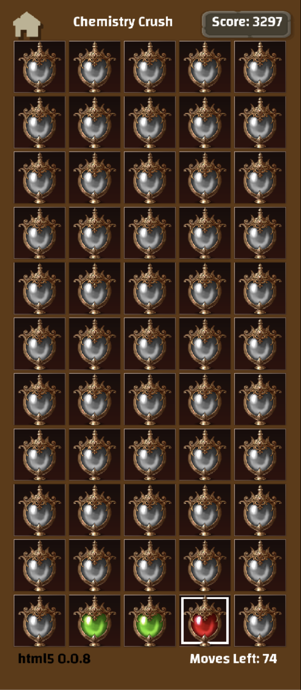

# LabAttack

 
     #Foton/Games/junglerobots
HTML 0.0.8 2019/11/18
The colors seem to be a bit better.
Would consider putting pure mixable colors in smaller or less important looking flasks.
Colors that have already been mixed can be in a slightly nicer and larger flask
and if 
Mixable colors can be mixed further then there should be a really nice flask
additionally the scoring for connecting 3 basic, mixed, or complex colors should be different and I would consider even making the gameplay different.
Maybe if they are mixed or complex they can explode when they clear eliminating more flasks around them.
y ganó la vieja…

  
     
 
