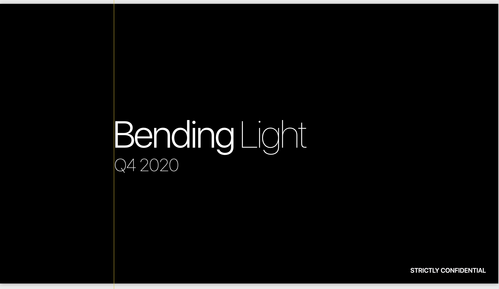
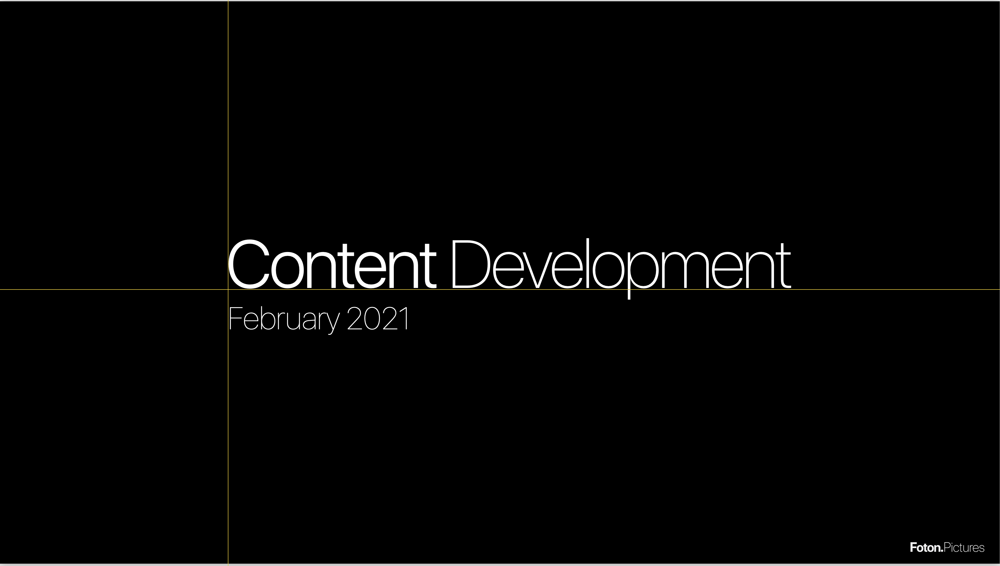

# Bending Light Report Q1 2021

 
     #foton/ventures/bendinglight

  
      **Power BI Dashboard**

  
     Notes

Lograste instalar el fond SF UI o esto es Helvetica?

  
     *Slide 1*
  
     
“Bending”
SF UI / Light

“Light” y “Q1 2021”
SF UI / Ultralight

Intenta replicar este layout y tamaños. Quitemos el logo de FP y agrega el “strictly confidential” idéntico a como lo ves ahí. SF UI / Bold / All Caps

  
     
 

 
     *Slide 2*
  
     
Textos a la izq (este y todos los slides con este módulo)
	SF UI / Regular para los títulos
	SF UI / Light para los números.

Intenta crear espacio negativo al rededor de los elementos. Actualmente están muy pegados a los bordes. 

  
     * El título mas abajo y a la derecha. Replicando los mismo font types que usaste para BL en el slide 1

  
     * Llevaría todos los textos a que no se abrevie nada. i.e. “Mgmt. Fee” “ J. Pechter”

 
 
     
  
     

Para el 
  
     *logo*
  
      de FP, en este y los otros slides excepto el primero, intenta replicar esta propoción. El logo debe quedar mucho mas pequeño y tener mas o menos el mismo espacio negativo hacia la derecha que hacia abajo. 

  
     
 

 
     *Slide 3*
  
     
Subtítulo cambia a: Project Detail / TITULO DEL PROYECTO

El graph de la derecha cambiemos el título a “Waterfall & MG Projections”

Las columnas pasan a llamarse
	Revenue Waterfall
	MG Estimates
	MG / Actual & Projected

No distringamos Glanzrock de ninguna manera. Solo resaltemos a BL con color. Que parezca cualquier otro socio. 

Tenemos que buscar la manera de resaltar la posición de BL dentro del waterfall que en algunos proyectos es bien ventajosa. Por lo cual hace que podamos tener un 30% ROI en inversiones en las que el proyecto nunca llega a recuperar, como es el caso de HATYM.

Podríamos hacer que la columna de Waterfall tenga ese detalle? O sea, sumar cuando aplique, fees, debt, priority equity, eq premium, y cualquier particularidad? Eso debe estar en las proyecciones y los CAMA. HATYM es el más diferente que podríamos usar de ej para ver si la idea funciona. Porque por ejemplo no todo el equity recuperan juntos, creo que CTG tenía una particularidad asi también, y en el caso de To The Stars no está resaltada la porción de deuda. 

Se puede hacer que en el PIE CHART los nombres usen un font mas pequeño que los números para también evitar abreviar?

  
     *Changing The Game*
  
     
Faltan el ASK de Int’l en los estimates. No teníamos nada en nuestras proyecciones? 

 