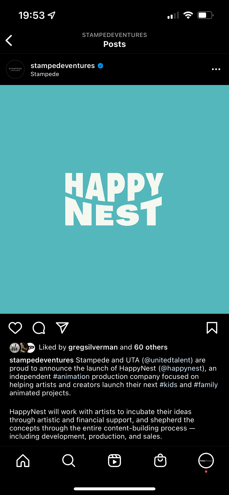

# UTA Representation

 
     Jake Carter
Happy Nest? How did that work?
Politics and Loyalties… any insight?
Call w Micah… offer to continue with them on a 3 month trial with no retainer and exit clause. 
	Can this be used to influence negotiations? Maybe only replicating the trial period?
Personal representation within the same deal
	as writer, director, game director, script consultant, strategic consultant, latam and latinx consultant, marketing consultant, board member for biz and non profits.

Ventures
	

Film
	Fiction
	Non Fiction
TV

Endorsements

Fine Art

Marketing
	Media Link

Audio
Media Rights / IP

Music

IQ
	Data & Analytics

(Clutch) Sports
	

News & Broadcasting

Sports Content

Production / BTL
	HODs and LPs

Publishing

eSports

Digital
	Influencers
		D Amelio
	MCN
		Awesomeness

Games
	

Heartland

Theater / Drama

Events / Experiences

Innovations

Foton.
	Fundraising for capital
	Advisory Services
	Strategic Services
	PR Function for partners
Foton.Ventures
	Fundraising for funds
		IP
		Debt
		VC / Tech & Media
	Advisory Services
	Strategic Services
	PR Function Financial Sector Facing
Foton.Pictures
	Investment Opportunities for TV / Film / Immersive
	Fundraising for independent projects
	Representation as Producers
	Packaging Services
	Advisory Services
	Content Sales
	PR Function for Execs
Foton.Games
	Fundraising for independent projects
	Investment Opportunities in Games / Studios / UA Campaigns etc
	Representation as Studio and Publisher

  
     
 

