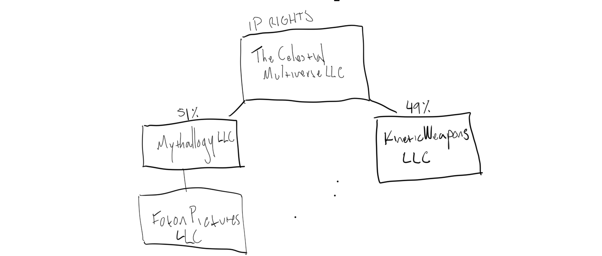

# #CelestialWeapons

# #CelestialWeapons

## #creative

STORY

PREQUEL

UNIVERSE ONE

2017 First AI is created.

2035 Nanotechnology and cyborg advancements have lead to common use of the technologies in our daily lives.  

2070 Most advanced AI is installed in the world’s first use of quantic computing, the super computer Helios I. Given the energy needs of the supercomputer it is installed.  

2090 Helios I achieves presence and omniscience in hyperspace and once this is detected by humanity they decide to shut down Helios I 

 Nihilism and pragmatism overruns way of thought as 

The end of humanity but not humans. 

The universe has gone cold. 

Billions of years. 

UNIVERSE TWO

UNIVERSE RULES

SubPlot / Storyline Celestial Weapons

Satan rapes a Nun in order have his son infiltrate heaven given the unwaverable mercy and compassion of God. 

REFERENCE
Anceint Aliens Comparison of Religions

SubPlot / Storyline Celestial Weapons

Satan rapes a Nun in order have his son infiltrate heaven given the unwaverable mercy and compassion of God. 

[James Earl Jones](https://en.m.wikipedia.org/wiki/James_Earl_Jones)
Cast Celestial Weapons

June 30 2016 Meeting Notes

What is this recurring mention of a virtual universe. Does this mean the Celestial Weapons universe is virtual or that it was just one route things could have gone?

Celestial Weapons I

Slumdog millionaire type find of the main character.

**How fast does light travel from the Sun to each of the planets?**
Light travels at a speed of 299,792 kilometers per second; 186,287 miles per second. It takes 499.0 seconds for light to travel from the Sun to the Earth, a distance called 1 Astronomical Unit. below I list the light travel times from the Sun to each planet: 
**Planet           Distance in AU            Travel time
....................................................................
Mercury              0.387        193.0 seconds   or    3.2 minutes
Venus                0.723        360.0 seconds   or    6.0 minutes
Earth                1.000        499.0 seconds   or    8.3 minutes
Mars                 1.523        759.9 seconds   or   12.6 minutes
Jupiter              5.203       2595.0 seconds   or   43.2 minutes
Saturn               9.538       4759.0 seconds   or   79.3 minutes
Uranus              19.819       9575.0 seconds   or  159.6 minutes
Neptune             30.058      14998.0 seconds   or    4.1 hours
Pluto               39.44       19680.0 seconds   or    5.5 hours
....................................................................**

https://image.gsfc.nasa.gov/poetry/venus/q89.html

[Earth’s newest cloud is terrifying — The Verge](https://apple.news/AeS6_ucXJTNeJqe5ZUjdK9g)

## #business

We would create an SPC for this development that will be owned by Foton Pictures. We could call it Mythallogy LLC. Is this something that you can do for us or should I ask corp lawyers to do this? Now that we are on the subject, most of our LLCs are due for their annual reports. That is something that our corp lawyers used to handle but with the intention of handling all matters with you is this something you can handle as well?

Then Mythallogy LLC will create Celestial Multiverse LLC. It will have two partners. Mythallogy will be the controlling partner with 51% of the company and 49% will belong to the LLC that our friends in Mexico will have to create.

So we would need a simple OA for Mythallogy and a more complex one for Celestial Multiverse. 

In the Celestial Multiverse OA first and foremost they will transfer all ownership of the IP of their original work but clarifying that what is being created is a completely new work and a work for hire fully owned by the new entity. They would have no claim over the work created beyond their specific participation as partners in the LLC.

I would like to include certain protections for our partners in which we would do our best to keep Luis Bernal as writer of the script and potentially director but it is understood between the parties that we will look for the true best option in both cases and that it will not necessarily be Luis Bernal. Not sure what kind of additional protections we can provide for them but there needs to be a feeling a true partnership in the project although we have complete control over the LLC and the IP. In the extreme scenario that during the process of development and eventual production of the project we decide to remove them from any active involvement they would still retain their economic participation moving forward. 

Then Celestial Multiverse will enter into a work for hire agreement with Luis Bernal and Cesar xxxxx (missing last name) for the research, development and writing necessary for the Celestial Trilogy feature films with the working titles:

A New God

Celestial 1

Celestial 2

Phases / Costs & Fees

Research
January-March 2016
$10,000
Paid and executed

Outline
April-June 2016
$10,000
Negotiated and approved

Writing
July-September 2016
$10,000
At this stage we will define all writer off options including both the original team as well as WGA level options. 

