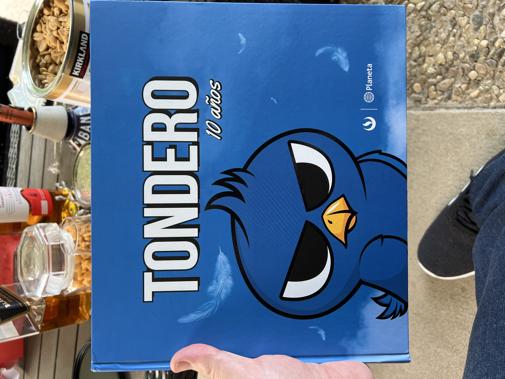

# Solomon Sessions / Involvy Meetings

 
     **Reset Sep 17, 2022**

  
     ICF is there in diligence process with no assurances yet. Involvy relationship is separate and runs project per project. Based on the conversation yesterday we will see where we are after we close ICF and if the relationship should be updated in any way. 

For Solomon it can be advisor for FP
Honor ~5% off net money minus expenses and costs and interests of what FP specifically gets:
Including indirect revenue from an additional degree of separation but only for the first instance in each case and no indirect inclusion into the list. 
Keep an updated list with the chance to make additions on a monthly basis and any new intros need to be verified of any pre existing relationships like the examples of Mary Ann and Jim Packer / Lionsgate

De Passe Jones
Art Bilger
Tondero
Cecilia Gómez
Alex Yemenidjian
David Ellender
CSSE
Mary Ann Halford
Christian Solomon
Lee Solomon
Lorraine Spurge
	Edwin J. Wang
	Michael Lewitt
Andy Heyward
Sandy Climan

Jim Packer / Lionsgate only limited to Foton Pictures even more strictly and at half the % rate.

Improving and elevating Ole perception of both Foton’s businesses and Carlos’ activities should be a priority
When FP becomes profitable for the year we will explore the possibility of bringing on Michael as an advisor on a monthly retainer as long as the company stays profitable on a quarterly basis. 

#foton/ventures #foton/alliances/involvy

  
     	☐	
  
     Fully utilize all of Involvy Board Advisors

 
 
     [https://www.involvy.com/](https://www.involvy.com/)
 

 
     **Wednesday Dec 1, 2021 at 1pm**

  
     Lunch w Christian Halsey Solomon

  
     **Saturday Nov 20, 2021 at 3pm**

  
     With Michael and a surprise cameo from Christian 

Follow up Ellender re CSSE Pipeline / 

Lucho Llosa in DR / Santo Domingo 

Nancy Josefsen from WME / We need to connect
Cecilia Gomez @ Tondero for opoortunities

  
     
  
     

————————

CSSE Press Release with Michael’s role - Congrats!
In-person meeting next week. How are you seeing things there? Timeline? 
Met with Isaac Palmer, who I asked if you knew earlier this week… he actually is helping Christian raise funds for Talespin and they are going to be sharing some information about the opportunity. Would be great to see if we can get involved and help in any way. 
The the Pictures side things are going well… still negotiating Gigante and are moving to get more out of our relationship with 30West. 
Games is simply fascinating, the possibilities and access to pipeline is very exciting. Hope to share more on that soon. 

on to the Main Event… Ventures… I am finding myself at a bit of a crossroads with regards to the different roads to take on things. 

  
     * Chase Institutional which takes us in one direction with regards to…

  
     	* Simplifying the proposal to less sophisticated mix

  
     	* Goalpost is farther away

  
     	* Higher revenue/fee potential

  
     	* Film is seen as very unattractive

  
     	* Tech / Games / IP and in that order seems to be the interest rankings

  
     	* Need for a larger pipeline to correspond with the 100M+ scale.

  
     		* Worry that quality might be sacrificed.

  
     * Go after HNWI and Family Offices

  
     	* Can play a more unique mix / secret sauce

  
     	* Goalpost is nearer.

  
     	* Lower revenue / fee potential

  
     	* Film less scary

  
     	* Interest ranking is the same

  
     	* Current pipeline capability is more than enough but would not like to leave any money or miss out on any opportunity to achieve scale.

  
     
Regardless we must…

  
     * More immediate need of advisors to solidify credibility.

  
     
This is the innovation economy… where flashy, buzzy and large with a focus on the flip being the name of the game. 
Makes it hard to approach with the mentality and perspective of a builder. 

  
     **Friday Oct 29, 2021 at 330pm**

  
     Involvy
Slow to start but very intrigued

Buckley / Berkeley
50 / Naz Afshar
Medical Recs?
Trainer / Gym Rec again?

 