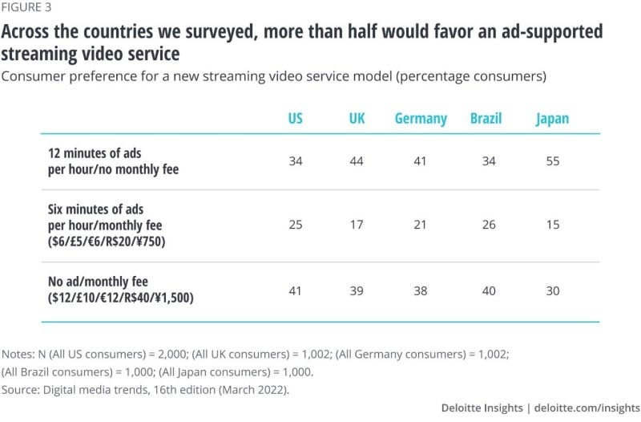
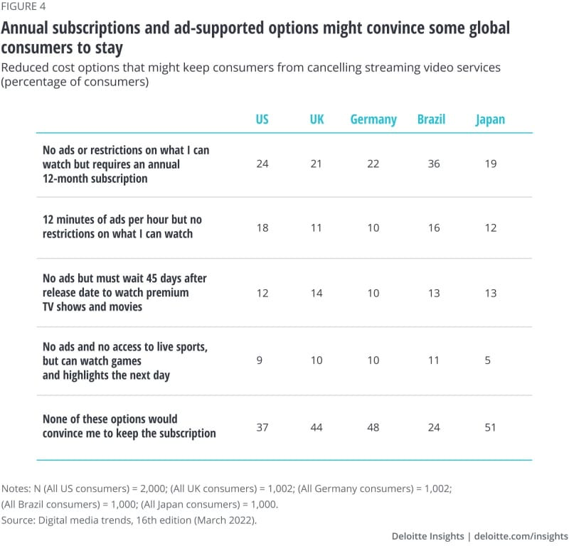

# Converging Trends / Findings / Hypotheses / Ventures

 
     #foton/ventures 

  
     **Creator Economy**

  
     Creator economy at every scale. From 300 million deals for Shondaland and Bad Robot to thousands of self made storytellers makers on social media platforms

  
     [https://www.theinformation.com/articles/content-alone-will-kill-the-creator-economy?utm_source=ti_app](https://www.theinformation.com/articles/content-alone-will-kill-the-creator-economy?utm_source=ti_app)
 
 
     [https://redef.com/original/age-of-abundance-how-the-content-explosion-will-invert-the-media-industry](https://redef.com/original/age-of-abundance-how-the-content-explosion-will-invert-the-media-industry)
 
 
     [https://www.fastcompany.com/best-creators-2022](https://www.fastcompany.com/best-creators-2022)
  
     

Platform Fees

  
     [https://www.theverge.com/21445923/platform-fees-apps-games-business-marketplace-apple-google](https://www.theverge.com/21445923/platform-fees-apps-games-business-marketplace-apple-google)
 
 
     **The User becomes part of the Content**

  
     From Games becoming a mainstream form of entertainment to the adoption of this aspect into other experiences like blockbuster films and toys, this trend has continued undeterred for the last 40 years and is only showing signs of acceleration. 
From UGC above down through crowdsourced creative processes like Press REC and Daisie or even the global covers of Marley songs, crowdfunding with direct financial commitment to the project happening, crowdsourcing 

  
     [Disney’s new Tron action figures put your face and voice into the Grid - The Verge](https://www.theverge.com/2023/3/17/23644498/tron-identity-program-lightcycle-disney-world-florida-action-figure-face-voice)
 
 
     **Games IP in Film/TV**

  
     from SXSW 2021 Panel
After years of substandard adaptations, videogames have surpassed books and podcasts to become arguably the hottest form of underlying rights for hit movies and TV shows. Sonic The Hedgehog brought in over $300m worldwide, the heavily game-inspired The Witcher was a global hit, and there are adaptations of The Last of Us, Uncharted, Halo and Resident Evil coming very soon. In this panel, a number of industry practitioners In this panel moderated by a top entertainment lawyer, break down what works when adapting videogames to film and TV. Topics covered will include: What kind of videogame intellectual property is most suited for adaptation into a movie or TV series? What do producers need to know when working with videogame companies? How can producers engage with game fans?

  
     **AI and ML assisted Creation**

  
     [Professional AI whisperers have launched a marketplace for DALL-E prompts - The Verge](https://www.theverge.com/2022/9/2/23326868/dalle-midjourney-ai-promptbase-prompt-market-sales-artist-interview)
 
 
     [DALL-E can now help you imagine what’s outside the frame of famous paintings](https://www.theverge.com/2022/9/5/23337580/openai-dall-e-text-to-image-generator-outpainting-native-function)
 

 
     **D2C Substack, Patreon etc combined with gutted traditional journalistic entities are isolating the world’s most elevated thinkers into echo chambers while mass media will replace them with clickbait and AI supported filler content. What is the long term impact of this.**

 

 
     **The Rebuilding of the Window system**

  
     To retain more subscribers, SVOD providers are exploring ways to shift the value proposition in their favor. Offering flexible pricing options could be the most direct path. Among consumers in all five countries surveyed, options that allowed people to watch ads in exchange for lower costs—or at no cost—are the most popular (figure 3). Ad-supported tiers could attract more cost-conscious subscribers. And even when there are lulls in engaging content, subscribers may not cancel their subscription if the cost is low enough.

  
     
  
     
Streaming services can also use gated content to offer consumers pricing tiers. Some companies are experimenting with offering premium access to everything at a higher price and cheaper options for less content. Our global study found that many respondents thinking of cancelling a paid SVOD service would likely keep their subscriptions if they could get a discount. Some would be willing to watch more ads, or less content, or wait 45 days to watch a new release (figure 4).

  
     
  
     
Bundles and perks can also support subscriber retention. If US respondents were thinking about cancelling an SVOD service, 37% said that access to first-run movies would convince them to stay, and 34% would stay if a loyalty program were included. Among Gen Zs and Millennials, about 51% would stay if their subscription included a gaming or music service or another SVOD service.

 ## Global and Decentralized 

[People Are Watching Netflix to Learn Foreign Languages
](https://www.indiewire.com/news/analysis/watching-netflix-to-learn-foreign-language-1234950555/)

## Diversity / Inclusion

[https://variety.com/2022/film/news/ucla-scholars-storytellers-creative-artists-agency-full-story-initiative-1235237460/](https://variety.com/2022/film/news/ucla-scholars-storytellers-creative-artists-agency-full-story-initiative-1235237460/)

 
     **Media / Studio / Platform Convergence**

  
     Regulation in Europe towards big tech

  
     **Web3** 

  
     Regulation of Crypto
The boom of the Metaverse

  
     [https://www.axios.com/the-many-worlds-of-the-metaverse-29176f60-0273-4f21-a31a-db8507dc0e32.html](https://www.axios.com/the-many-worlds-of-the-metaverse-29176f60-0273-4f21-a31a-db8507dc0e32.html)
 

 
     **Journalism in Danger**

  
     [https://www.axios.com/newsletters/axios-media-trends-511021be-1377-4bd5-b83c-e9736f3a37ec.html?chunk=5&utm_campaign=axios_app#story5](https://www.axios.com/newsletters/axios-media-trends-511021be-1377-4bd5-b83c-e9736f3a37ec.html?chunk=5&utm_campaign=axios_app#story5)
  
     

Future if Love / Sex & Human Relationships
Love Machines
Bicentennial Man
Robot & Frank

 