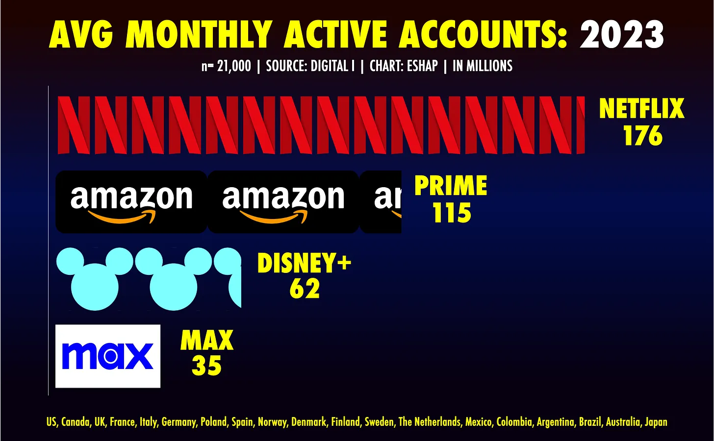
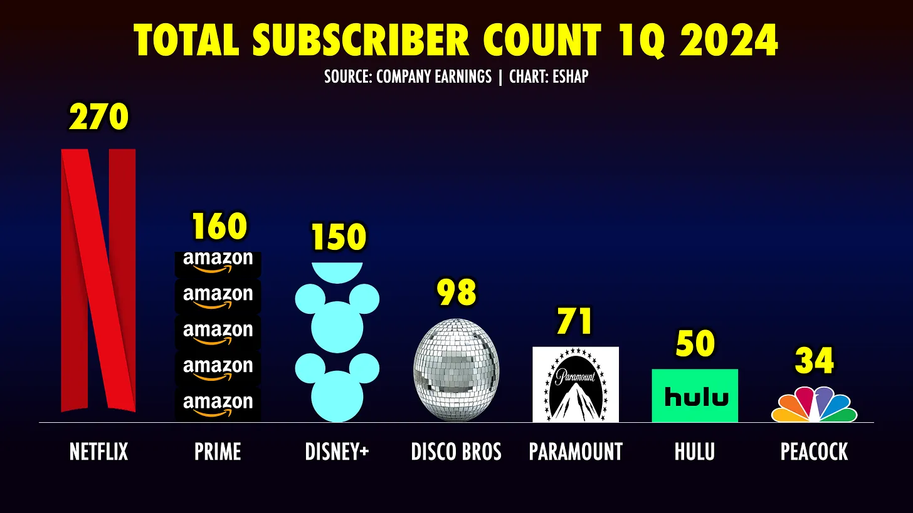
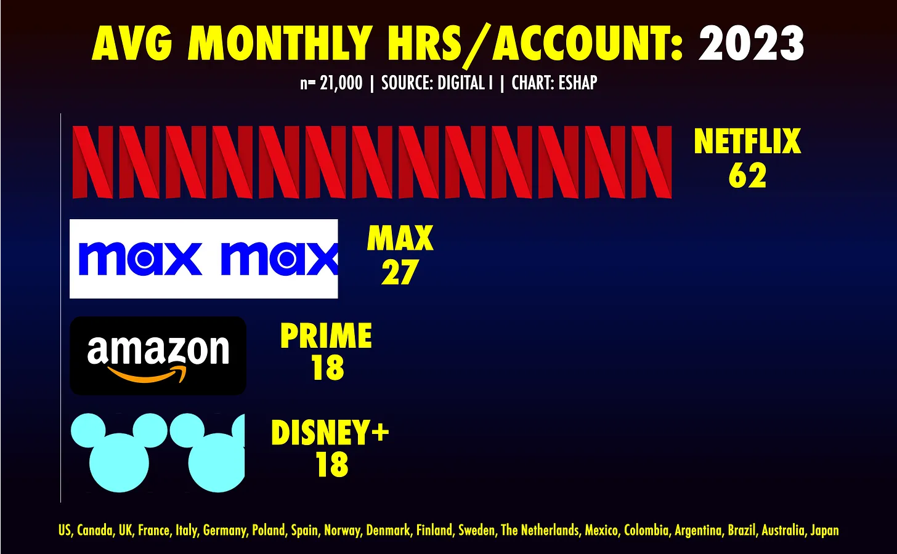
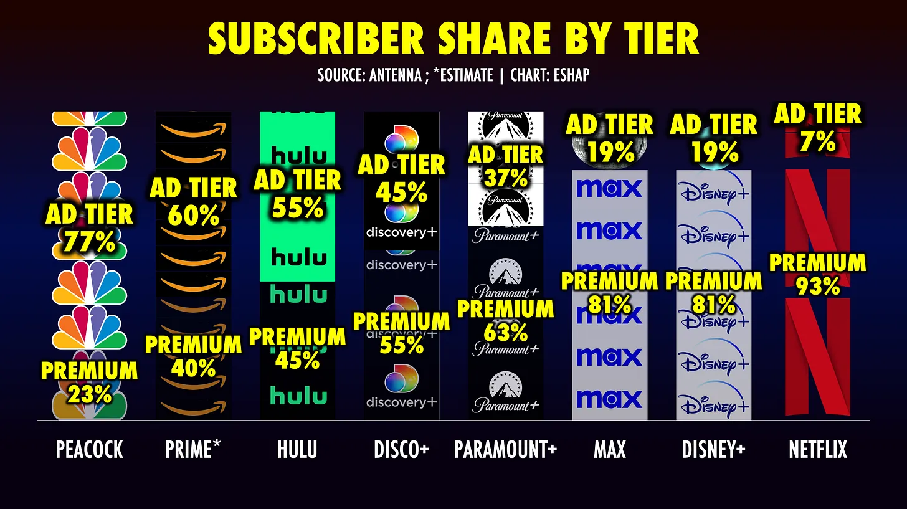
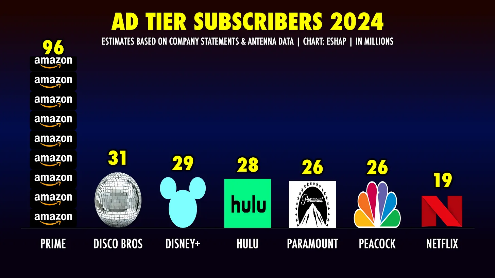
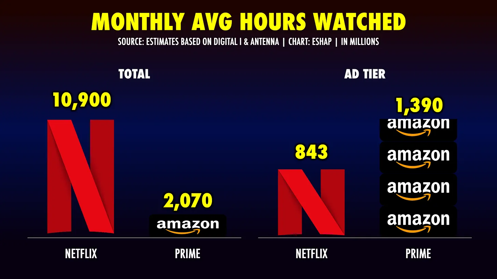

# Market Update VF3

Slide 7
	Interesante pero creo lo sumaría como otro bullet mas en el Slide 6. 

# Ole Business Intelligence Report & Media Market Update V2

Huele full a GPT. 

Slide 7
	Repetiría el slide con eliminando los broadcasters para poder ver mas claramente el detalle dentro de los canales de Pay Tv

Slide 11
	Would continue with insights beyond 2018. Particularly commenting on Live PD’s rise/fall and controversy as well as have some kind of reasoning for History’s own decline. 

Slide 12 
	Parecido al Slide 7 creo q lo debería dividir in enfocar en el pack de abajo para ver mejro el detalle. 

Slides 19, 21,23,25, 27, 28, 30, 33, 35, 37, 51, 52, 53,54,55
	Could be removed. 

Slide 32, 34
	Add graphs from other presentation showing viewership and ranker evolution for these networks during 2012-2023. Add total change from 2012-2023 in addition to yearly rate of change.

Slide 36
	Add graphs from other presentation showing viewership and ranker evolution for these networks during 2012-2023 and also redo text as it reads weird. Add total change from 2012-2023 in addition to yearly rate of change.

Slides 40, 41, 48
	Would bring these close together. Needs context of how OTT is essentially no ads premium and avod is basic cable and FAST is broadcast and presented linearly at least when seen as business models. Excluding YouTub is a major distortion. I think the story needs to be to see ALL of these as a combined opportunity and necessary strategic panorama to being a media player for today’s audiences. 

Slide 45, 46
	Looks like BS 

Slide 47
	Has to be old by now. 

Slide 49, 50
	Why does it flatten out like that? Is it that linear kind of consumption will top out? 

Add these slides and add Evan’s insights

Happy Monday War & Peaceniks. Let’s get measured!
The chart above measures ***total active accounts*** for each of the streaming services listed - Netflix, Prime, Disney+, and MAX. We get subscriber accounts from the companies, but this new data measures how many of those subs actually *use* the service each month.
For this chart I utilized new data provided to me exclusively by **[Digital I](https://www.digital-i.com/services-overview/svod-data-tools/)**, which recruits respondents around the world to install software to track their *actual usage* of their premium streaming services - without providing login credentials or any other private information. For the moment, Digital I only tracks these four services. **But, boy, is the data enormously telling.**
First, because this data is based on the actual usage of twenty-one thousand subscribers in nineteen countries, it’s far more reliable than a survey of the same or even larger size. Second, the data above awakens a major thought for the streaming media industrial complex, and the advertisers who are buying into it:
**The number of subscribers a service has, is far less important than the number of subscribers who actually use it.**

Netflix has *now* has 270 million global subscribers. According to this usage data, the average number of subs who *used* the service any given month in 2023 was 176 million. If Netflix averaged 244 million subs in 2023, that means 68 million Netflix subs *did not use it* each month. That said, an average of 176 million subscribers *did* use Netflix each month - 60 million more than the closest competitor, Prime.
Amazon Prime Video has approximately 160 million paying users. According to he usage data, an average of 115 million *actually* *use it* each month. If they had an average of 150 million paying subs in 2023, it means on average, 77% of Prime’s subscribers *do* *use it* each month. Prime has fewer monthly active accounts, but their share of active to non-active accounts is actually better than Netflix’s, with an average of 72% monthly active accounts.
The story inside the data is far worse for Disney and Disco Bros. They have both been losing subscribers in the past year, so we will use their current subs as benchmark. A seemingly unhealthy 59% of Disney’s 150 million Disney+ subs *do not use* the service in an average month. More worrisome, an average of 64% of MAX subscribers do not use the service each month.
These usage and non usage numbers matter for customer retention - users who do not use the service are far more likely to churn. But as these services all pivot to advertising to save their business models, these average active account numbers are akin to old school TV ratings. Netflix has an addressable universe of 270 million, 72% of whom use the service each month. It’s great that Disco Bros have 98 million subs. But only about *one third* of their install base actually watches the service every month. Not such an efficient environment.
An “active account” only tells you so much, however. Digital I’s data gets much more granular - down to title and genre, for example. In keeping with the season of Upfronts, I am focused on the data that matters most to advertisers. Let’s be honest, the *only real reason* to count viewers is to *count the money* they generate from ads.
When you dig into the data on total comparative usage across all users, the story gets more interesting and complex.
Netflix subscribers watch a LOT of content - more than 2X per user than the closest competitor, MAX. This data is user vs user, apples to apples. It shows just how much more engaged Netflix users are than everyone else - and *precisely* why their subscriber churn is *less than half* the industry average.
When these numbers get compounded by total subscribers, Netflix’s usage advantage explodes. Netflix generated 10.9 billion hours of monthly viewing in 2023. Prime users watched an average of 2 billion hours per month; Disney+ subscribers an average of 1.1 billion; and Max users an average of just 945 million hours.
**Netflix has more than 2X the monthly watch time of Prime Video, Max, and Disney+** ***combined*****.**

But let’s remember *why we measure.* The only real reason to *measure viewers* is to *measure the ad money* they generate. While Netflix’s numbers in this data really do add up to a massive advantage in premium streaming, when you add in *different* data from a *different* source, it tells a *different* story.
Most of the data above comes from **[Antenna](https://www.antenna.live/)**, who provides big data on SVOD subscriptions each month, using actual transactional data from millions of consumers’ banking apps (creepy, yes, but effective). They show that *just 7%* of Netflix subscribers use their ad tier. That equates to just 19 million ad tier users. When you factor their average active monthly accounts of 72%, this translates to just 13.6 million *active* Netflix ad tier users each month.
The split in the chart of ad tier to ad-free for Amazon is my estimate. In February, **[Amazon started charging their members $3 more per month to keep the ad free tier.](https://www.cnet.com/tech/services-and-software/ad-breaks-prime-video-what-you-should-know-about-amazon-latest-update/)** At the time, Alan Wolk of TV REV **[estimated than only 30%](https://www.tvrev.com/news/wir20240202)** of their members would choose to pay more, leaving 70% on the ad tier. I choose to assume that slightly more members upgraded - modeling my estimate after the Hulu split, which has held consistent over time.
If 60% of Prime Video subscribers are on their ad tier, it means Amazon now has 96 million ad tier users. In just three months, Amazon has garnered *four times more ad tier subs* *than Netflix*, and three times as many as Hulu, Disney+, Paramount, Peacock, and all of Disco Bros. Even when you factor in their active user drop-off of 23% Prime has 77 million average *active* ad tier accounts.
**While their video ad tier may be in its infancy, Prime is** ***already*****, by far, the biggest premium advertising tier in premium streaming.**

**This is how big of an advantage Amazon’s meteoric ad tier launch gives them:**
***What*** **we measure** ***when*** **we measure** ***matters*****.**
Amazon just held their upfront. Netflix is prepping for theirs. This data - from two different sources both *measuring* *actual subscriptions and usage -* shows that Amazon has a surprising lead in total available advertising inventory, despite a huge deficit in total time watched across their platform.
**It highlights a direct path to ad tier success for Netflix: increase subscribers.** For Amazon, despite a massive and long-term investment in content, their usage per user is disappointingly low. Their share of active users remains high, which is a testament to their over Prime Membership program. It’s *the* reason their launched their ad tier so smoothly. **The question is, can Amazon grow usage to make it worthwhile?**
For platforms like Disney+ and MAX, the lack of user engagement is evident all over. These numbers - monthly active accounts and hours of content per user - are telling diagnostics for a platform’s health. For advertisers, this data shows disengaged, periodic audiences. In a world of commoditized eyeballs, that does not inspire an investment of time or budget.
With Earnings Season and the Upfront colliding, this *combination* of data is intended to offer you new questions to ask at presentations, in negotiations, or when you read the headlines. It gives you context for why, after four years in business, Disco Bros doesn’t sell more digital and connected television advertising than they do. It offers a view of what drives Disney’s Hulu-Disney+ strategy. It demonstrates why Netflix *does not give out its ad tier sub numbers* in their earnings, and why they *want to stop* focusing on total subs as a KPI. It shows that Amazon learned well from everyone else’s ad tier launch mistakes, and begs the question if they know what to do *next*.
There will be a ton of data thrown around during Upfront and Earnings Seasons. It’s difficult at times to know which to use and/or how to use it. To help separate the data wheat from the measurement chaff, I usually ask ***“what really matters?”*** For *these* sexy new platforms, at *this* time of year, the *main* *question* is: ***“How many people are truly watching my friggin’ ads?”***
For the rest of us, for the rest of our careers, asking *the right questions* will be a big part of doing *the right things*. Access to new data is great… as long as you *know* what *you want to know*. I hope this prompted new questions for you. Let me know what you think below.
Enjoy the week!
***ESHAP***

