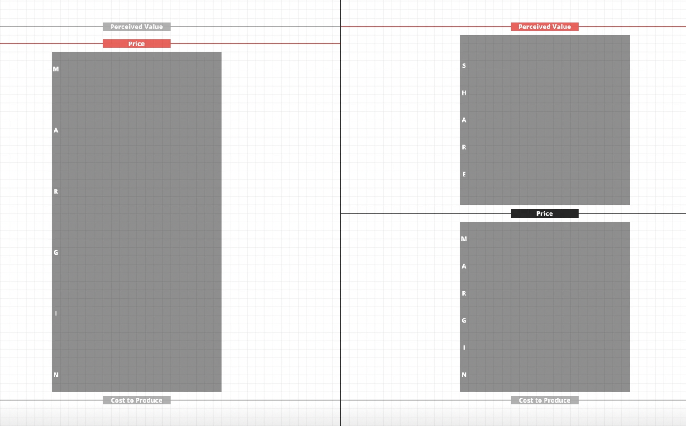
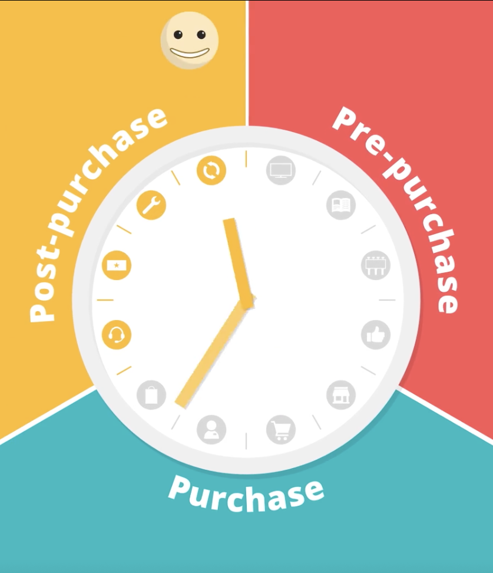
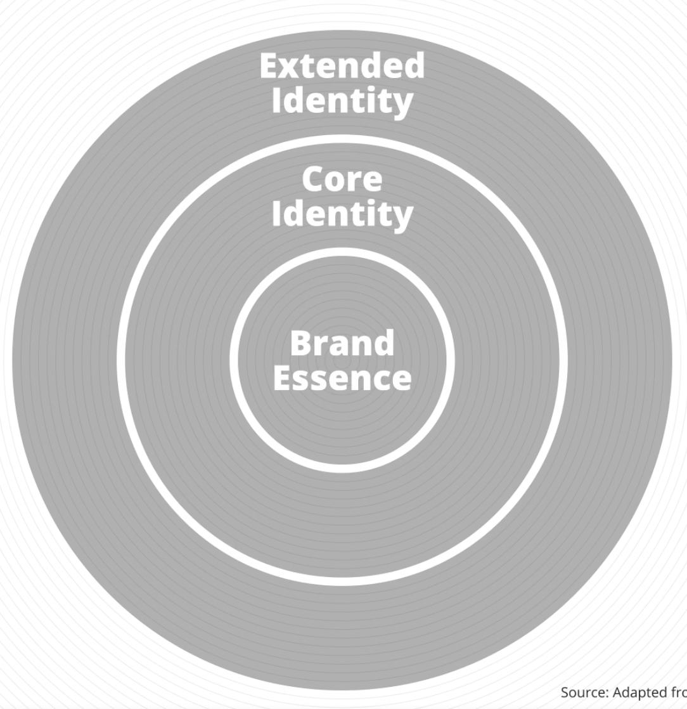
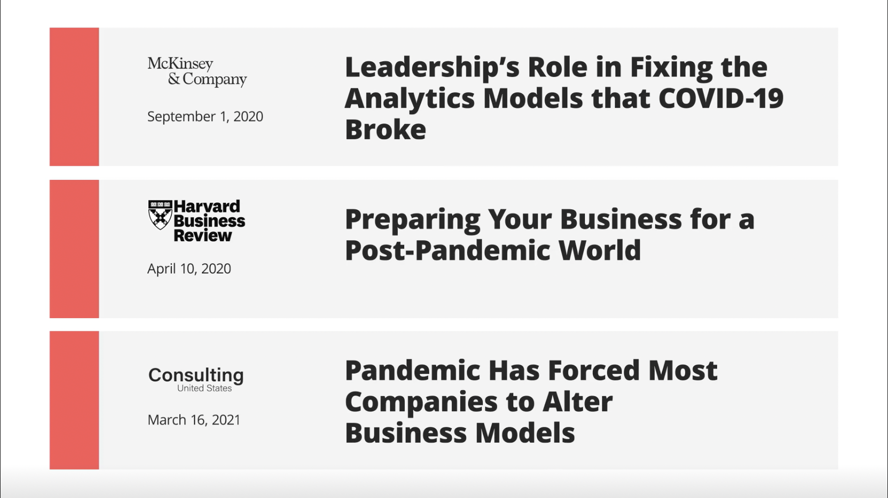
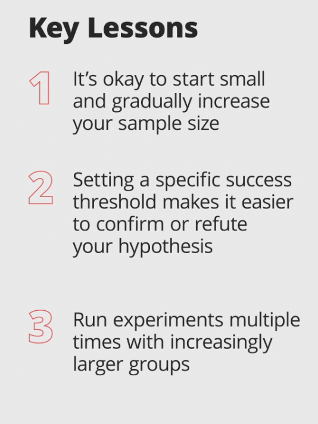

# Section 4

 
     #academia

  
     **Brand Strategy Sprint by Prof G, NYU Stern**

  
     Dec 4, 2021 at 15:36

  
     **Sprint Goals**

  
     1. Conduct a brand audit and clearly articulate a brand identity that’s differentiated, relevant, and sustainable vs. competitors.

  
     2. Make strategic recommendations for how to bring this brand identity to life across your customer journey

  
     3. Evaluate any brand for its ability to survive and drive value.

 
 
     **Module 1**

  
     **Three Lines of Business**

  
     Business is built upon the architecture, identity, and associations with brand. It is brand that implies value and serves as a guiding light for every strategic decision a firm makes.
What is a brand? 
A brand exists in the hearts and minds of customers.
It’s the intangible associations wrapped around a given set of products or services.
They’re the beliefs or feelings associated with an organization or company and, try as we might, can’t be simply distilled down into one product, logo or slogan. 
Brand is Latin for margin, and ideally, irrational margin. 
The ultimate benefit is, that this should all translate into above-market margins. 
At the very basis, branding is getting people to make irrational decisions. 

  
     * Perceived Value

  
     * Price

  
     * Cost to Produce

 
 
     
  
     
Trying to create a set of emotional associations that result in an irrational decision that increases the perceived value a given set of products or services.
A strong brand means greater perceived value, which typically translates to greater margins for that firm. 

  
     **Brand as Touchstone**

  
     for an organization, constantly referred to for every decision around strategy or capital allocation. 
a guiding light helping everyone understand the types of communications, the types of distribution, essentially how they behave and allocate capital, such that every man or woman is rowing in the same direction.
It creates a whole that’s greater than the sum of its parts. 
Brand not only serves as an external rallying point around differentiation, it serves as an internal guide and touchstone for behavior and capital allocation across the organization.
Probably the greatest value creator in business for about 50 years, the intangible association surrounding a group of service or product that resided in the heart - the brand. 

  
     **Ford vs Ferrari Case Study**

  
     The Three Lines Framework Take aways

  
     * Leverage brand to raise perceived value

  
     * Emphasizing value, accessibility, and more-for-less if effective for firms keeping price low

  
     * Exclusivity and Scarcity increase preceived value

 
 
     **Module 2**

  
     **The Clock Model**

  
     Relates to ALL the touchpoints that a consumer has with a brand 

  
     
 

 
     **Pre Purchase Branding**

  
     Nike as Reference / Tesla

  
     * Advertising

  
     * Trade Shows

  
     * Events

  
     * Sponsorships

  
     * Social Media

  
     * PR

 
 
     **Purchase Branding**

  
     * Distribution

  
     * Packaging

  
     * Store Design

  
     * User Reviews

  
     * UGC

  
     * Financing

 
 
     **Post-Purchase Branding** 

  
     * Customer Service

  
     * Loyalty Programs

  
     * Warranties

  
     
Too costly to invest in all 3 and most firms will typically pick one, and double down. 
Best or great in one and outsource the other two to industry standard. 
Customer at the center and look at the experience holistically around the brand. We’re gonna look at our competitors and ask, where is the opportunity to stand out?
Where is the variance? Where is the world headed? We have a bias and where with my limited capital can I have the greatest ROI or potentially become world-class relative to the other players in that sector?

  
     **Leveraging the Clock Model Case Study - Apple**

 
 
     1. Have a bias toward purchase and post-purchase branding

  
     2. Identify and invest in areas of variance among your competitors.

  
     
Each day branding becomes less about advertising… why? because advertising sucks…

  
     **Hurdles**

  
     Programs, capital allocation, efforts need to clear 3 different hurdles…
Differentiation / Competitors
	Stands out vs. other similar offerings
Relevance / Customers
	Matters to your consumer
Sustainability / Self
	Able to maintain its edge

Differentiation and Relevance are on opposite ends of a spectrum. 
The primary means of differentiation was marketing and branding…

Professor Sonia Marciano, “Examples of Moats or Impediments to Replication or Imitation of a Firm’s Market Advantages:

  
     * Legal Barriers

  
     	* Patents / Copyrights / Trademarks

  
     	* Operating Licenses

  
     * One-of-a-Kind Strategic Assets

  
     	* Superior Locations

  
     	* Human Talent

  
     	* Trade Secrets

  
     	* Intellectual Property

  
     	* Brand Names

  
     * Economies of Scale, Market Size, and Sunk Cost

  
     * Information Gaps and Complexity

  
     * Increasing Returns Advantages

 
 
     **Hurdles Case Study - Salesforce**

  
     1. Identify positioning that signicantly differentiates your firm

  
     2. Balance differentiation with relevance

  
     3. Build moats to sustain your competitive differentiation

 
 
     **Module 3**

  
     **The Brand Identity Model**

  
     
  
     
It is a model that intends to take the intangible and make it tangible.

  
     **Conduct a Brand Audit**

  
     	Positives and Negatives associated with your brand

  
     **Fix the negatives
Elevate the positives**

 
 
     * Image is what you are

  
     * Identity is what we want to be… it should be just outside our grasp because in fact it is

 
 
     **Brand Essence**

  
     What we think of immediate, almost a reflex, what is the flavor, the smell that they have almost instinctively.
The one thing that comes to mind when you think of the brand. It should be aspirational and simple, embodying the visceral feeling evoked by the brand.

  
     **Core Identity**

  
     Timeless, highly important elements of the brand that just miss to being included in the essence. 
It is what adds texture and substance to the brand essence and can help differentiate between two brands with similar essences.
It affords multiple companies to carve out their own space in the same market. 

  
     **Extended Identity**

  
     Series of elaborations that bring the brand to life. 
	Brand as Person
	as Product
	as Organization
	as Symbol

Quality Cues
Product characteristics that might seem trivial that serve as shortcuts to signal excellence and quality with outsized value to consumers. 
	Pricing
	Product Traits
	Packaging 
	 
Laddering
Ladder on a feature that is easy for customers to understand
Implement laddering across the customer purchase journey
Ladder on a feature that passes the three hurdles

  
     **Module 5
Brand Architecture**

  
     **Masterbrand
Sub-Brands
Endorsed Brands
Invisible Brands**

 
 
     **Expanding Beyond a Master Brand**

  
     1. Access new, distinct customer segment

  
     2. Enter new markets

  
     3. Specific value proposition

  
     4. New associations with parent brand

  
     5. Eliminate Channel Conflict

 
 
     **Leveraging Brand Architecture**

  
     1. Ensure brand architecture is clear to the customer

  
     2. Sub-brands shouldn’t be tied to a channel

  
     3. Avoid sub-brands that dilute your masterbrand

 
 
     **The Thermometer Model**

  
     * NAME

  
     * LOGO

  
     * PRODUCT

  
     * DISTRIBUTION

  
     * PRICE

  
     * COMMUNICATIONS

  
     
The evidence shows that successful truly global brands are actually very local. Their consumer success is based on relatively low freezing points. 
Higher freezing points tend to appear with products that are appear to a cohort that is much more homogeneous globally… Luxury Brands, Brands focused on teens, B2B financial services brands. 

  
     **Nike’s Use of the Thermomemeter**

  
     Very High Freezing Point

  
     1. Keep name and logo below the freezing point to drive global brand awareness

  
     2. If you own your own distribution, a global strategy unlocks eoncomies of scale.

  
     3. Give large markets the flexibility to localize pricing and communications to remain relevant.

 
 
     **Tenets of Crisis Management**

  
     1. Top person responds

  
     2. Acknowledge the issue

  
     3. Overcorrect

  
     

————————

  
     **Data & Analytics Sprint by Tom Davenport, PhD Babson College**

  
     Nov 5, 2021 at 20:29

  
     **Project Peer Feedback / Chart+Foster**

  
     **Insight**
 
 
     * Exemplary. The problem was clear and the data used was clever and it seems like there would be many more interesting variables to explore.

 
 
     **Actionability**
  
 
     * Exemplary.

 
 
     **Presentation**
  
 
     * Exemplary.

  
     
Was very intrigued by the company and product. Believe that there was a lot of valuable information that might have been excessive if this was used to garner internal buy-in to the analysis. 
Found the variables to cover a good spectrum for this initial search and the price sensitivity based filtering would probably yield good results. 
Attractive visuals and colors but with some repetition that made it a bit overwhelming. 
All the best on the analysis if this is something you are actually doing. 

  
     **Project Peer Feedback - Shekel JHP**

  
     * **Insight**
  
     Exemplary

  
     * **Actionability**
  
     Exemplary

  
     * **Presentation**
  
     Exemplary

  
     
What a fascinating mission and don’t know much about this but seemingly impressive levels of recycling in Singapore. Have been lucky to attend conferences where I have learned about the fashion industry’s impact on our planet and hope that this is real and would love to help in any way we can to bring awareness to these kinds of initiatives. 
From a pure business standpoint I find it hard to believe that this is actually effective without the clothing makers and brands bear some of the impact in their costs as almost a marketing or positioning standpoint and the customers moving their preferences over time based on these values. Still could be immensely lucrative for brands if it indeed becomes such a strong differentiating factor in consumer preference. 
I think everything was presented clearly and would only mention that that some of the presentation would have benefitted from more polish and I find Data Source number 2 seems to be more a combination of other variables to which it would have been great to have more clarity on. 

  
     **Project Peer Feedback Tactical Helicopter Squadron**

  
     **Insight**
 
 
     * Exemplary

 
 
     **Actionability**
  
 
     * Exemplary

 
 
     **Presentation**
  
 
     * Proficient

  
     
Beyond impressed by the range of projects that have had the opportunity to give feedback to. I believe your presentation was clear and think I might not be following on some of the terminology but it seems logical. The presentation would have benefited from some polish and I think come of the slides got cut off making hard to read all the text. 
Best of luck with the analysis. 

  
     **Project Structure**

 

 
     **Core Sprint Components**

 
 
     **Content**

  
     * Lessons

  
     * Case Studies

 
 
     **Workbook
Slack Community
Live Case Discussion
Livestream Class
Project**

 
 
     **Module 1**

  
     **Analytics**

  
     a systematic attempt to use data and quantitative analysis to tell us something about the world. In order to better understand the past or somehow predict future events.

  
     **Descriptive Analytics**

  
     The past… financial reports, sales reports.

  
     **Predictive Analytics**

  
     Past data to predict the future

  
     **Prescriptive Analytics**

  
     Actually tells you what to do… 

  
     **Analytics Sequence**

  
     **Step 1 / Collecting the Data**

  
     Quality of the data like in raw materials is essential
Quality Factors
	Size / Smaller is better in traditional analytics. 
	Reliability / Trust in how it was collected.
	Uniqueness / If it is publicly available it provides no competitive advantage
	Accessibility / Across the organization	

  
     **Step 2 / Running a Model**

  
     AI vs Traditional Analytics

  
     **Step 3 / Quality Assurance
Step 4 / Deployment**

  
     Putting it into production and use…

  
     **Human-in-the-loop: When a person monitors the output of machine learning.**

  
     
Stitch Fix - Takeaways

  
     1. Treat analytics as a competitive advantage.

  
     2. Use analytics to strengthen your relationship with customers.

  
     3. Make the people behind the process a priority

 
 
     **Lesson Takeaways**

  
     1. Audit your current data collection methods for quality based on qualities listed above

  
     2. Identify unique measures of performance

  
     3. Data is a vital resource for your firm - treat it with care

 
 
     **Case Study Takeaways: Domino’s**

  
     1. Evaluate and collect data across your entire customer journey

  
     2. Democratize interpretation of, and action on, data

  
     3. Leverage software suppliers to capture and organize your data

 
 
      **Module 2**

  
     **Framing the problem correctly**

  
     1. U DATA I

  
     	1. Untested

  
     		1. Previous studies to reference?

  
     	2. Defined

  
     		1. What, where and why?

  
     	3. Acute

  
     		1. Important to the organization, worthy of the time and attention of anlytics

  
     	4. Testable

  
     		1. Feasibility

  
     	5. Actionable

  
     	6. Impactful

 
 
     **Key Takeaways**

  
     1. Analytics is an iterative process

  
     	1. Evaluate Data

  
     	2. Frame the Problem

  
     	3. Identify Opportunities

  
     2. Evaluate a problem on whether it’s U DATA I

  
     3. Resist rushing into analysis - spend to fully understand your problem

 
 
     **Case Study LexisNexis**

  
     Key Learnings

  
     1. Make your problem defined and testable by framing it around your core competencies

  
     2. Focus on untested, acute, and impactful problems to capture market share UAI

  
     3. When it comes to actionability, consider the range of use-cases and applications

 
 
     **Module 3 / Designing your Model**

  
     **Analytics Blueprint**

  
     * Problem

  
     * Hypothesis

  
     * Variables

  
     	* Dependent Variable

  
     	* Data

  
     * Independent Variable num 1

  
     	* Data Point 1

  
     	* Data Point 2

  
     	* Data Point 3

  
     * Independent Variable num 2

  
     	* Data Point 1

  
     	* Data Point 2

  
     	* Data Point 3

 
 
     **Data Categories**

  
     **Binary**

  
     Yes / No

  
     **Categorical** 

  
     Labeled groups

  
     **Ordinal**

  
     Numerical data applied to labeled groups 

  
     **Numerical**

  
     Most precise
Age / Income

  
     **Key Takeaways**

  
     1. Hypotheses are educated guesses - keep an open mind and solicit input from key stakeholders

  
     2. Whereas machine learning can process many variables, traditional analytics runs better with fewer variables

  
     3. Evaluate data complexity when designing a model - when in doubt, keep it simple

 
 
     **Case Study / FICO**

  
     **Key Takeaways**

  
     1. Frequent, high-stakes decisions call for strong confidence in analytics

  
     2. Incorporate various types of data to add context to an analysis

  
     3. Assign different weights to independent variables and data and update and monitor them over time based on their predictive success.

 
 
     **Analyzing Results**

  
     and avoiding Big Data Hubris or Self fulfilling prophecies

  
     **Checking the results**

  
     1. Do the results confirm or refute your hypothesis

  
     	1. Do your independent variables do a good job of explaining your dependent variable?

  
     2. How confident are you in the model?

  
     	1. The Confidence Interval (n) (95% minimum is acceptable)

  
     		1. A measure of how widely a result applies across the broader population being studied

  
     2. Do you understand the correlation and causation?

 
 
     
 

 
     **Key Takeaways**

  
     1. Results aren’t always conclusive - expect to iterate your models

  
     2. Question results that defy the norm

  
     3. Don’t rush a decision

 
 
     **Moderna Case Study**

 
 
     
 

 
     **Module 4**

  
     **Storytelling with analytics**

  
     Following a traditional 3 act structure

  
     * Act 1 - Our Hero’s Problem U DATA I

  
     	* Captivating beginning that establishes a problem.

  
     * Act 2 - Results

  
     	* Middle that reveals the source of the problem

  
     		* What independent variables helped you best predict the outcome

  
     		* What does this suggest

  
     			- What correlation or causation are shown between independent and dependent variable

  
     			- Mistaking correlation for causation can inspire mistaken confidence… % of the variation.

  
     			- a b c d e f g h i j k l m n o p q r s t u v w x y z

  
     * Act 3

  
     	* Resolution

  
     	* Final act where an answer resolves the problem.

  
     	* Recommended course of action, why they should take this action, and what does it require from the structure to do so.

  
     		* Analyzed by

  
     			- Cost

  
     			- Change

  
     			- Collaboration

  
     			- Customers

 
 
     **Key Takeaways**

  
     1. Keep your audience engaged by saving recommendations for the end of your presentation

  
     2. Make data easier to grasp by adding context

  
     3. Keep visuals simple don't overcomplicate things

 
 
     **Competing on Analytics**

  
     DELTA Framework / how do improve my analyticial capabilities

  
     * D / Data

  
     	* Gather and leverage high value data

  
     * E / Enterprise Strategy

  
     	* Networked System instead of silos

  
     * L / Leadership

  
     	* The benefits become more pronounced in line with executive buy-in to the strategy

  
     * T / Targets

  
     	* Takes one aspect of your business and lays out a lofty but reasonable road map on how to get there

  
     * A / Analysts

 
 
     **Key Takeaways**

  
     * Use the delta model to score your data and analytics competencies - no matter your role

  
     * Mature anlaytical companies rely on quality data and processes - and empathy.

 

