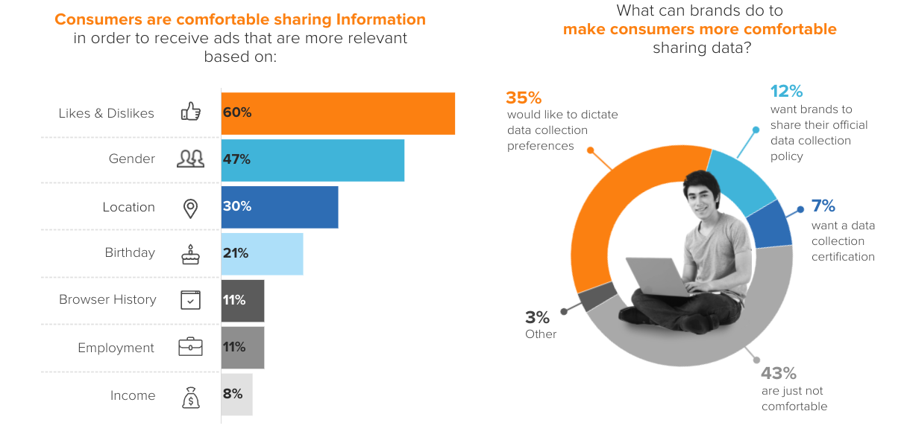

# The Future of Advertising

 
     [Facebook’s profits depended on trampling it users’ privacy. Apple put a stop to that. Now what?](https://macdailynews.com/2022/11/17/facebooks-profits-depended-on-trampling-it-users-privacy-apple-put-a-stop-to-that-now-what/)
 
 
     [NBCUniversal Starts Selling Ads Against New Currencies – The Hollywood Reporter](https://www.hollywoodreporter.com/business/business-news/nbcuniversal-advertising-new-currencies-peacock-ad-expansion-1235264348/)
 
 
     [Bill Rouhana, CEO Of Crackle Parent Chicken Soup For The Soul, On Netflix & Disney+ Ad Tiers, How Roku “Missed The Point” And Why His Acquisition Of Redbox “Scared The Daylights Out Of Wall Street” – Deadline](https://deadline.com/2022/10/bill-rouhana-ceo-crackle-chicken-soup-for-the-soul-netflix-disney-roku-redbox-wall-street-streaming-1235142389/)
 
 
     [Yahoo and Taboola Enter 30-Year Commercial Agreement, Developing a Leading Offering for Advertisers, Publishers and Merchants on the Open Web; Partnership to Generate Approximately $1 Billion in Annual Revenue](https://finance.yahoo.com/news/yahoo-taboola-enter-30-commercial-112000890.html)
  
     

Trends for 2023 and beyond

  
     **Artificial Intelligence Will Play A Much Larger Role**
 
 
     **Ads Will Need To Be Socially Relevant And Value-Aligned**
 
 
     **Personalization Will Take Center Stage**
 
 
     **Proximity Marketing Will Be A Priority**
 
 
     **Companies Will Take Greater Advantage Of QR Codes**
 
 
     **Social Proof Will Become The New Advertising Currency**
 
 
     **Companies Will Have To Create Even More Content**
  
     
There is an increasing emphasis on content production these days—especially going into 2023. Influencers are building their own brands and, in response, brands are becoming content creators themselves. As users increasingly consume more digital media, successful businesses in 2023 will need to produce more of their own content to compete and manage their advertising budgets. By sharing blog posts, videos, photos and more, brands will be able to better optimize their marketing budgets to grow and scale in 2023. - 
  
     [ Firas Kittaneh](https://yec.co/u/999ca476-a547-40d1-81ff-80f8cc5b769e)
  
      , 
  
     [ Amerisleep Mattress](https://amerisleep.com/mattresses/)
  
 
     **Augmented Reality Will Become More Widespread**
 
 
     **Advertisers Will Need To Grapple With Changing Data Regulations**
 
 
     **The death of device ID**
 

 
     
 
 
     **The renaissance of contextual targeting**
 
 
     **“Endemically matched ads, or those that align with and match the surrounding content based on vertical (e.g. auto ad near auto content), drove a 23% lift in activation within the part of the brain responsible for memory of practical details, which includes key messages, calls to action, and branding elements.“**
 
 
     **User experience comes first**
 

 
     
 
 
     **Brand safety as an indispensable part of digital advertising**
 
 
     **The future of digital ads lies in user willingness to opt-in**
 
 
     **Video advertising as the key to reaching younger audiences**
 
 
     **Mobile takes over the advertising industry**
 
 
     **Conclusions**

  
     The future of advertising lies in inobtrusive technology that follows the latest privacy directives and provides a high-quality user experience. The choice of sharing data belongs to every consumer. The value provided by companies will determine how much of that data will be shared. And if you don’t have the means to shape the brand’s relationship with consumers, you need to switch to privacy-oriented contextual advertising. 
NewProgrammatic provides ad formats that can shape the future of digital advertising. 
 