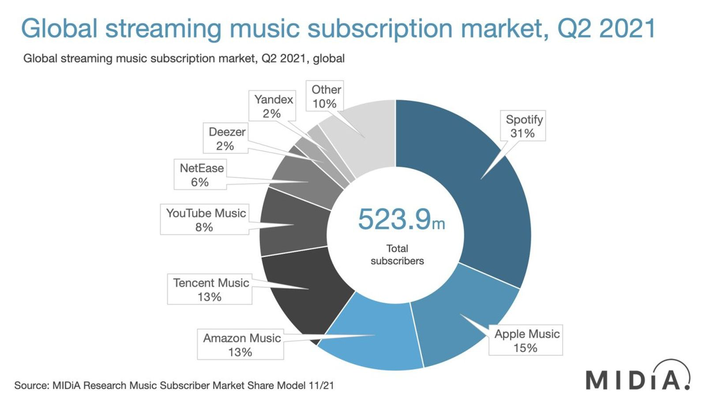

# The Pay TV and VOD correlation to Music Industry

 
     #foton/intel/industry #artist/writer/industry

  
     **The Sequence**

  
     Broadcast
Physical 
Digital
Streaming

Piracy seeping in at the fringes to greater or lesser degree for each. Find out how it evolved and fluctuated. 
If hypothesis is true, then this chart reflects how the SVOD market will eventually shake out… (Find current SVOD Market Share for comparison, break down by country) Clear leader doubling the second tier… the second tier challenger… the up and comer… the specialized. 

  
     
 
