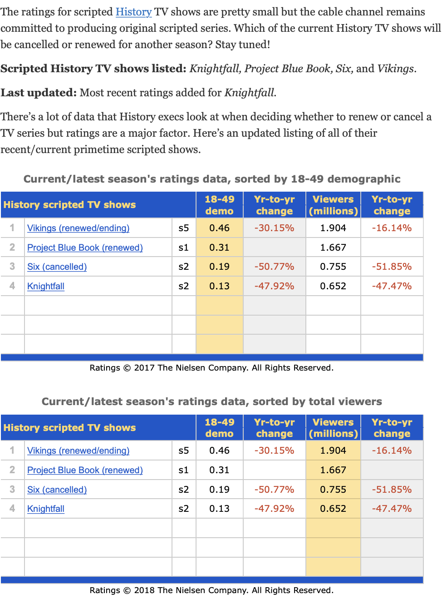

# #Ole/A+E/CSM

 
     **#Ole/A+E/CSM**

 

 
     **CSM Jun 24, 2021**

 
 
     **Research**

 
 
     **A&E**

  
     
OP continues with the influence of where A&E was oging a couple of years ago. Interesting to see how even in Colombia we are seeing social movements that make this content less ideal for the situation. 

  
     **Lifetime**

  
     
Acquisitions
HIP from France looks great
Really amazing job in selecting the series titles for Acq… numbers even look reasonable. 

  
     **History**

  
     
New Content Director from Discovery got great feedback from initial digging I did with Discovery people. 

  
     **CSM Nov 9, 2020**

  
     
We need clarity on ownership using formats for OP. We as partners are getting the bad side of that deal. 

  
     **A+E**

  
     
Understand that Cold Case has only 7 seasons and we are on our 6th… what do we have in mind to try and retain this audience on the channel?

  
     
  
     

OP
Contraband / Lots of her talking, intrigued but quite the change in pace compared to all the other content we are seeing. 

  
     **Lifetime**

 

 
     
 

 
     **CSM July 23 2020**

  
     
Research Presentation

  
     **A&E**

  
     
Carmen, Juan María, and their corresponding network of producers is delivering excellent results. Additionally 

Content Delay - Seems like we are enjoying the results of this kind of violent content as well as effectively going local, and might be getting into the same loop as domestic. Could it end the same way? Is the geopolitical delay slower? 

S38 The TV movie package they have should not proceed. 

  
     **History**

  
     
Great idea to have the separate link for the videos. 

Washington flop is worrying. 

  
     **PLA Call // Jun 4, 2020 at 12:15**

  
     
The way that this is handled is very reactive. We should not keep following the management’s pace and manner with this aspects of our business. Believe that this would be better handled if strategized by Ole moving forward. Taking into account the management’s strategy and asks but prioritizing partner relationship and effectiveness of the asks themselves. 

  
     **GENERAL**

  
     
PLA
2016 FR price per hour for A&E and THC is $20,750; for Lifetime it’s $13,720 and for H2 it’s $7,901; for re-runs, the price is 50% of the FR price.
Clear difference on how productions are financed. Global perspective. Much more along the lines of Netflix and the big players seem to be aligning.

  
     
 
 
     **A+E International Team**

  
     
Patrick Vien / Head of International
Liz Soriano / Op / Logistics / Fulfillment
Melissa Madden / Int'l Marketing reports to Tom Lucas
Laura Fleury / Prog Strategy International / 
Tim Nolan / Brand Consultant / Ex Lifetime Marketing

  
     **PLA Call May 27, 2020 at 12:45**

 
 
     * Extra 500k that was included in the PLA was born as an H2 bonus that stayed in. 

  
     	- Reasoning was to give us the freedom to license cross-catalog. 

  
     	- I remember this being part of the MG for the expanded rights. Is this not the case?

  
     	- 500k has a credit mechanic that has not been used effectively or even returned. 

  
     * This was all born out of getting extra runs or more flexibility on that. 

  
     * PLA commitment 

 
 
     **September 2019 / Bogotá**

 
 
     **Research**

  
     
Results are positive but once again data and metrics are inconsistent. 

  
     **NonLinear**

  
     
IFOW strategy is necessary for relevance. The stubbornness towards this matter is distorted by HBO and A+E interests. If the PLA gives us the capacity we should do it as much as possible to extract the value of such an expensive content commitment. 
How much revenue is YT generating?
Promo code plan for NonLinear access to behind the wall for a limited time or to specific content. 
HBO has become an obstacle. Paseo is causing problems. Social login incapacity is unacceptable. 

  
     **A&E**

  
     
Narcos/A&E PR worry from US. Can this become a limitation?

  
     **History**

 

 
     **PLA**

  
     
Download rights 48-72hrs requested to board. This is necessary to stay relevant. 
Additional requests from team to modify PLA for full stacking. 

  
     **US TEAM PRESENTATION Sep 2019**

 
 
     **History**

  
     
Program Types
Scripted
Unscripted
Mega-docs
History Films
Theme weeks
	Alien Week (NEW)
	Car Week
(NEW) History’s Greatest Mysteries

  
     **Nights of the Week**

 
 
     **MON**

 
 
     * Fan Favorites

  
     	- Pawn Stars

  
     	- Pickers

  
     **TUE**

 
 
     * Unsolved History

  
     	- Project Blue Book

  
     	- The Curse of Oak Island

  
     	- Curse of Skinwalker Ranch

  
     	- History’s Greatest Mysteries

  
     **WED**

 
 
     * Younger Male

  
     	- Forged in Fire

  
     	- Strongest Man

  
     	- Kings of Pain

  
     	- Eating History

  
     **THU**

 
 
     * American Originals

  
     	- Swamp People

  
     	- Mountain Men

  
     	- Alone

  
     	- Ax Men

  
     **FRI**

 
 
     * UFOs & The Unexplained

  
     	- Ancient Aliens

  
     	- In Search of…

  
     	- The UnXplained with William Shatner

  
     	- Unidentified: Inside America’s UFO Investigation

  
     **Takeaways**

  
     
Circus / Jackass / Science and History / Big Machines / Spy Tools

  
     
 

 
     **A&E**

 
 
     **Night of the Week**

 
 
     **MON**

 
 
     * Live Rescue

  
     **TUE**

 
 
     * Front Row Experience

  
     	- The First 48

  
     	- Intervention

  
     	- Kids Behind Bars

  
     	- 60 Days In

  
     	- The Accused: Guilty or Innocent

  
     **WED**

 
 
     * Paranormal

  
     	- Ghost Hunters

  
     	- Psychic Kids

  
     	- Celebrity Ghost Stories

  
     **THU**

 
 
     * Crime & Justice

  
     	- PD Cam

  
     	- Wanter

  
     **FRI**

 
 
     * Live PD

  
     **SAT**

 
 
     * Live PD

  
     **SUN**

 
 
     * Acquired Theatrical Films

  
     **TAKEAWAYS**

  
     
Completely at odds with their directions. On one side it is full on paranormal content. On the other it is police, rescue, etc. programs.

  
     **Lifetime**

 
 
     **Nights of the Week**

 
 
     **MON**

 
 
     * Theatricals

  
     	- Pretty Woman

  
     	- Big Daddy

  
     	- Magic Mike XXL

  
     **TUE**

 
 
     * Big Characters / Big Talent

  
     	- Supernanny

  
     	- Little Women Franchise

  
     **WED**

 
 
     * Real Love & Relationships

  
     	- Married at First Sight franchise

  
     	- Bride & Prejudice

  
     	- The Big Fat Wedding Walk	

  
     **THU**

 
 
     * Justice for Women / Off-Net Series

  
     	- Surviving R Kelly: The Aftermath

  
     	- King of Queens

  
     **FRI**

 
 
     * Justice for Women / Off-Net Series

  
     	- Surviving R Kelly: The Aftermath

  
     	- King of Queens

  
     **SAT**

 
 
     * Movie Premieres + Companion Docs

  
     **SUN**

 
 
     * Movie Premieres + Companion Docs

  
     **Movie Buckets**

 
 
     * The untold stories of real women

  
     * Ripped from the headlines

  
     * From Book to Screen

  
     * It’s a Wonderful Lifetime

  
     * Hope & Inspiration

 
 
     **VC / A+E post CSM meeting**

 
 
     [#ole/vcstudios](bear://x-callback-url/open-tag?name=ole/vcstudios)
  
     
VC is not notifying their client correctly. 
Client claims a lack of transparency.
They need to know what gets sent to HBO and when.
VC hides behind Nahomi
25 de Agosto Cablevisión Argentina no había recibido Blue Book y lo tenían como programa destacado.
Estamos quedando muy mal ante los afiliados.
Cesar se entera de las cosas en reuniones con HBO pero no de parte de VC
HBO seems to be to blame as they were not technically ready to receive files under the XVOD format. A+E getting charged by HBO since last year for a functionality that has not been delivered correctly.
Additionally HBO keeps changing aspects of the file that lead to both VC and AE spinning their wheels and wasting resources.
VC made a Masstec update which lead to comms issues between that an Avid leading to multi week delay.
Analog engineers are not best equipped for today’s issues and operation.
Issues between lists of what gets sent from CCS. Laura has a dedicated person to deal with the mistakes made by caracas. XML errors, metadata errors, etc
We have lost all time that was avail to get the library ready and now we have almost nothing. In order to catch up it would requiere an AE investment.
We need to stop saying so openly “en Caracas la gente no vale nada” el costo es en equipos.
CSM just concluded to increase hours and on the tech side one of the potential solutions would ve to reduce the hours below even the current level. 
This is delaying the sale of XVOD and if they were ready to sell we would be at less than half the hours committed to.
Metadata could be sent from US. Currently they are loading manually.
GFX issue has gotten worse but I find VCs answer is unacceptable. 
This is quite the blame game. There are many issues along the chain.
Analogy was bandaids on keep going.
Juan needs to stop complaining about how hard their job is. They need to provide solutions.
RecordTV is software solution for metadata loading. Instead we choose to have cheap employees do it. VC should be the on get this service not the network.
Juan mentioned they should get it and they answered that is exactly what VC is there for.
Now Juan mentioned that to even have this integrated into ForeTV would be very costly and time consuming.
We are we still using ForeTV.
Tonny recommends that AE needs additional ops people to support Nahomi.
Providers cant connect w VC. Lack of availability or no one even speaks english.
VC is not following up with content receiving. 
Human resource issues on both sides that are at least partly responsible for these issues.
OP approval processes are broken. Segment 1 of Metropoli was sent by the producer weeks ago and VC has done nothing except make mistakes.
QC has 3 days per piece of content.  After already 2-3 days to even receive it.
Internet connections are also an issue. Bandwidth is a big issue. How can this be? MPLS is limited to 10-20mbit
50mbps in Caracas.

  
     **March 2019 / São Paulo**

 
 
     **History**

  
     
Blue Book programming strategy to be confirmed. 
They are assuming they will have stacking capability and based on latest it is not possible.
Pagani: Social media as a tease tool and a channel for us to build up expectation for our big premieres and events. 
Una Idea to be funded solely by Ole Communications?

  
     **A&E**

  
     
Patrick: Liz do they know about the shows that will not be coming back?
Liz: 
  
     *shakes head*
  
     
On Air Fail

  
     **Lifetime**

  
     
On Air Fail

  
     **Pre Read Notes**

 
 
     **A&E**

  
     
S7 Is this a positive trend general to Pay TV or is it only us?

  
     **A+E Monthly Content Calls February 14 2018**

 
 
     [#Ole/A+E/csm](bear://x-callback-url/open-tag?name=Ole/A+E/csm)
  
     

History
Liz is on and leading the call. Corporate reshuffling and they referenced a new boss.
Hernan performed great. Second best scripted premiere ever. Triple digit over PT avg. Second episode even higher ratings. H ranked #2 / #3 most targets and 
Second season renewal immediately.
Production starts in less than a month. Azteca is on board. Amazon not yet.
Next week board meeting decision for next season. If the results and deal terms hold we should approve this swiftly.
Advertising revenue is a huge worry.

 
H2 is the elephant in the room. Does it make sense to keep it on life support if we do not see growth prospects in the market?
CSM and Monthly calls need to include costs and economics that were previously avoided in these conversations. This information is essential for effective decision making in these matters even at the cost of decreasing the amount of people that participate.
Ratings should be the metric of all linear research efforts as it is the standard and defines rankings. Only addition would be impressions so as to have a translatable metric to compare with digital performance. 
Share should be removed from these reports and conversations as they distort the reality of our performance. 

  
     **MIPCOM 2017**

  
     
Int’l team is having constant meetings directly with management. Influencing marketing and programming efforts. This negates the consistency of what was decided in CSMs.
In the meeting the push for licensing content in a manner that does not make sense to the JV but is economically beneficial for A+E.
In the meeting they are talking even to the level of scheduling.

  
     **September 2017 / Miami**

  
     
Marathons work. Warner example.
Pay TV growth decelerates in the market. Rating and Share both down. 
E! used as an example of growth in the market. But their strategy or cause for this growth is not what this team is assuming. 
Focus on feeling and brand values and how they connect with an audience, the brand and the content beyond just promoting isolated content offerings. Presented by Coletti.

  
     **A&E**

  
     
LatAm justice position en “para quien” is a mirror of the attempt domestic did with Attn:
Mex Arg and Col will be hurt by removal of Storage Wars… Brasil might actually be helped.
Week Stunt promo was weak. Still an issue for us. Are we aware of this? Doing something about it?
How will Storage Wars be phased out? Clear on usage of movies to mitigate impact but will it be cold turkey or wean the audience off the show or transition that audience over to History?

  
     **Lifetime**

  
     
Movies need to be much more prominent to establish the Lifetime movies franchise and concept in our territory.  Especially given the success of movie channels lately as this will make our offering stand out with the exclusive titles.
There seems to be a contradiction between the focus on younger audiences that seemingly have left cable or 35-49 sweet spot that was mentioned today. Interesting to see the transition. 
Themed night phobia kicking in… seeing a trend of stacking (weekend) or striping (weekdays) in almost all the best performing networks. 

  
     **History**

  
     
Forged in fire needs to continue with their casting process for local adaptation. Good things take time. 
Live talk show would be interesting for digital and the yearly peak moment could be the person of the year campaign.
Una idea and all other in-situ initiatives like forged in fire medieval fair and a classic car show all at HistoryCon Latin America
H2 should be relaunched. All that content will strengthen the H Flagship offering for the next landscape shift as well as feed all the digital channels of H. 
The educational initiative for H2 seems like another great marketing initiative and set of alliances that turn into strategy instead of the other way around.
History and H2 COMBINED are the real History brand that can evolve into an essential must carry to serve both a linear showcase network and an extensive VOD library that can include the combined depth of content tailored for someone like Juan to show mostly H2 content.

  
     **OP**

  
     
Brasil is on another level with storytelling. The strategy is still reactionary. In 2012 we slowed OP because we had strong A+E content and now in 2017 they want to step it up again. It seems like we react one way or the other and don’t really understand the nature of this business.
It needs to be hyper efficient to reach levels that can be wholly sustained by the network. The other opportunities must be seen as coproductions with distributors, US Hispanic networks or A+E to mitigate risk and gain a distribution partner for other territories. 

  
     **Ole Team Conclusions** 

 
 
     **A&E**

 
 
     **Agreed**

 
 
     * Justice Positioning

  
     	- Space in the market

  
     	- Best to maximize A+E Catalog

  
     **To review**

 
 
     * Storage wars for History

  
     * Born This Way and Married at First Sight to Lifetime

  
     * Hoarders not compatible with Justice in our opinion.

  
     * Frankenstein Chronicles for History.

  
     * Are themed nights the best strategy? Marketing costs? Viewer habits?

  
     * Stripping in top 10 networks.

  
     **Recommendations**

 

 
     **History**

 
 
     **Agreed**

 
 
     **To review**

 
 
     **Recommendations**

 

 
     **Lifetime**

 
 
     **Agreed**

 
 
     **To review**

 
 
     * Movie scheduling not maximizing their value.

  
     **Recommendations**

 
 
     * Use more movies during primetime. Wed and Sat not enough. If this is a programming pillar then use it as such.

 
 
     **MAY 2017**

 
 
     *General*
  
     
If we align with US we are at the hope that they will be able to elevate the brands over time to have a premium perception and value when included in OTT bundles. If not revenue for the venture and the partners will be hindered considerably.
Follow up with International Co-Pro incentive.

  
     **A&E**

  
     
Underperforming. Should follow US direction and eliminate drama. Try to get CI and Vice content to supercharge A+E. Bring it back to flagship brand status within its stronger position. Original production of formats is also worthy of jumpstarting again.
How can we have 3 of the top 10 US Shows and perform like we are?

  
     
 
 
     **History**

  
     
It has been hard for all factual. Everywhere.
Very Bad for history. 
All shows eroding fast.
Original production? At least car formats.

  
     **Lifetime**

  
     
Growth gone. Go factual to go efficient. 
Strengthen with FYI content.
Original Production?

  
     **October 2016 Sao Paulo**

  
     
Participants
	Ole - ENC / Juan / Abascal
	A+E - Edward / Laura / Tom
New format... no more reviewing what most already should know but instead focused on discussion items and open conversation about programming and brands moving forward.

  
     **A&E**

  
     
Mood video was same as MIPCOM same worries were raised and Int share them. Coletti perspective is very interesting but he is still worried that it is still impossible to synthesize the essence of the brand. 

  
     **History**

  
     
Humanity's infinite storybook / Life's Explorers.
Rebranding for History.... first pass is Nov 30 full switch on all platforms by January. 
The Partner needs to be licensed along with formats related to partner and profit. 
El Chapo & Sean Penn... what happened in Argentina.

  
     **A&E Discussion Points**

  
     
Crime
Not being able to select from all buckets is completely counter-intuitive to Linear support and complete design of digital future. 

  
     **History Performance Update**

  
     
Dropped in all territories except Brasil.
Sunday drop is most telling given the solid performance we have seen there historically with Pawn Stars.
Add New Viewers brought to network as metric to analyze programs. 
Think beyond the live rating.... +7 etc.
We need new KPIs to define success. This live rating and mc9 obsession is what lead to the decimation of the venture's OP efforts. Went from pioneers to small player in the field. 

  
     **September 15 2016 / History Vault Call**

  
     
How is vault working in the US?
What is the plan for original/exclusive content on Vault?
Where are we now with the H2 hours issue?
What other words can we use to replace vault that have a similar meaning.

  
     **April 2016 Buenos Aires**

  
     
There were evident communication issues that became came to light during the discussion of the video database system as well as when the discussion came up on how to create the VOD packages for the MSOs. There should be meetings prior to the committees in which the management team gets on the same page before presenting to the partners. Also ALL the management team is presenting. If the top execs are not on board or have not seen what is being presented it distorts the discussion.

  
     **Opening Remarks**

  
     
User Centric Company concept is clearly the new management concept. 
Why are we still at the mercy of what the MSOs want to do or when they want to update their technologies while at the same time building their own advanced solutions for their users that will combine content from their current partners but mixed with digital brands like Netflix. On top of all this they are negotiating directly with the studios and content producers effectively eliminating the need for sub brands within their system… an MSO operated/owned Netflix if you will.
They are asking for many things and offering very little. This with the reality that what they paid the networks in the last two decades has been almost unchanged. 
The mentality of using other touch points to drive audiences back to cable is illogical. How much have new generations gone back to newspapers, magazines, radio?
If we do not change our perspective to a global brand together with our partners we do not stand a chance against the competition. 
There is NO clarity or unified vision on what is happening on this new shift towards VOD and expanded rights.
Coletti’s presentation was good. 

  
     **Lifetime**

  
     
Jane lost steam in 2016… why was it aired split with year-end?
Distribution is still an issue… focus is on HD feeds as solution. Clearly the market is very saturated. 4 year cycle for contract renewals to happen that will include Lifetime in the HBO basic channel pack.
Xmas movie situation limited to a specific territory? Southern hemisphere is thinking about end of school year and going to the beach… not chestnuts roasting on the open fire. 
Front of the wall stunts cannot be done given licensing limitations… Edward says that exceptions can be made.

  
     **US UPDATE**

  
     
History management change seems to be showing in the content shared in the presentation. Definitely back to basics and focused on what works.
Pipeline looks interesting for all networks. Looking forward to seeing more at IC

  
     **Original Production**

  
     
Focus on AdSales driven production is excellent. Would like to see how it actually becomes a reality beyond what has been done before. 
Regarding the perspective of opening up to new partnerships it is a necessity given the high cost of production needed for maintaining the quality when compared with the US product. We need to be wary of who we partner with. 
Hyper localized development should be more of a priority.
The way all original productions are presented for approval must be standardized. Use PAC type ROI form or come up with a new system that includes all details regarding story/concept, prod company/creative talent involved, total production budget, investment type (license, right ownership) what are we getting, who are we sharing it with, what are we giving and what are the expectations of the return associated with the project, both economically and in press, branding etc.
Guia Incorrecta, Os Bravos, Redes Sociales looks great
Historia Secreta, History Drone, Accelerators, Na Trilha do Mito is looking pretty good. 

  
     **History**

  
     
Erosion is strong. Leadership position is at play.
Promos are mostly hard to understand. This applies not only to History.
H2 performance among History heavy viewers is troubling. Look into it.
Very happy with localized per feed scheduling. This was an advantage our competitors had on us. Let’s see how they take advantage of this new capability.
Look into the whole change to a global history fan page… what was the benefit we were expecting? The loss is clear.
TedX alliance seems promising and is a good addition to the emprendedores concept. 
Escobar OP/… 6 hours??

  
     **H2**

  
     
Situation w/ reruns being charged as first run is not acceptable. On top of that we are in a situation that will potentially impact our distribution once the MSOs realize that was promised to them regarding premieres and content that is different and new from History is no longer true.
Schools are using H2 as part of their curriculum. Great promotional opportunity to bring a new younger audience that can become fans of the brand… maybe refocus the bran more in this direction especially online a la khan academy and such.

  
     **Operations and Distribution**

  
     
Since our partner owns and controls the content that is most of what we show in LatAm we are technically in a position to offer much more than our competitors with the exception of Warner. This volume and quality of content with such flexible rights would potentially present more of a fee per brand. This would be under the concept of seeing where everyone stands with phase 1 and 2 but then hold under our sleeves a potential phase 3. 
We need to work with the MSOs and give them whatever they want and more… creating a habit with the audience of functionality more along the lines of what is available in the US. All this while developing the technological side of how the content is delivered at the rhythm and focus of a Netflix or any other OTT that does not have another option. Once the habit is created not only in consumption but also in payment the move to a Digital Bundle could be much smoother.
Runs situation continues w A+E. They are in a position of thinking how generous they are and the special treatment that we get and it is simply not the case when compared with all the other major content providers.
SERIOUS op issue with A+E regarding program deliveries and processes… this is having a huge impact on our operation and in the results that are being achieved. The management does not feel that they can be held accountable for performance if these problems are not fixed. 
Get even more dedicated feeds in exchange for the phase 2 level content.

  
     **A&E**

  
     
All network ratings drop in Argentina. Why?
Reasoning for the ratings issue between Argentina and Colombia in the case of A&E is a supposed explanation that when you cater to one you hurt the other. Drop in Argentina worse than gain in Colombia. 

  
     **Nov 2015 / Miami**

 
 
     **History**

  
     
What happened in Mexico? Gravity?

  
     
  
     
Worried about the movie quality. Last meeting was very high-end films that created mini events when combined with thematically similar content. Now they are keeping the strategy but with lower quality direct-to-tv films. 
Get Multiplatform analysis presentation from Julya Fridman. 

  
     **H2**

  
     
Definitely should have a smaller group discussion regarding the future of H2 and whatever it is how we can be a part of it from the beginning of its planning.

  
     **A&E**

  
     
Storage Wars lost its steam. Currently being held up by NCIS. 
A+E Net is not reaching their yearly committed amount of hours for the PLA
Polar Star Films / 10 films… check titles. 

  
     **Lifetime**

  
     
We are always complaining about not having enough access to the talent for promotional purposes and in today’s meeting they offered twice and in one case we said no and in the other we were hesitant. WTF.
Lifetime movies brand and concept is dead with the movies going to Netflix.
Lifetime movie club for the use of this window?

  
     **Aug 2015 / Buenos Aires**

  
     
TVE must go to HTML5 compatibility. No proprietary.
The bringing up of a supposed impact in the ad sales performance for a programming is negligible both taking into account what the AdSales money represents in the total business as well as the lack of reliability when AdSales claims are made and programming adheres to it and Ad Sales almost always does not deliver on goals.
Dubbing quality seems to be even worse than before. Analyze where the problem lies either channel or dubbing company and then push for an increase in perceived quality. Will the audience even notice?
The deal for the jesuit is covering 60% of the total budget in exchange for LatAm all media rights. 360,000USD / 
Sugestiones looked great and format was appealing to Sally. 
Where are the ROI forms? Request at board level for all Original Productions as well as extraordinary acquisitions. Provide new structure on how original productions should be presented not only showing our investment but what that represents exactly inside of the total project. 
Drone footage can become excellent stock footage.
Unsurprising focus on Panama for original production advertainment.
Start adding marketing spend to acquisition on original production total spend numbers.
Additionally marketing initiatives should have their cost included in these presentations.
H2 has become an issue given the use of those catalog hours on History. In addition to that domestic has cut back and refocused their strategy regarding H2. The temporary uncertainty with the brand domestically should be compensated somehow so as to maintain affiliate, audience and company expectations.

  
     **February 2015 / São Paulo**

  
     
The participation of lower level management people creates a limitation on subjects that can be touched upon. Important matters that are necessary to go over before preparing for Board Meetings.
Include Marketing Spend in Programming total cost.

  
     **November 2014 / Miami**

 
 
     **History**

  
     
Competition is hitting hard with more variety in genres as well as format / more premieres per year 
Page 14 is excellent visualization of content performance. 
Tentpoles are delivering big time 
Houdini diluted by simultaneous premiere 
Output content erosion / Variety through 3rd party acquisitions as proposed solution 
History domestic is premiering even less hours than we are.
Our audience erosion is migrating to Discovery and Movie channels. 

  
     * Space 

  
     * TNT 

  
     New Content Balance 
Separate Schedule stacks will reveal performance more clearly. Generate consistency. 
Tentpoles normally a Su / Mon / Tue launch. 
New run definition to allow different day programming in the same week between LatAm & Brasil 
US and UK did a Media Buy upfront type event/system. They state their total investment and have the media companies bid for the money. 
El Jesuita / What is the total budget / What are we receiving in exchange for the 100k 

  
     **INTERNATIONAL UPDATE**

  
     
Ask Michael if this can be shared more frequently

  
     *American Originals*
  
     
	Mountain Men
	Last of the Rivermen 
	Rivermen 

  
     *Life on the Line / Powerline Workers / Alaska*
  
      
	Tree People 

  
     *Artifactual*
  
     
	Pickers / More focus on the picked characters 
	Downeast Dickering* / More Variety 

  
     *Competition Gameshow*
  
     
	Pawnography 
	Alaska Off Road Warriors 
	Last Survivor 

  
     *Gearhead*
  
     
	Counting Cars 
	Lipu and Pitbull 
	Lost in Transmission 

  
     *Tentpole*
  
     
	Atlantis Found 
	End of Days 
	The Shift 

  
     *Renegades*
  
     
	Mavericks 
	Appalachian Outlaws 
	Gangland Undercover 
	Secrets of the Hell’s Angels  

  
     *Mystery*
  
     
	Curse of Oak Island 
	Curse of Superstition Mountain  

  
     **H2**

  
     
At 50% distrib compared to H… Performance has kept up with Distribution growth. 
Dedicated site was an inevitability. Great initiative. 

  
     **A&E**

  
     
Very worrying performance numbers 
After such a weak year the follow up goals cannot be so conservative. 
Performance is reflecting Domestic performance 
Their proposed strategy is back to basics 

  
     * Redemption 

  
     * Crime 

  
     * Edgy / Darker 

  
     Se Presume Inocente Strategy is ridiculous. Mexican episode performed Pan.
Orphan Black Binge Strategy.
Novela Style o Stacked Programming Strategy.
OnAir is still a serious issue.

  
     *Big Characters/Light*
  
     
	Not so light 

  
     *Artifactual / Transactional*
  
     
	More 
	Driving Vegas 

  
     *Crime / Redemption*
  
     
	This is were the growth will happen 

  
     *Movies / Mini Series*
  
     
	No News 

  
     *Drama Series*
  
     
	No News 

  
     *Magic*
  
     
	NO 

  
     *Turning into social experiments*
  
      
	Married at first Sight 
	Cul de Sac / Neighbors with Benefits 
	Surviving Marriage 

  
     **Lifetime**

 

 
     **February 2014 / Miami**

 
 
     **General**

  
     
Design and Implement Burst Plan of how the PLA works with each network.  

  
     **Lifetime**

 
 
     * Transition

  
     * Feed Transition Chart 

  
     * Every Feed and Every Territory 

  
     * Awaiting Roadmap from Management including Content Management 

  
     * How the different brand hybrids will behave onair 

  
     * Cost / Headcount implications of transition 

  
     * Brand Positioning 

  
     * Needs to be an intro campaign 

  
     * A+E PLA Hours Usage 2014 

  
     * Final List of SPTI content use 

  
     * Brand positioning is off

 
 
     **History**

  
     
History team manages the H2/Bio hybrids. 
Define clear and complete KPIs for analysis of Original Productions 

  
     * Ratings Performance 

  
     * AdSales 

  
     * Press / PR 

  
     * Marketing Relevance 

  
     * Brand Positioning 

  
     * Affiliates Relevance 

  
     * Web Traffic 

  
     * Social Media Influence 

  
     * Subsequent Distribution windows and international format sales. 

  
     
History and H2 are getting blurry if History goes "back to basics"
Series vs Serialized programming... Do we know how to handle serialized content? 
Incomplete KPIs for production. 

  
     **H2**

  
     
Transition 
	Feed Transition Chart 
	Every Feed and Every Territory 
	Awaiting Roadmap from Management including Content Management 
	Cost / Headcount implications of transition

  
     **Bio**

  
     
Transition 
	Feed Transition Chart 
	Every Feed and Every Territory 
	Awaiting Roadmap from Management including Content Management 
	Cost / Headcount implications of transition 

  
     **A&E**

  
     
On Air is a huge issue. 
	Process Issues 
	Comm Issues 
	Mafer?? 
Branding positioning… why even discuss… be original should be used and we need to stop thinking we are THAT different. 

  
     *SPI*
  
     
CityTV Copro 
Serious interest in Brasil 
Frame the Ole Foton Deal with A&E Ole Networks for the Original Productions. Done, Given to Eddy in a Proposal as he requested pending follow after the Board. 
Review the cases for SPI 2nd Season make final selection.  Carlos Abascal and Carlos E Cusco selected 8 cases. Done 
Review Report made in Caracas by Mario Con about the On Air Channel Image. Evaluate for recommendations.  Carlos Abascal asks Mario Con to send it to see and evaluate the recommendations made by the Consultant they contracted. Has not yet arrived. Want to see how we can add. To A&E On Air communication and positioning today. 
Review and make a content analysis with Programming and Acquisitions regarding the Content mix; Movies (Evaluate Studios vs Indies + Availability 25 to 40), Scripted Series Drama, Factual Series, Specials. Mario, Isabel Q & Sales. 
Revised the premier planning from May to the end of the tear on the A&E channel. Implement the changes suggested by Factual Season and Scripted Season.(Suggested by Michael Katz) When is the right time during 2014 2nd half. 
Lack of Leadership and Knowledge form Mario on first look after 2 comittees. Does he has the tools ? The structure? Is the tyranny of the distance; Buenos Aires, Caracas, Miami, New York to much? 
The channels are working in silos. Does not seem as an integrated cross programming and promotion with in them. Having History ch in the top 5 in Mexico !!!!! Top 10 in Pan Regional. Talk about 
  
     *Barker.com*
  
      
Usage of the FR premieres hat were cancel in the States during the Word Cup / summer / Winter great for promotional stunts. Treat Word Cup as Holidays or Carnival. 
Programming line up. If every Month especially during summer and Fall on Mex & Winter in the South. How are they going to manage the Premier season of the other General Entertainment Networks in Mexico, Brazil and Pan Regional.
On air issues have gotten worse. 
Exacerbating Brasil on air situation 
Sundays are still being avoided 
Nonexistent OP strategy 
Brasil strategy is too focused on getting easy numbers. It is like fasting... All the weight will come back just as the p24 audience will leave. 
It is like november never happened... I recall as agreed... 

  
     * NO Music

  
     * Phase out Movies by end of year

  
     * Focus on quality not quantity regarding series and minis

  
     * Focus cash on securing A&E domestic scripted series.

  
     They need mini series desperately! 
Switch to Lifetime is a go
Fragmented rollout strategy. 

  
     **Original Production KPI**

  
     
Rating 
AdSales 
Press Coverage 
Affiliate Leverage 
Web Performance 
Brand Equity 
Subsequent Content Sales 

  
     **CONTENT PRE MEETING RESEARCH KIT**

  
     
Heat Charts 

  
     **November 2013 / New York**

 
 
     **BIO/LIFETIME**

  
     
March Brand Switch / 90 Day Decision to switch window. 
Switch from impressions to Share is GREAT 
Major demos are / Adults 18+ / Adults 18-49 / and W and M in both Demos 
Not skew too female… could plateau the general growth 
Bio could survive as a digital only platform and LatAm Team could reach a deal to translate/curate the site for both LatAm and US Hispanic. 
"Not step on each other toes” is not an established practice… this destroys x-promo intention.

  
     **A&E**

  
     
Completely avoid cancelled domestic series.

  
     **History**

  
     
Transmedia and complete strategy is forward thinking and completely in tune with what is happening in the entertainment industry at a grander scale.
There must be a much more complete plan that details how all this translates onto the business. 
The audience / reach / money flow among all parts. 

  
     **April 2013 / Buenos Aires**

 

 
     **A&E**

 
 
     * Bio is back in action regarding original production… Crime, Paranormal, Dance Moms….

  
     * Dance Moms a full… cultivar relación directa con Interntational

  
     * Conseguir TODAS las presentaciones…. incluyendo la de Krishna sobre producción en Brasil 

  
     * History Serie… Buscar temáticas que History no ha tocado por cualquier razón como "que no vende" que la competencia si ha tocado… Ejemplo Tabu y eventualmente History hizo Milagros muy recientemente.  

  
     * In order to increase the like/share ratio on Facebook the post must focus on something that if shared will say more about the sharer than the poster… must connect with what they stand for and that post be a symbol of that that screams their values and beliefs. Start from the positive and motivational. 

  
     * Revivir Custom Garage para LatAm y meterlo en la caja de Counting Cars. 

  
     * O Infiltrado Mexico / Colombia 

  
     * Develop Scripted MiniSeries Event / 4hrs / A&E 

 
 
     **February 2012 / Miami**

  
     
All Original Network defined primarily by our nonfiction franchises.

  
     * Real Life Content

  
     * Strong Characters

  
     * Authentic, Provocative, Emotional

  
     * Not Dark, can be witty and sometimes even fun.

  
     * No problem but solution focused.

  
     * Not irrelevant and meaningless.

  
     
Vertical Schedule

Monday / Strong Characters 
Tuesday / Non Fiction Crime 
Wednesday / Non Fiction Redemption 
Thursday / Storage Wars night. 

  
     *Blocks*
 
 
     *Mon-Thu*
  
      
Non Fiction 

  
     *Fri-Sun*
  
      
Fiction, Dramas, movies, music, variety 

  
     **A&E Domestic Buckets**

 
 
     **Transactional**

 
 
     * Storage Wars

  
     * Storage Wars: Texas

  
     * Shipping Wars

  
     * Barter Kings

  
     **Crime & Justice**

 
 
     * First 48

  
     * First 48: Missing Persons

  
     * After yhe first 48

  
     * Beyond Scared Straight

  
     * Cajun Justice

  
     **On the Job**

 
 
     * Dog: The Bounty Hunter

  
     * Duck Dynasty

  
     * Billy the Exterminator

  
     * Parking Wars

  
     * American Hoggers

  
     * Rambug

  
     * Flipped Off

  
     * Last Chance Driving

  
     **Redemptive/Transformative**

 
 
     * Hoarders

  
     * Intervention

  
     * Monster in Laws

  
     **Drama**

 
 
     * Break Out Kings

  
     * The Glades

  
     * Longmire

  
     * Coma

  
     **Misc**

 
 
     * Gene Simmons / Family Jewels

 
 
     *A&E Domestic Growth Opportunities*
 
 
     * 100% Original Programming in Prime Time

  
     * Increase # of premiere hours.

  
     * Build off of hit franchises.

  
     * Expand original programming in targeted time periods based on available audience.

 
 
     *A&E Domestic Communication*
 
 
     * Daily interactions w/ research, programming, on-air promo, marketing & pr

  
     * Cross departmental meetings

  
     * Brainstorm ideas/stunts with on air promo & research

  
     * Partner with marketing to plan out year, line up priorities and get all departments on the same page.

 
 
     *A&E Budget Timeline*
 
 
     * 1 year Plan - Started in April, Binding.

  
     * 3 Year Plan - started in summer, flexible, adjusts as year progresses.

  
     * November-presented to Board for approval.

 