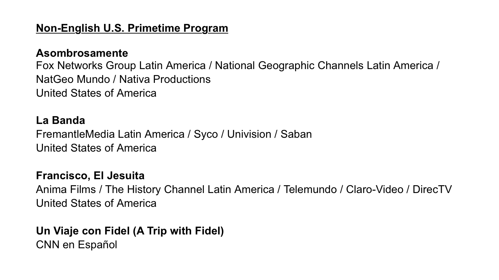
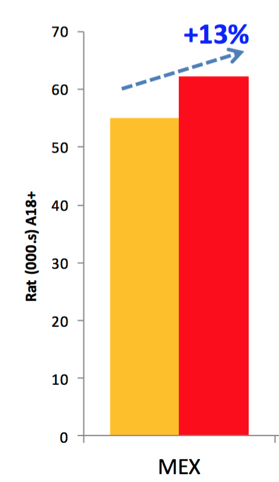
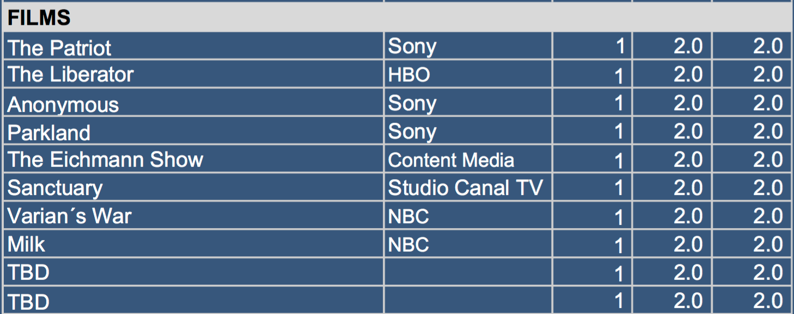

# A+E Content Committee

GENERAL

2016 FR price per hour for A&E and THC is $20,750; for Lifetime it’s $13,720 and for H2 it’s $7,901; for re-runs, the price is 50% of the FR price.b

Clear difference on how productions are financed. Global perspective. Much more along the lines of Netflix and the big players seem to be aligning.

**A+E International Team**

Tim Nolan / Brand Consultant / Ex Lifetime Marketing

?????????? Production Asset man
## 
Tom Lucas / International Marketing

Melissa / Int'l Marketing reports to Tom Lucas

Laura Fleury / Prog Strategy International / 

Liz Soriano / Op / Logistics / Fulfillment

Simone

# **May 2017**

**General**

If we align with US we are at the hope that they will be able to elevate the brands over time to have a premium perception and value when included in OTT bundles. If not revenue for the venture and the partners will be hindered considerably.

Follow up with International Co-Pro incentive.

**A&E**

Very bad performance. Should follow US direction and eliminate drama. Try to get CI and Vice content to supercharge A+E. Bring it back to flagship brand status within its stronger position. Original production of formats is also worthy of jumpstarting again.

How can we have 3 of the top 10 US Shows and perform like we are?

**History**

It has been hard for all factual. Everywhere.
Very Bad for history. 

All shows eroding fast.

Original production? At least car formats.

**Lifetime**

Growth gone. Go factual to go efficient. 

Strengthen with FYI content.

Original Production?

# **October 2016 Sao Paulo**

**Ole** ENC / Juan / Abascal
**A+E** Edward / Laura / Tom 

New format... no more reviewing what most already should know but instead focused on discussion items and open conversation about programming and brands moving forward.

**A&E** Mood video was same as MIPCOM same worries were raised and Int share them. Coletti perspective is very interesting but he is still worried that it is still impossible to synthesize the essence of the brand. 

**History**
Humanity's infinite storybook / Life's Explorers.

Rebranding for History.... first pass is Nov 30 full switch on all platforms by January. 

**The Partner** needs to be licensed along with formats related to partner and profit. 

El Chapo & Sean Penn... what happened in Argentina.

**A&E Discussion Points**

Crime
Not being able to select from all buckets is completely counter-intuitive to Linear support and complete design of digital future. 

**History Performance Update**
Dropped in all territories except Brasil.

Sunday drop is most telling given the solid performance we have seen there historically with Pawn Stars.

Add New Viewers brought to network as metric to analyze programs. 

Think beyond the live rating.... +7 etc.
We need new KPIs to define success. This live rating and mc9 obsession is what lead to the decimation of the venture's OP efforts. Went from pioneers to small player in the field. 

## 

**September 15 2016 / History Vault Call**

How is vault working in the US?
What is the plan for original/exclusive content on Vault?

Where are we now with the H2 hours issue?

What other words can we use to replace vault that have a similar meaning.

## April 2016 Buenos Aires

There were evident communication issues that became evident during the discussion of the video database system as well as when the discussion came up on how to create the VOD packages for the MSOs. There should be meetings prior to the committees in which the management team gets on the same page before presenting to the partners. Also ALL the management team is presenting. If the top execs are not on board or have not seen what is being presented it distorts the discussion.

## **Opening Remarks**
User Centric Company concept is clearly the new management concept. 

Why are we still at the mercy of what the MSOs want to do or when they want to update their technologies while at the same time building their own advanced solutions for their users that will combine content from their current partners but mixed with digital brands like Netflix. On top of all this they are negotiating directly with the studios and content producers effectively eliminating the need for sub brands within their system… an MSO operated/owned Netflix if you will.

They are asking for many things and offering very little. This with the reality that what they paid the networks in the last two decades has been almost unchanged. 

The mentality of using other touch points to drive audiences back to cable is illogical. How much have new generations gone back to newspapers, magazines, radio?

If we do not change our perspective to a global brand together with our partners we do not stand a chance against the competition. 

There is NO clarity or unified vision on what is happening on this new shift towards VOD and expanded rights.

Coletti’s presentation was good. 

 
## Lifetime

Jane lost steam in 2016… why was it aired split with year-end?

Distribution is still an issue… focus is on HD feeds as solution. Clearly the market is very saturated. 4 year cycle for contract renewals to happen that will include Lifetime in the HBO basic channel pack.

Xmas movie situation limited to a specific territory? Southern hemisphere is thinking about end of school year and going to the beach… not chestnuts roasting on the open fire. 

Front of the wall stunts cannot be done given licensing limitations… Edward says that exceptions can be made.

## US UPDATE

History management change seems to be showing in the content shared in the presentation. Definitely back to basics and focused on what works.

Pipeline looks interesting for all networks. Looking forward to seeing more at IC

## Original Production

Focus on AdSales driven production is excellent. Would like to see how it actually becomes a reality beyond what has been done before. 

Regarding the perspective of opening up to new partnerships it is a necessity given the high cost of production needed for maintaining the quality when compared with the US product. We need to be wary of who we partner with. 

Hyper localized development should be more of a priority.

The way all original productions are presented for approval must be standardized. Use PAC type ROI form or come up with a new system that includes all details regarding story/concept, prod company/creative talent involved, total production budget, investment type (license, right ownership) what are we getting, who are we sharing it with, what are we giving and what are the expectations of the return associated with the project, both economically and in press, branding etc.

Guia Incorrecta, Os Bravos, Redes Sociales looks great

Historia Secreta, History Drone, Accelerators, Na Trilha do Mito is looking pretty good. 

## 
History

Erosion is strong. Leadership position is at play.

Promos are mostly hard to understand. This applies not only to History.

H2 performance among History heavy viewers is troubling. Look into it.

Very happy with localized per feed scheduling. This was an advantage our competitors had on us. Let’s see how they take advantage of this new capability.

Look into the whole change to a global history fan page… what was the benefit we were expecting? The loss is clear.

TedX alliance seems promising and is a good addition to the emprendedores concept. 

Escobar OP/… 6 hours??

## H2

Situation w/ reruns being charged as first run is not acceptable. On top of that we are in a situation that will potentially impact our distribution once the MSOs realize that was promised to them regarding premieres and content that is different and new from History is no longer true.

Schools are using H2 as part of their curriculum. Great promotional opportunity to bring a new younger audience that can become fans of the brand… maybe refocus the bran more in this direction especially online a la khan academy and such.

## **Operations and Distribution** 

Since our partner owns and controls the content that is most of what we show in LatAm we are technically in a position to offer much more than our competitors with the exception of Warner. This volume and quality of content with such flexible rights would potentially present more of a fee per brand. This would be under the concept of seeing where everyone stands with phase 1 and 2 but then hold under our sleeves a potential phase 3. 

We need to work with the MSOs and give them whatever they want and more… creating a habit with the audience of functionality more along the lines of what is available in the US. All this while developing the technological side of how the content is delivered at the rhythm and focus of a Netflix or any other OTT that does not have another option. Once the habit is created not only in consumption but also in payment the move to a Digital Bundle could be much smoother.

Runs situation continues w A+E. They are in a position of thinking how generous they are and the special treatment that we get and it is simply not the case when compared with all the other major content providers.

SERIOUS op issue with A+E regarding program deliveries and processes… this is having a huge impact on our operation and in the results that are being achieved. The management does not feel that they can be held accountable for performance if these problems are not fixed. 

Get even more dedicated feeds in exchange for the phase 2 level content.

## A&E

All network ratings drop in Argentina. Why?

Reasoning for the ratings issue between Argentina and Colombia in the case of A&E is a supposed explanation that when you cater to one you hurt the other. Drop in Argentina worse than gain in Colombia. 

______________________________________________________________________________________________________________________________________ 
     

**Nov 2015**

 
___________________________________________________________________ 
     

**History**

 

What happened in Mexico? Gravity?

Worried about the movie quality. Last meeting was very high-end films that created mini events when combined with thematically similar content. Now they are keeping the strategy but with lower quality direct-to-tv films. 

Get Multiplatform analysis presentation from Julya Fridman. 

___________________________________________________________________

 
     H2
 
Definitely should have a smaller group discussion regarding the future of H2 and whatever it is how we can be a part of it from the beginning of its planning.

___________________________________________________________________

 
     A&E

 Storage Wars lost its steam. Currently being held up by NCIS. 

A+E Net is not reaching their yearly committed amount of hours for the PLA

Polar Star Films / 10 films… check titles. 

___________________________________________________________________

 
     **Lifetime**

  
     We are always complaining about not having enough access to the talent for promotional purposes and in today’s meeting they offered twice and in one case we said no and in the other we were hesitant. WTF.

Lifetime movies brand and concept is dead with the movies going to Netflix.

Lifetime movie club for the use of this window?
 

## Aug 2015 Bueno Aires

TVE must go to HTML5 compatibility. No proprietary.

The bringing up of a supposed impact in the ad sales performance for a programming is negligible both taking into account what the AdSales money represents in the total business as well as the lack of reliability when AdSales claims are made and programming adheres to it and Ad Sales almost always does not deliver on goals.

Dubbing quality seems to be even worse than before. Analyze where the problem lies either channel or dubbing company and then push for an increase in perceived quality. Will the audience even notice?

The deal for the jesuit is covering 60% of the total budget in exchange for LatAm all media rights. 360,000USD / 

Sugestiones looked great and format was appealing to Sally. 

Where are the ROI forms? Request at board level for all Original Productions as well as extraordinary acquisitions. Provide new structure on how original productions should be presented not only showing our investment but what that represents exactly inside of the total project. 

Drone footage can become excellent stock footage.

Unsurprising focus on Panama for original production advertainment.

Start adding marketing spend to acquisition on original production total spend numbers.

Additionally marketing initiatives should have their cost included in these presentations.

H2 has become an issue given the use of those catalog hours on History. In addition to that domestic has cut back and refocused their strategy regarding H2. The temporary uncertainty with the brand domestically should be compensated somehow so as to maintain affiliate, audience and company expectations.

## Feb 2015 Sao Paulo

The participation of lower level management people creates a limitation on subjects that can be touched upon. Important matters that are necessary to go over before preparing for Board Meetings

Include Marketing Spend in Programming total cost.

## **NOV 2014**

## **History**

Competition is hitting hard with more variety in genres as well as format / more premieres per year 

Page 14 is excellent visualization of content performance. 

Tentpoles are delivering big time 

Houdini diluted by simultaneous premiere 

Output content erosion / Variety through 3rd party acquisitions as proposed solution 

History domestic is premiering even less hours than we are.  

Our audience erosion is migrating to Discovery and Movie channels. 
     Space 
     TNT 

New Content Balance 

Separate Schedule stacks will reveal performance more clearly. Generate consistency. 

Tentpoles normally a Su/Mon/Tue launch. 

New run definition to allow different day programming in the same week between LatAm & Brasil 

US and UK did a Media Buy upfront type event/system. They state their total investment and have the media companies bid for the money. 

El Jesuita / What is the total budget / What are we receiving in exchange for the 100k 

**INTERNATIONAL UPDATE / Ask Michael if this can be shared more frequently /** 

**American Originals**
     *Mountain Men* 
     Last of the Rivermen 
     Rivermen 
     Life on the Line / Powerline Workers / Alaska 
     Tree People 

**Artifactual**
     *Pickers* / More focus on the picked characters 
     *Downeast Dickering* / More Variety 

**Competition Gameshow**
     Pawnography 
     Alaska Off Road Warriors 
     Last Survivor 

**Gearhead**
     Counting Cars 
     Lipu and Pitbull 
     Lost in Transmission 

**Tentpole**
     Atlantis Found 
     End of Days 
     The Shift 

**Renegades**
     Mavericks 
     Appalachian Outlaws 
     Gangland Undercover 
     Secrets of the Hell’s Angels 
      
**Mystery**
     Curse of Oak Island 
     Curse of Superstition Mountain 
      

# **H2**

At 50% distrib compared to H… Performance has kept up with Distribution growth. 

Dedicated site was an inevitability. Great initiative. 

## **A&E**
Very worrying performance numbers 
     After such a weak year the follow up goals cannot be so conservative. 

Performance is reflecting Domestic performance 

Their proposed strategy is back to basics 
     Redemption 
     Crime 
     Edgy / Darker 

Se Presume Inocente Strategy is ridiculous. Mexican episode performed Pan 

Orphan Black Binge Strategy 
 Novela Style o Stacked Programming Strategy 

OnAir is still a serious issue  

**Big Characters/Light**
     Not so light 

**Artifactual / Transactional**
     More 
          Driving Vegas 

**Crime / Redemption**
     This is were the growth will happen 

**Movies / Mini Series**
     No News 

**Drama Series**
     No News 

**Magic**
     NO 
     Turning into social experiments 
          Married at first Sight 
          Cul de Sac / Neighbors with Benefits 
          Surviving Marriage 
           

## **Lifetime**

##         

///

 
     **FEB 2014**
 

**GENERAL**

Design and Implement Burst Plan of how the PLA works with each network.  

**Lifetime**
* Transition
* Feed Transition Chart 
* Every Feed and Every Territory 
* Awaiting Roadmap from Management including Content Management 
* How the different brand hybrids will behave onair 
* Cost / Headcount implications of transition 
* Brand Positioning 
* Needs to be an intro campaign 
* A+E PLA Hours Usage 2014 
* Final List of SPTI content use 
* Brand positioning is off

**History**
History team manages the H2/Bio hybrids. 

Define clear and complete KPIs for analysis of Original Productions 
     Ratings Performance 
     AdSales 
     Press / PR 
     Marketing Relevance 
     Brand Positioning 
     Affiliates Relevance 
     Web Traffic 
     Social Media Influence 
     Subsequent Distribution windows and international format sales. 
      
History and H2 are getting blurry if History goes "back to basics"

Series vs Serialized programming... Do we know how to handle serialized content? 

Incomplete KPIs for production. 

**H2**
Transition 
     Feed Transition Chart 
          Every Feed and Every Territory 
     Awaiting Roadmap from Management including Content Management 
     Cost / Headcount implications of transition

**Bio**
Transition 
     Feed Transition Chart 
          Every Feed and Every Territory 
     Awaiting Roadmap from Management including Content Management 
     Cost / Headcount implications of transition 

**A&E**
On Air is a huge issue. 
     Process Issues 
     Comm Issues 
     Mafer?? 
      
Branding positioning… why even discuss… be original should be used and we need to stop thinking we are THAT different. 

*SPI*
CityTV Copro 
Serious interest in Brasil 

Frame the Ole Foton Deal with A&E Ole Networks for the Original Productions. Done, Given to Eddy in a Proposal as he requested pending follow after the Board. 
  
Review the cases for SPI 2nd Season make final selection.  Carlos Abascal and Carlos E Cusco selected 8 cases. Done 
  
Review Report made in Caracas by Mario Con about the On Air Channel Image. Evaluate for recommendations.  Carlos Abascal asks Mario Con to send it to see and evaluate the recommendations made by the Consultant they contracted. Has not yet arrived. Want to see how we can add. To A&E On Air communication and positioning today. 
  
Review and make a content analysis with Programming and Acquisitions regarding the Content mix; Movies (Evaluate Studios vs Indies + Availability 25 to 40), Scripted Series Drama, Factual Series, Specials. Mario, Isabel Q & Sales. 
  
Revised the premier planning from May to the end of the tear on the A&E channel.  Implement the changes suggested by Factual Season and Scripted Season.(  Suggested by Michael Katz ,) When is the right time during 2014 2nd half . 
  
Lack of Leadership and Knowledge form Mario on first look after 2 comities.  Does he has the tools ? The structure? Is the tyranny of the distance; Buenos Aires, Caracas, Miami, New York to much?  
  
  
  
The channels are working in silos. Does not seem as an integrated cross programming and promotion with in them.  Having History ch in the top 5  in Mexico !!!!!  Top 10 in Pan Regional. Talk about  
     <u>[Barker.com](http://barker.com/)</u>
  
  
Usage of the FR premieres hat were cancel in the States during the Word Cup / summer / Winter great for promotional stunts.  Treat Word Cup as Holydays or Carnival. 
  
  
 Programming line up. If every Month especially during summer and Fall on Mex & Winter in the South. How are they going to manage the Premier season of the other General Entertainment Networks in Mexico, Brazil and Pan Regional.  

On air issues have gotten worse. 

Exacerbating Brasil on air situation 

Sundays are still being avoided 

Nonexistent OP strategy 

Brasil strategy is too focused on getting easy numbers. It is like fasting... All the weight will come back just as the p24 audience will leave. 

It is like november never happened... I recall as agreed... 
* NO Music
* Phase out Movies by end of year
* Focus on quality not quantity regarding series and minis
* Focus cash on securing A&E domestic scripted series.
They need mini series desperately! 

Switch to Lifetime is a go

Fragmented rollout strategy. 

**Original Production KPI**
Rating 
AdSales 
Press Coverage 
Affiliate Leverage 
Web Performance 
Brand Equity 
Subsequent Content Sales 

**CONTENT PRE MEETING RESEARCH KIT**

Heat Charts 

//

 
     **NOV 2013**

 **BIO/LIFETIME**

March Brand Switch / 90 Day Decision to switch window. 

Switch from impressions to Share is GREAT 
Major demos are / Adults 18+ / Adults 18-49 / and W and M in both Demos 

Not skew too female… could plateau the general growth 

Bio could survive as a digital only platform and LatAm Team could reach a deal to translate/curate the site for both LatAm and US Hispanic. 

"Not step on each other toes” is not an established practice… this destroys x-promo intention. 

**A&E**

Completely avoid cancelled domestic series.  

**History**

Transmedia and complete strategy is forward thinking and completely in tune with what is happening in the entertainment industry at a grander scale.  

There must be a much more complete plan that details how all this translates onto the business. 

The audience / reach / money flow among all parts. 

//

 
     **APR 2013**
 

A&E

- Bio is back in action regarding original production… Crime, Paranormal, Dance Moms….

- Dance Moms a full… cultivar relación directa con Interntational

- Conseguir TODAS las presentaciones…. incluyendo la de Krishna sobre producción en Brasil 

- History Serie… Buscar temáticas que History no ha tocado por cualquier razón como "que no vende" que la competencia si ha tocado… Ejemplo Tabu y eventualmente History hizo Milagros muy recientemente.  

- In order to increase the like/share ratio on Facebook the post must focus on something that if shared will say more about the sharer than the poster… must connect with what they stand for and that post be a symbol of that that screams their values and beliefs. Start from the positive and motivational. 

- Revivir Custom Garage para LatAm y meterlo en la caja de Counting Cars. 

- O Infiltrado Mexico / Colombia 

- Develop Scripted MiniSeries Event / 4hrs / A&E 

//

 
     **FEBRUARY 2012**
 

All Original Network defined primarily by our nonfiction franchises.  
* Real Life Content
* Strong Characters
* Authentic, Provocative, Emotional
* Not Dark, can be witty and sometimes even fun. 
* No problem but solution focused.
* Not irrelevant and meaningless. 
## **Vertical Schedule**
  
Mon  
Strong Characters 
  
Tue 
Non Fiction Crime 
  
Wed 
Non Fiction Redemption 
  
Thu 
Storage Wars night. 
  
**Blocks**
  
Mon-Thu  
Non Fiction 
  
Fri-Sun 
Fiction, Dramas, movies, music, variety 
  
  
  
## **A&E Domestic Buckets**
  
**Transactional**
* Storage Wars
* Storage Wars: Texas
* Shipping Wars
* Barter Kings
  
**Crime & Justice**
* First 48
* First 48: Missing Persons
* After yhe first 48
* Beyond Scared Straight
* Cajun Justice
**On the Job**
* Dog: The Bounty Hunter
* Duck Dynasty
* Billy the Exterminator
* Parking Wars
* American Hoggers
* Rambug
* Flipped Off
* Last Chance Driving
**Redemptive/Transformative**
* Hoarders
* Intervention
* Monster in Laws
**Drama**
* Break Out Kings
* The Glades
* Longmire
* Coma
**Misc**
* Gene Simmons / Family Jewels
## 
**A&E Domestic Growth Opportunities**
* 100% Original Programming in Prime Time
* Increase # of premiere hours.
* Build off of hit franchises.
* Expand original programming in targeted time periods based on available audience.
## **A&E Domestic Communication**
* Daily interactions w/ research, programming, on-air promo, marketing & pr
* Cross departmental meetings
* Brainstorm ideas/stunts with on air promo & research
* Partner with marketing to plan out year, line up priorities and get all departments on the same page.
**A&E Budget Timeline**
* 1 year Plan - Started in April, Binding.
* 3 Year Plan - started in summer, flexible, adjusts as year progresses.
* November-presented to Board for approval.

  
  

