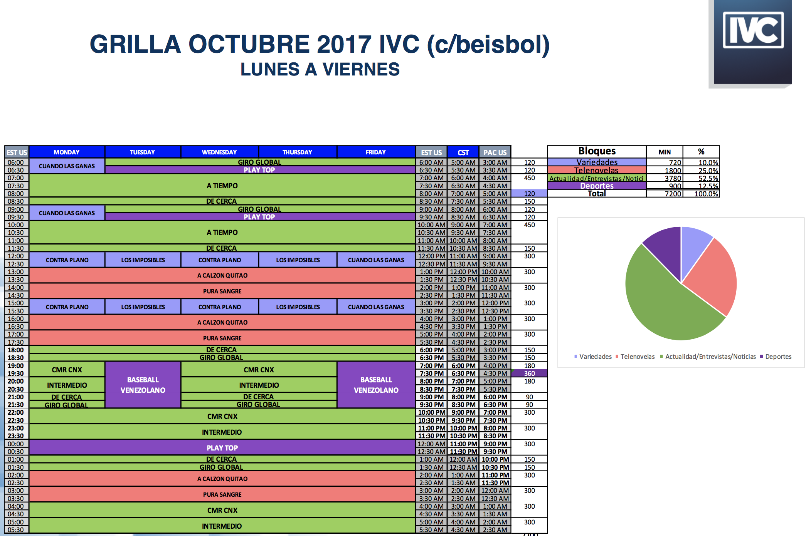
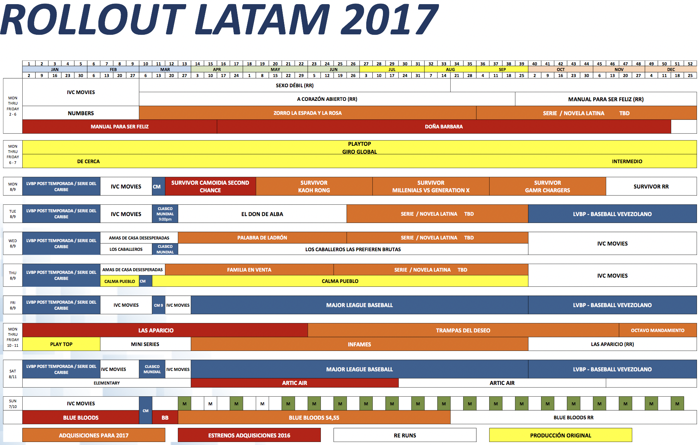
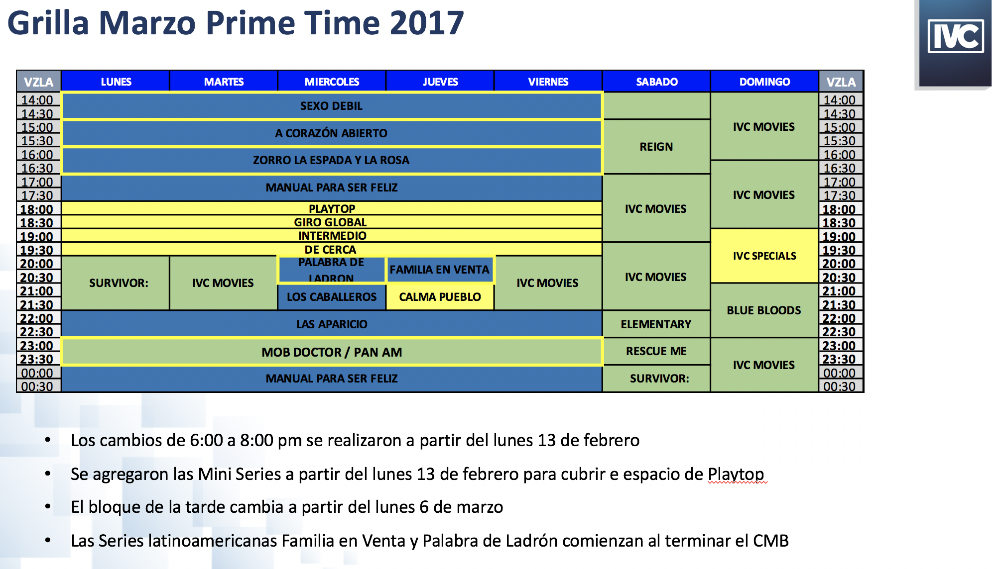

# #OleCom/IVC/CSM

 
     **#OleCom/IVC/CSM**

 

 
     **May 13, 2020**

  
     Feed Sur needs to be unVenezuelanized

  
     **May 12, 2020 at 07:18** 

  
     COVID impact and how it is affecting operation in Venezuela. 
Ratings reports are being shown based on recent changes to look at performance based on time bands. This will probably decrease visibility over performance in favor of less resources assigned to IVCs research efforts. Improve communication with BiD by designing a process for IVC team to process some of the data before it gets to BiD.
Adriana was just requested to process the programming performance by category. 
Audience flow seems to be ignored at times but it could be holdover strategies. Sergio brought up the point of PlayTop sitting between two female focused shows. It was obvious but was discussed by the team. 
PODCASTS / Huge opportunity for UR/IVC
Need to be clear on how these podcasts can be used on each feed as they don’t all apply everywhere. 

  
     **April 20 2018**

 

 
     **January 18 2018**

  
     No comments

  
     **August 16 2017**

  
     **Pilot Screennings**

  
     **Venezuela Kitchen Power**

  
     * Wardrobe feels out of place with the environment.

  
     * Lacking in variety of shots. Particularly detailed inserts.

  
     * Camera movement is way too handheld causing lots of strobing and blur. Better planning can lead to stealing more appealing material instead of seemingly just looking around.

  
     * 1;02 Audio issues. Double source.

  
     * Gfx need proper readout time.

  
     * Coverage of single shot plays against the benefit of intercutting these types of scenes and manipulate time or conversations.

  
     * 1;40 audio gets better.

  
     * 2;05 lo q le genera mucha curiosidad es de donde vienen esas aullamas? Setup y payoff not working. How much is improv?

  
     * Upbeat attitude and music is great although repetitive.

  
     * Insert shots once they finally start appearing at 3;05 are not well though and paint the food in an appealing way. These programs live off the food porn cinematography.

  
     * People they interact with needs to be better selected, better prepped, better shot stealing expressions for key moments.

  
     * Action and deep narrative or explanation should be captured separately focusing the moment on each for performance. Later intercut into a seamless scene. Currently it is interrupting the flow of both the narration as well as the action in addition to making sound capture and missing unnecessarily complex.

  
     * Sync is an issue throughout the second half of the episode.

  
     * Gfx size for better reading. Also descriptions could be better.

  
     * Fire gfx designer.

 
 
     **Y mi Persona**

  
     Best gfx. 
Structurally cannot hold up 22min

  
     **Batazo Millonario**

  
     This format cannot hold up 22min
Exploit comedy potential of host. Either make him loosen up or play up his formality.
He was less relaxed than the contestants.
Need of a lot more imagery to support the content.
Show could be centered around visual animation of the game and run through the bases and points related to the game. Either gfx or stock footage with a comedic tone could work.

  
     **Pa lante es Pa Lla**

  
     GREAT! Whoever made this should be in charge of all our productions.

  
     **En Foco**

  
     Who made this? Why are there such discernible differences between programs?
The concept and intention seems to be much bigger than what you are seeing in the material. Maybe change the tone to something more comedic instead of “epic”
Technically superior to all the others but a clear step below Palante.

  
     **Fragamente Hablando**

  
     Camera and set angles seem to be off
complete lack of shot variety and cut rhythm
impossible to hold up compelling 22min without better stock footage.
virtual set completely missed opportunity that is quite distracting. 
gfx designer should be the same that got fired earlier.

  
     **Betsayda**

  
     This looks great. Like a mini doc.

  
     *First CSM March 23 & 24 2017*
 

 
     *Day One*
 

 
     *Original Production*
  
     
CMR to be reformulated with complete editorial freedom for International feed. 

New UR set up worth further discussion.

Escalante will design a new org proposal for onair.

Next time we need to include grids for weekend also. 

  
     *Venezuelans in USA*
 

 
     * Original Production Talent Links

 
 
     
 
 
     
 
 
     
 
 
     
 
 
     
 
 
     
 
 
     
 
 
     
 

