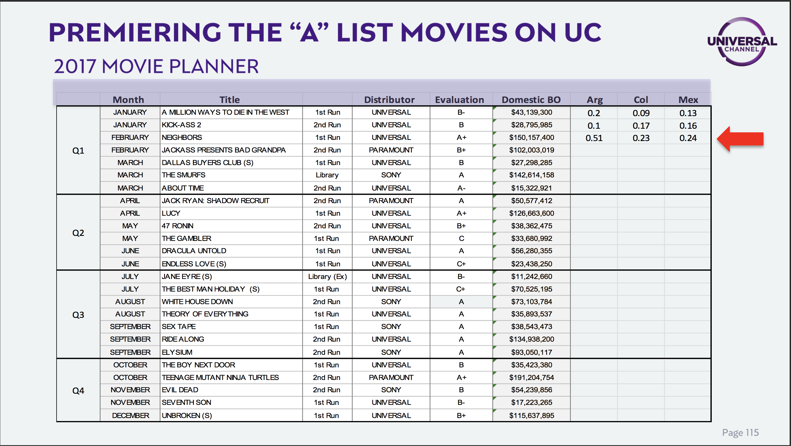

# CSM NBCUniversal UNISLA

#olecom #unisla #csm 

 
     **NBCU CCM October 4 2024**

 [1233A27D-5B22-497F-A9BB-4E5B4A9254DD](attachments/1233A27D-5B22-497F-A9BB-4E5B4A9254DD.m4a)

 
     **NBC**
  
     **U CCM May 3 2024**

 
 
     **NBCU CCM Sep 18, 2022**

  
     Pre Read
Content Performance Report 

UTV Mexico Performance is incredible but the hit on all the other networks is massive. Colombia and Argentina also contrasted and worrying. 
The acceleration of cord cutting in Brazil compared to SPLAT in proportion to this viewership drop would be interesting to compare. 
Either way very worrying and would be inesteresting to see if we have anyone that could help project that effectively.

On the premiere vs rerun slide for UTV case study… why does Chile have repeats performing better than premieres?

  
     **NBCU CCM Apr 20, 2022**

  
     Tribute video for Pagani was very appreciated and wonderfully produced. 
The hyperfocus on UTV is yielding expected results with a sustained top 10 performance for the network and weaker overall performance for all the other networks. 

  
     * Macro consumption shifts also would explain this trend with a move towards fewer channels performing better.

 
 
     **NBCU CCM Sep 20, 2021**

  
     340 Proposals / 23% Conversion — NBCU’s branded content division’s numbers… don’t remember OI’s but maybe interesting as benchmark… knowing for sure that this is their “showoff” number. 

  
     **NBCU CSM Apr 19, 2021 at 07:23**

  
     Went smoothly. Channels look good and performance is backing that. OP has been very effective and seemingly able to crossover from Bra to LatAm which is quite the feat. 

  
     **NBCU CSM Nov 5, 2020**

  
     Megacable TI deal mentions that it was direct. Does that mean that Ole Distrib was not involved?

  
     **NBCU CSM 11/4-5 2019**

  
     We have never had a better interface and opportunity with NBCU
Ken as well as us are completely aligned in moving quickly in generating value and ensuring their continued involvement and relevance. 
As head of global networks he can stay running a dying revenue stream or pivot and become the tip of the spear to a new way of seeing traditional media excelling in this new realm but only after seeing their brands as the focus and all platforms at its service. 
Linear and what that means needs to evolve. It is the ideal premiere stage. Using live events and that kind of programming to keep justifying the liveness of things.
Credibility will collapse the digital content publishing world and those that earn the trust of their audience and can also verify it in an eventual audit driven world.

  
     **E!**

  
     Yo casi q no creo en estrategias verticales en tv lineal hoy en dia. Veníamos viendo a TNT series subir desde la nada por aplicar prácticas Horizontal para M-F PT y Vertical fuera de PT y Weekend. 

La gente no have discovery on linear. Give them consistency and a lot of it. Contemos en el lack of audience loyalty y juguemos a minarla.

Off the clock for sure.

  
     **NBCU CSM 4/15-16 2019**

  
     **Studio Universal**

  
     Why was Warner an HBO specifically removed from the adhoc report. 
Fullscreen reset or back to what it was?
Branded block for classics is not promotable. It is not about branding it is about content offering in the current landscape. 

  
     **SyFy**

  
     Gaming and eSports focus is visionary. Stay on course and own the sector.

  
     **Universal TV**

  
     Same old. 

  
     **E!**

  
     Stripping in LatAm worth some analysis. 
OP seems quite basic and the programs done seem too dynamic.

  
     **NBCU Content Committee 4/2-3/2018**

  
     Marketing spend seems to be quite fragmented. It cannot be effective this way and probably accentuated the feeling of having a very limited marketing budget. It would seem much less limited if it was not spread so thin.
Get full brand tracker report.
How has the age of the entire pay tv universe evolved in the last years.
Output deal is suffocating E!. Maybe it was naive of me but I always thought that after the merger the problem with this would have become completely evident to NBCU and something would give. Not likely at all.

  
     **SYFY**

  
     An honest yet pessimistic outlook from management. Incapacity to perform against competitors due to budgetary constraints impacting content offering and brand awareness. 
Historical ratings drivers have eroded considerably. The channel has aged after efforts to revert this. Although it is a general trend in the pay TV universe. 
However they do see great potential in their brand’s proposition and their latest brand tracker supports that. We agree. 
Currently the obsessive scifi fanbase is very critical of the network.
SciFi is peaking as a general trend and it is being reflected in this type of programming being present in competitor’s offerings. AXN, Warner, Space, FX, AMC, Netflix, Blim and Claro referenced specifically.
AMC Doc Series

  
     [http://www.amc.com/shows/james-camerons-story-of-science-fiction/video-extras/james-camerons-story-of-science-fiction-teaser](http://www.amc.com/shows/james-camerons-story-of-science-fiction/video-extras/james-camerons-story-of-science-fiction-teaser)
  
     
They are implementing a more focused strategy on few main promotable titles every two quarters and focus on their few premieres. Librarians, Magicians and Grimm in H1 2018 and Killjoys, Sharknado, Outpost and Spides for H2 2018.
After removing Star Trek entirely from the network a few years ago due to the impact it was having on the age of the channel, in the end it became a greater negative impact on total viewership. They have relicensed Star Trek: The Next Generation for 2018. 
Their proposed grid is accesible and easy to navigate. 

  
     [10154849-00A2-40F5-887B-0BD9300B3355](attachments/10154849-00A2-40F5-887B-0BD9300B3355.pdf)
  
     
Digital is a great avenue for this network to have a new life. New digital content proposed looks promising and eSports is an excellent angle for the brand. 
Within the proposal of pivoting SyFy into a purely digital brand eSports and these digital only content beginnings can be a great opportunity.

  
     **E!**

  
     Pan regionally all the growth achieved in a very promising 2016 was completely erased in 2017. Current performance is comparable to late 2014. E! Is at the bottom of the competitive set with Discovery H&H leading by double the performance of the nearest competitor which is FoxLife which in turn is double the rating of E!. Quite the climb within the genre. 
In Brazil, E!’s growth peaked Q2 2017 and although marginal better than 2016, we are back at 2014 performance levels.
Argentina sees all channels within the genre lose audience, with E! flat and most recently dropping 50% in Q1 2018. 
Best performing content for E! in Argentina was Revenge Body, Project Runway, Cambiame el Look USA, Wild On OP and KUWTK
Colombia, a historically weak territory for E! Gets even worse in the start of 2018. Content performance is very polarized with low performing content achieving 0% rating. Best performing content was Cambiame el Look US and OP, Wags Miami, Project Runway, KUWK, Guerra de Pieles, Famously Single and Life of Kylie.
In México E! is a mirror to pan regional as it is the main driver of that change with all the growth of 2016 having been eliminated within 2017. 2018 is currently looking even worse.  Top performing content in México was Cambiame el Look USA and OP, Desafío de Uñas, Cuidate de la Cámara, Revenge Body y Project Runway.
Management not happy with content from HQ and attributes the poor performance to this deficiency together with the high cost of the low performing content which stifles their capacity to acquire or produce more. 
Ratings drivers are eroding with KUWTK being the most impactful. Less premiere hours available this year. Previous acquisitions were costly and also underperformed. E! News as the largest component of the cost issue it has become unusable in the territory. 
Original Production could benefit from some applied best practices in how to handle series development as well as improving the selection of vendors in the territory. 
Wild On’s reboot underperformed leading to the decision of cancelling after just one season. Management attributes the poor performance to deficiencies with the producer. 
We believe the cancellation was premature as the show over-performed in Argentina and is a strong brand worthy of retooling. 
Cámbiame el Look has performed well in México but less so in other territories. AdSales was able to generate sales that covered 60% of the production cost. They will continue producing more episodes. We agree. 
Kiss Bang Love underperformed but will continue production. We believe in the potential of the format. 
For Q1 2018 they focused on KUWTK and Events, Q2 will see the premiere of Drag me as a Queen, a new season of The Royals, a new season of Kiss Bang Love and the premiere of Below Deck. Q3 will premiere S11 of Project Runway and the original productions My Hotter Half and Cámbiame el Look S3. Q4 premieres Model Squad, Wags Atlanta S2 and a revamped People’s Choice Awards.
The rollout looks well thought out with premieres throughout the year. The proposed grid is easy to navigate and has ratings drivers stripped across access and 11pm slots.

  
     [0F81804E-E982-46A4-AFE6-0673CBDE6D91](attachments/0F81804E-E982-46A4-AFE6-0673CBDE6D91.pdf)
 

 
     **Studio**

  
     Pan performance was flat with a promising start for 2018. TNT and Cinemax are the only 2 currently growing in the segment. 
Studio was stable in Argentina but is off to a rocky start for 2018. Cinecanal and TNT lead the segment. 
Colombia showed general growth for the segment and Studio has continually grown recently and is looking well in Q1 2018.
Mexico is driving Studio’s regional growth. TNT and Space dominate the segment. 
Movies performed well with classic movies outperforming premieres. But they are redefining premiere to first time on Studio opposed to 1st or 2nd run exclusive. Fenix and Fullscreen OP well below PT avg. They continue production but we would recommend to cancel unless fully covered by sales revenue.
They are reducing the windows between UC and Studio to allow main titles to premiere sooner and live longer on Studio.
Brand awareness is low when compared to the other brands.
They have strong premiere and library titles for 2018 and comprehensive stunts and specials strategies for every month of the year.  Special football movie selection for June. 

  
     [C78246F9-36DC-4AE5-9513-8453884969B9](attachments/C78246F9-36DC-4AE5-9513-8453884969B9.key)
 
 
     [816E8480-F3B8-45F4-B63A-7266F072FC8F](attachments/816E8480-F3B8-45F4-B63A-7266F072FC8F.key)
 
 
     **Universal**

  
     UC is stable in Spanish LatAm.
Argentina saw double digit perceptual growth and is off to a good start in 2018. TNT Series flew past them. UC has 5 of the top 25 series among competitors in 2017. Non pillar content as main driver with very balanced content performance. 
Colombia also improving double digits and looking good for 2018. TNT Series in triple digit perceptual growth. UC has 1 of the top 25 series among competitors in 2017. L&O, Lucifer and MacGyver as main drivers.
México performance has been eroding for the last two years but in March 2018 UC had its  best month since 2011. UC has 2 of the top 25 series among competitors in 2017. Content performance shows clear polarization in México. L&O is the main driver with the Chicago franchises and Grimm as a distant second. 
Argentina local content acquisition performed 62% above pt avg in Argentina but underperformed heavily in the rest of the region with -65% pt avg in México, -78% in Colombia and -82% pt avg in Chile.
TNT Series schedule presented. Full stripping is working very well for them. Also heavy inventory of premieres. UC has 45% less premiere hours in the months analyzed in 2017. 2018 look only marginally better on inventory.

  
     [6D40B6DE-CC12-4D02-AC9D-7E8746047629](attachments/6D40B6DE-CC12-4D02-AC9D-7E8746047629.key)
  
     
Management blames limited budget which affects the capacity to make competitive offers as well as no movies from Disney, Fox and Warner as main challenges. Movies still necessary to keep ratings stable.
Industry shifts were also brought up.

  
     [538897B5-DE6C-4DDC-B946-F0F77D00BEE8](attachments/538897B5-DE6C-4DDC-B946-F0F77D00BEE8.key)
 
 
     [5EC0521C-511B-4E5B-A34C-4E2AB710022F](attachments/5EC0521C-511B-4E5B-A34C-4E2AB710022F.key)
 
 
     [60D6CAAA-0063-48CF-B5B2-CBE010714813](attachments/60D6CAAA-0063-48CF-B5B2-CBE010714813.key)
 
 
     [C87EC9A6-29A3-47AE-A591-AC6F8B7A9B01](attachments/C87EC9A6-29A3-47AE-A591-AC6F8B7A9B01.key)
 
 
     [6C187B21-1132-4E56-8235-B7231F044A4C](attachments/6C187B21-1132-4E56-8235-B7231F044A4C.key)
 
 
     [38510AC8-7F53-429D-906A-ED153D41A4BD](attachments/38510AC8-7F53-429D-906A-ED153D41A4BD.key)
  
     
Localization will be key. More feeds are more justified than ever. They proposed an increase to L&O presence on the grid and we agree. Chicago drops in importance. 
Timeless is not looking promising in the US. Do not understand acquisition beyond the explanation of budget constraints. Movies will stay on UC at 2 blockbuster premieres per month. 
With TNT Series clear evidence we do not understand their insistence on stacking. Access looks good and let’s see if March 2018 numbers hold up.

  
     [D387B703-772A-4AED-B652-BC1D2E79E000](attachments/D387B703-772A-4AED-B652-BC1D2E79E000.key)
 
 
     [EB721E55-7219-41FA-89EC-262806FA5C35](attachments/EB721E55-7219-41FA-89EC-262806FA5C35.key)
 

 
     **Telemundo**

  
     TI is growing everywhere except Colombia. Tough crowd. 
Fastest growing network among competitors. Breaking their own records on ATS. Q1 2018 looks promising. 
Return to Megacable had positive impact on México ratings.
Paquita la del barrio over indexed in México but had terrible performance in Colombia. Localization is key. 

  
     [585B423B-DB3F-4FC0-8BC9-13987896E6F1](attachments/585B423B-DB3F-4FC0-8BC9-13987896E6F1.pdf)
  
     
Turkish acquisitions are paying off. One is performing extremely well across all territories, another with only México as the exception and a third that simply did not resonate outside of Guatemala. La Reina del Sur did 0% in Colombia. 
Gloria Trevi performed very well in all territories. 
They need an extra feed in order to localize further and continue their explosive growth. 
Push towards local acquisitions looks to be a good idea. 
————————

  
     **NBCU Content Committee 3/16/17**

  
     **Telemundo International**

 
 
     **E!**

 
 
     **Universal**

  
     Watch MacGyver episodes. 
Keep track of this as the results roll in. 

 
 
     
**SyFy**

  
     Is it worth analyzing a digital exposure to the network in the territories that we have very limited distribution? 

————————

  
     **NBCU Content Committee Update 12/1/16**

 
 
     **STUDIO**

  
     Brasil performance is heavily impacting MC9 result. 

  
     **SyFy**

  
     What exactly is the strategy from the board perspective for this brand? Let it die on linear and transition over to digital. Meanwhile use the distribution to launch another NBCUniversal brand.

————————

  
     **NBCU Content Committee August 30-31 2016**

 
 
     **DAY 1**

 [0F3018EE-5CF9-4486-83D1-C92A57ABF9FF](attachments/0F3018EE-5CF9-4486-83D1-C92A57ABF9FF.pdf)

 
     Page 4
Is universe referring to sample or true sub count change.
SyFy has been seriously underperforming and keeps doing so. 
Research Data looks negative all-around.
This is the check out the silver lining meeting.
SyFy 5 Months per year have no premieres.

Page 46
These are weak proposals for 6 months of not talking.

Page 66/67
The decrease in Movies charts are a bit strange to really see the data.

Page 68
UC No premiere for 5 months of the year.

Separated presentation sections take away from the context of what is being presented.

  
     **DAY 2**

 [8A6CF60F-77D1-4B06-8E5B-7319B2FB943C](attachments/8A6CF60F-77D1-4B06-8E5B-7319B2FB943C.pdf)

 
     How do I Look 8k per hour / and we are producing it so they get the format fee / It was cancelled 2012
How much was Discovery paying????
Page 44 / What do we do on the weekends? Why eliminate scripted entirely? Does E! US apply this strategy?
Page 45 look into assumptions on the channel's growth being fully driven by the specific programs they are mentioning.
These meetings are pointless without seeing the economic implications of the decisions being made.
Apparent discrepancies in data within the presentation.
Page 76 / What happened at 8pm?

  
     **NBCUni CSM Pre-Meeting 8/16/2016**

 
 
     **SyFy**

  
     
Budget cuts impacted last meeting's strategy
Doctor Who did not perform.

  
     **Studio** 

 
 
     **UC**

 
 
     **Telemundo International**

 

 
     **NBCUniversal Creative Committee Meeting**

  
     
TELEMUNDO

High ATS but all novela nerworks have it as well.

Primetime is actually a rerun of the afternoon programming.

All promos give tune in for primetime.

Compliance is a big potential issue specifically in VEnezual and Mexico but also is spreading in LatAm

Mia Astral?

**
**
**

  
     **LatAm Programming Summit April 2015**

 
 
     **Day 1**
 