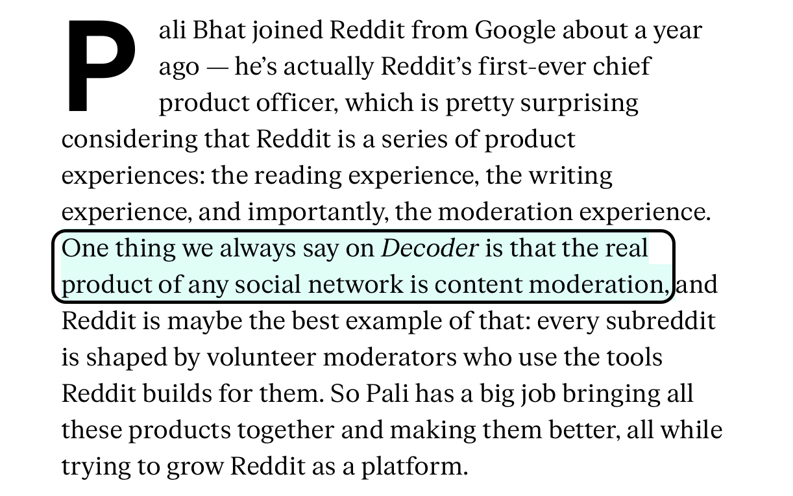

# Ole Interactive CC

 
     #OleCom/interactive/cc

  
     **Themes**

  
     The balance between content and distribution or as they call editorial and tech.

  
     
 

 
     **incubation**

  
     From Vanity Fair article about BuzzFeed… Waclawiak told the 
  
     *Journal*
  
      that part of BuzzFeed News’ strategy involves “pursuing long-form investigations that can serve as the basis for documentary projects.” 

  
     **Verticals / Brands**

  
     Resource allocation among them. 

Actualidad vs Evergreen

CRED WILL HAPPEN!!! Have been thinking about it so much… at least some form of it… the world needs a good source for truth when you have even Google handing off credibility to Wikipedia.
Separate public fact checking service called Pinochio

  
     **Distribution**

  
     SEO has expanded in all dimensions all they way to the most minute detail.

  
     **Research**

  
     Historical data of the performance of the PGC assets is its own ad-hoc study

  
     **2021 Strategy**

  
     Playground

  
     [57C2C4EC-037E-47D6-834E-7B52F21F257F](attachments/57C2C4EC-037E-47D6-834E-7B52F21F257F.pdf)
 
 
     **May 13, 2020 Meeting**

  
     VOX y los big players hacen este domain consolidation en favor a trafico? o sea… beyond branding why wouldn’t everyone do this?

  
     * eLearning process for Foton

 

