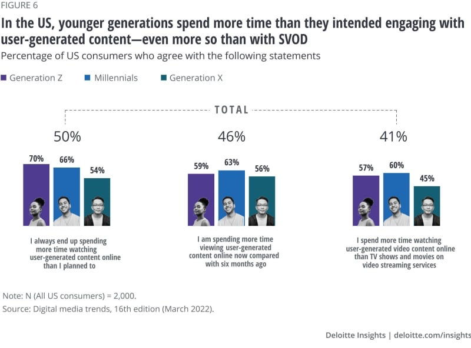

# Ole Interactive Content Strategy

 
     #OleCom/interactive/cc

  
     # **B**
  
     **randed Content**

 ## 
## **The B****rand Film**

[Rihanna and A$AP Rocky Star in Noir-Inspired Fenty Ad for Lux Balm](https://www.hollywoodreporter.com/lifestyle/style/rihanna-asap-rocky-fenty-lux-balm-ad-1235838427/)

 
     **Content Categories**

  
     [Netflix will start streaming Nike Training Club classes next week - The Verge](https://www.theverge.com/2022/12/21/23521005/netflix-nike-training-club-fitness-streaming)
 

# eLearning
[The New Influencer Gig: Teaching People to Use AI — The Information](https://www.theinformation.com/articles/the-new-influencer-gig-teaching-people-to-use-ai?rc=pxbok7)

 
     - A new industry has emerged of creators offering paid classes and tutorials on how to use the latest AI tools like ChatGPT and Midjourney.
- This AI-focused educational content is a rapidly growing category on platforms like Hotmart and Teachable.
- The rise of new AI tools is seen as a "tailwind" for the creator economy, as there is high demand for learning how to leverage these technologies.
- Educational products spanning AI, fashion, fitness, and language learning have generated over $10 billion in gross merchandise volume for creators on Hotmart and Teachable since 2011.
- The availability of powerful AI tools has led to the development of a new type of "influencer" - those who teach others how to effectively use these technologies.
- This reflects the significant impact AI is having on various industries and the need for people to learn new skills to keep up with the technology.
- The monetization of AI education shows the commercial opportunities emerging around these new tools.
- The growth of AI-focused educational content highlights the widespread interest and demand from the public to understand and utilize these advanced technologies.
- Platforms like Hotmart and Teachable are benefiting from this trend, as they provide the infrastructure for creators to build and sell their AI-related courses and products.
- The passage suggests the AI-driven creator economy is likely to continue expanding as these technologies become more prevalent and accessible.

Music Docs

About artists, movements, places, songs, albums, performances. All epic, all with something special.

 # NEWS

- Gen Z is increasingly getting its news from TikTok rather than traditional media outlets. TikTok has become a major news source for young people.
- The news on TikTok often comes from alternative sources like commentary accounts, influencers, and user-generated content, rather than mainstream media outlets.
- TikTok's recommendation algorithm rarely promotes content from established news organizations, contributing to the fragmentation of news consumption.
- "News influencers" on TikTok who distill and interpret the news for their followers are playing a key role in shaping how young people consume news.
- Many TikTok users find these "news influencers" more authentic and relatable than traditional journalists, who they perceive as having biases.
- Traditional media outlets are struggling to build audiences on TikTok, though some have found success by featuring individual reporter personalities.
- The rise of TikTok news poses challenges for an informed citizenry, as the platform's fast-paced, fragmented nature can lead to the spread of misinformation.
- Local journalism seems to be finding more success on TikTok compared to national news, as users are drawn to content tailored to their communities.
- TikTok has not provided a viable revenue stream for news publishers, and the platform's closed ecosystem and limited monetization options make it a risky bet for the industry.
- To win over the next generation of news consumers, traditional media outlets may need to make their content more relatable and meet young people where they are, on platforms like TikTok.

[https://www.businessinsider.com/gen-z-gets-news-from-tiktok-influencers-media-industry-2023-12](https://www.businessinsider.com/gen-z-gets-news-from-tiktok-influencers-media-industry-2023-12)

[ATTN: Expands Creative Shop Leadership Team to Support Growth and New Capabilities](https://www.adweek.com/agencyspy/attn-expands-creative-shop-leadership-team-to-support-growth-and-new-capabilities/)

 
     **Editorial Committee Meetings Jan 31, 2023**

  
     There could be a separation in the teams in which some focus on immediacy and some focus on longer term longer duration content. 

  
     **Content**

  
     [Condé Nast CEO Roger Lynch Interview: Remaking a Magazine Empire – The Hollywood Reporter](https://www.hollywoodreporter.com/business/business-news/conde-nast-ceo-magazine-empire-hollywood-player-1235263323/)
 
 
     **Games**

  
     G4TV? What are they doing? Can we run with it?
Create something new?

Why was Andrés asking Cristian about games influencers from Chile?

  
     **Platforms - History & Strategy**

  
     [The algorithmic anti-culture of scale - by Ryan Broderick](https://www.garbageday.email/p/the-algorithmic-anti-culture-of-scale)
  
     
But let’s start at the beginning. Myspace launches in 2003 and it quickly makes the idea of a social network mainstream. Facebook goes live exclusively for users with college email addresses a year later. Facebook’s News Feed, which turns the platform into something beyond just a Myspace for rich kids, turns on in 2006. Myspace use peaks in 2008. Facebook overtakes it in 2009. The chronological News Feed is phased out in 2011. The algorithmic era begins.

 [Test Content With Non-Followers Using Trial Reels | Meta](https://about.fb.com/news/2024/12/trial-reels-try-content-non-followers-first-see-what-perfoms-best/)
 
     
————————

Edit Style for Food and Recipes

  
     [https://reddit.com/r/oddlysatisfying/comments/m8ejlb/the_jump_cuts_and_the_food_looks_good/](https://reddit.com/r/oddlysatisfying/comments/m8ejlb/the_jump_cuts_and_the_food_looks_good/)
 

 
     **References**

  
     [ATTN:](https://www.attn.com/)
 

 
     **Services**

  
     [https://branch.io/about/](https://branch.io/about/)
 
 
     [Analytics Platform for Brand Advertising](https://www.upwave.com/)
 

 
     **Research and Trends**

  
     [From Deloitte 2022 Digital Media Trends Report, 16th edition: Toward the Metaverse](https://www2.deloitte.com/uk/en/insights/industry/technology/digital-media-trends-consumption-habits-survey/summary.html)
  
     
“User-generated content—which is usually short-form and easily consumable—has been bolstered by the rise and reach of video-centric, algorithmically fueled social media services.6 And it’s often highly engaging. About half of US respondents say they watch more user-generated content than they did six months ago, and half say they 
  
     *always*
  
      end up spending 
  
     *more*
  
      time watching user-generated content than they had planned (a number that jumps to 70% among Gen Zs) (figure 6).”

  
     
  
     
Influence on retail and commerce
“Much of this user-generated content is fueled by the creator economy and so-called influencers—users whose large followings enable them to monetize their content through brand partnerships on these platforms.7 Following influencers helps users connect with communities of like-minded people—an affordance not easily replicated on SVOD services. Seventy percent of US respondents say they follow an influencer, and one-third say these online personalities influence their buying decisions—a figure that increases to more than half for US Gen Zs and Millennials.”
“With such large global audiences, social media services are becoming shoppable retail destinations, enabling businesses big and small to reach new audiences and potential customers.8 Leveraging the same data and algorithms, these services can deliver ads and product placements that are highly targeted and personalized. More than half of US respondents and around 40% or more in the United Kingdom, Germany, and Japan say they see ads on social media for products or services they have been looking for—a number that increases to 72% in Brazil. These sales are highly profitable for social media services: In addition to making money on the ads they sell, they can also take a percentage of the sale price when a product is purchased, expanding their revenues beyond advertising.“
Live in-game events present a unique opportunity for brands, franchises, and performers. About a quarter of US gamers say they have attended an in-game event in the last year, with Millennials and men being the most likely attendees. Remarkably, 82% of those attending live in-game events also made a purchase because of the event: 65% purchased digital goods and 34% purchased physical merchandise, reinforcing the steady blurring between the real and virtual (figure 9).

 

## Retail Marketing

[Amazon.com: : All Departments](https://www.amazon.com/b?ie=UTF8&node=104548837011)

Editing Style
[B7ECB1AC-1366-4B6F-8F80-ED466AC24A9F](attachments/B7ECB1AC-1366-4B6F-8F80-ED466AC24A9F.mov)
